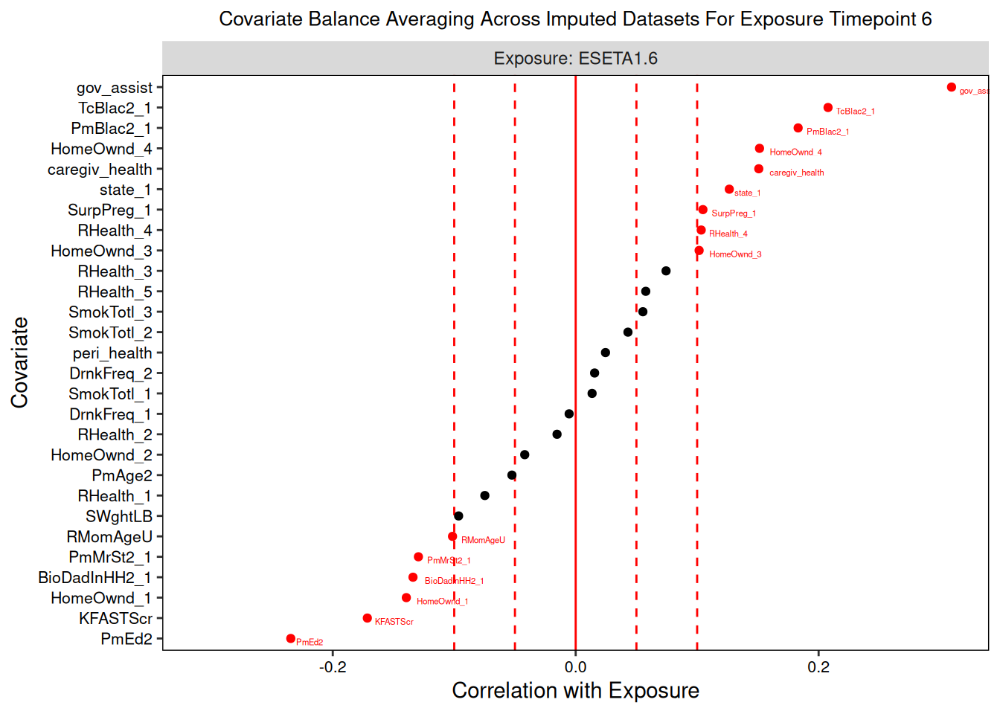
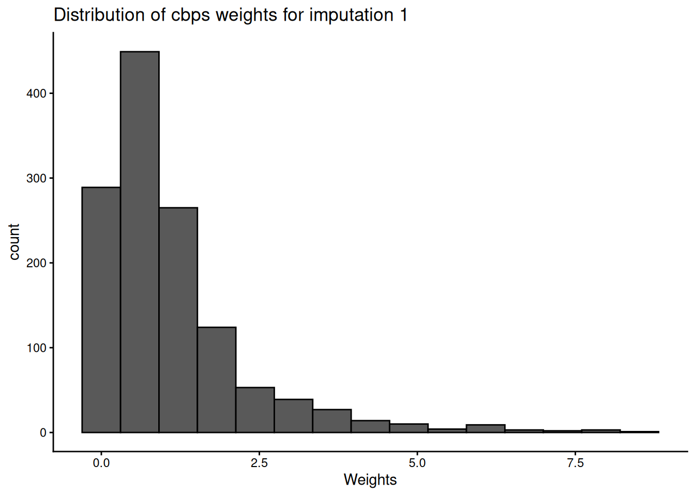
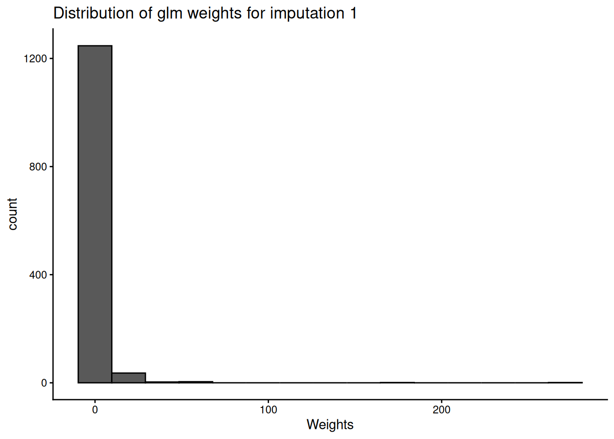
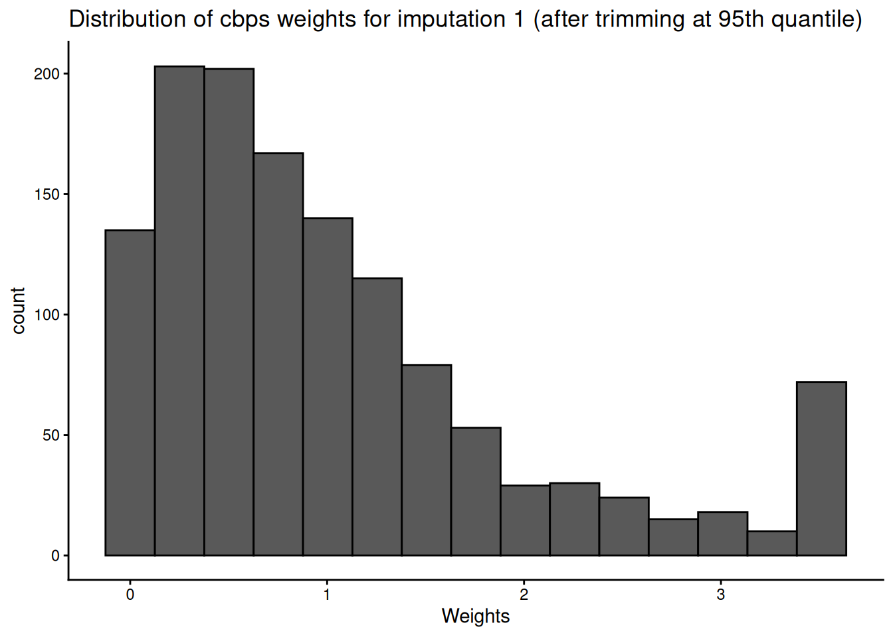
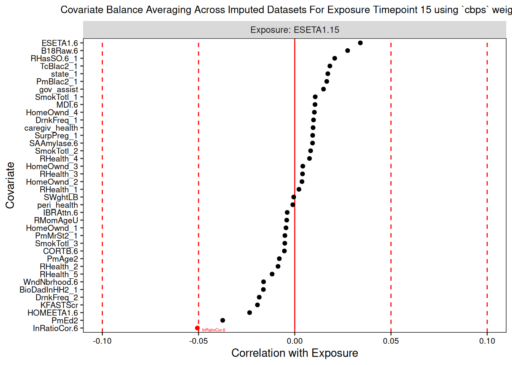

# Workflow: Continuous Exposure

This vignette guides a user through the process of using *devMSMs* to
fit marginal structural models (MSMs) with a a continuously distributed
exposure variable. The users should first view the
[Terminology](https://istallworthy.github.io/devMSMs/articles/Terminology.html),
[Data
Requirements](https://istallworthy.github.io/devMSMs/articles/Data_Requirements.html),
and [Specifying Core
Inputs](https://istallworthy.github.io/devMSMs/articles/Specify_Core_Inputs.html)
vignettes.

The code contained in this vignette is also available, integrated code
from the other vignettes, in the [ExampleWorkflow.rmd
file](https://github.com/istallworthy/devMSMs/blob/main/ExampleWorkflow.Rmd).
This workflow is designed to complement the conceptual and high-level
practical details provided in the manuscript
([preprintgh](https://osf.io/preprints/psyarxiv/284mb)). We strongly
suggest users familiarize themselves with concepts of the MSM process
outlined in the manuscript and the practical steps and functions put
forth in the following sections before implementing this workflow.  

## Installation

Until *devMSMs* is available on CRAN, you will need to install it
directly from Github (https://github.com/istallworthy/devMSMs), as shown
below.

``` r
options(repos = c(CRAN = "https://cloud.r-project.org"))

install.packages("devtools", quiet = TRUE)
require("devtools", quietly = TRUE)

devtools::install_github("istallworthy/devMSMs", quiet = TRUE)
library(devMSMs)

devtools::install_github("istallworthy/devMSMsHelpers", quiet = TRUE)
library(devMSMsHelpers)
```

All *devMSMs* functions have an option to save out objects as ‘.rds’
files. Users can also save out content from print, summary, and plot
methods, as illustrated in the sections below. To save, users must
supply a path to a home directory (`home_dir`) when creating their
initial MSM object. Users can save to the home directory using the
default file labels (and .txt file type) using `save.out` = TRUE. When
saving tables, users have the option to supply their own name and file
type (e.g., `save.out` = “custom_name.png”). Allowable file types are:
.png, .html, .pdf, .tex, and .md. All sub-folders referenced by each
function are created automatically within the home directory. We
recommend saving outputs for future use and provide commented out
examples here. When an output is saved out, the function automatically
provides a path file to aid the user in reading in that output in the
future.

Some functions output tables. These are all from the *tinytables*
package and can be further customized (e.g., dimensions, footnotes,
captions, combined, etc.) according to the options provided by the
package
(https://vincentarelbundock.github.io/tinytable/vignettes/tinytable.html).

``` r
save.out = FALSE
```

  

## Phase 0: Preliminary Conceptual & Data Preparation

Please see the accompanying manuscript for steps P1 (creating
hypotheses) and P2 (creating a DAG).

### STEP P3. Specify Core Inputs

The first step is to create an initial MSM object by specifying the core
variables and data for use with the package. Please see the [Specifying
Core Inputs
vignette](https://istallworthy.github.io/devMSMs/articles/Specify_Core_Inputs.html)
for more detail on the following core inputs.

Below, we specify data, exposure, time invariant and time-varying
confounders, as well as exposure epochs.

There are several other optional fields that a user could specify in the
MSM object.

The user also has the option to specify `concur_conf`, indicating, as a
list of character strings, the names of any time-varying confounders
(e.g., “variable.time”) they wish to be included concurrently in the
weights formulas (overriding the default which is to only include lagged
confounders). This should only be done if the user has strong evidence
to differentiate confounders from mediators in their relation with the
exposure contemporaneously.

#### P3.1 Recommended: Home Directory

We do not specify a home directory given the nature of this example, but
we do recommend doing so to save out core function outputs.

``` r
# home_dir = '/Users/isabella/Library/CloudStorage/Box-Box/BSL General/MSMs/testing/isa' 
```

#### P3.2 Recommended: Time Point Delimiter

Below, we use the default period as a time delimiter.

``` r
sep <- "\\."
```

#### P3.3 Required: Exposure Variable

We specify our 6 time points of exposure.

``` r
exposure <- c("ESETA1.6", "ESETA1.15", "ESETA1.24", "ESETA1.35", "ESETA1.58") 
```

#### P3.4. Required for Continuous Exposures: Identify High and Low Exemplar Cutoff Values

Below, we specify the 60th and 30th percentiles to demarcate exemplar
high and low levels of economic strain exposure, respectively.

``` r
hi_lo_cut <- c(0.6, 0.3)
```

#### P3.5 Optional: Exposure Epochs

We specify that the first two exposure time points (6 and 15 months)
will be considered infancy, the second two (34 and 25 months)
toddlerhood, and the final (58 months) childhood.

``` r
epochs <- c("Infancy", "Infancy", "Toddlerhood", "Toddlerhood", "Childhood")
```

#### P3.6 Recommended: Hypotheses-Relevant Exposure Histories

See the Specify Core Inputs vignette for more information.

Below, we specify low economic strain at all epochs (“l-l-l”) as our
reference event in comparison to high levels at all epochs (“h-h-h”) to
examine an example question comparing the causal effects of 0 vs 3 doses
of exposure to economic strain on children’s behavior problems.

``` r
reference <- c("l-l-l")

comparison <- c("h-h-h")
```

#### P3.7 Required: Outcome Variable

We specify out outcome as behavior problems at 58 months.

``` r
outcome <-  "StrDif_Tot.58"
```

#### P3.8 Recommended: Confounders

We specify both time-invariant and time-varying confounders.

``` r
ti_conf <- c( "state", "BioDadInHH2", "PmAge2", "PmBlac2", "TcBlac2", "PmMrSt2", "PmEd2", "KFASTScr",
  "RMomAgeU", "RHealth", "HomeOwnd", "SWghtLB", "SurpPreg", "SmokTotl", "DrnkFreq",
  "peri_health", "caregiv_health", "gov_assist")

tv_conf <- c("SAAmylase.6", "SAAmylase.15", "SAAmylase.24",
  "MDI.6", "MDI.15",
  "RHasSO.6", "RHasSO.15", "RHasSO.24", "RHasSO.35", 
  "WndNbrhood.6", "WndNbrhood.24", "WndNbrhood.35",
  "IBRAttn.6", "IBRAttn.15", "IBRAttn.24",
  "B18Raw.6", "B18Raw.15", "B18Raw.24", 
  "HOMEETA1.6", "HOMEETA1.15", "HOMEETA1.24", "HOMEETA1.35", 
  "InRatioCor.6", "InRatioCor.15", "InRatioCor.24", "InRatioCor.35",
  "CORTB.6", "CORTB.15", "CORTB.24",
  "EARS_TJo.24", "EARS_TJo.35",
  "LESMnPos.24", "LESMnPos.35",
  "LESMnNeg.24", "LESMnNeg.35",
  "StrDif_Tot.35", 
  "fscore.35")
```

#### P3.8c Optional: Concurrent Confounders

We specify no concurrent confounders as, given our data, we are unable
to disentangle them from mediators or colliders.

  

### STEP P4. Data Preparation & Inspection

#### P4.3b. Required: Read in Wide Data

We highly recommend first implementing the *Data Requirements &
Preparation Vignette*
https://istallworthy.github.io/devMSMs/articles/Data_Requirements.html
before assigning to the variable, `data`, one of the following wide data
formats (see Figure 1) for use in the package:

- a single data frame of data in wide format with no missing data

- a mids object (output from mice::mice()) of data imputed in wide
  format

- a list of data imputed in wide format as data frames

See the *Data Preparation* vignette for more detail.

We first load in 2 imputed datasets as a mice object. These data are
simulated based on data from the Family Life Project (FLP), a
longitudinal study following 1,292 families representative of two
geographic areas (three counties in North Carolina and three counties in
Pennsylvania) with high rural child poverty (Vernon-Feagans et al.,
2013; Burchinal et al., 2008). We take the example exposure of economic
strain (“ESETA1”) measured at 6, 15, 24, 35, and 58 months in relation
to the outcome of behavior problems (“StrDif_Tot”) measured at 58
months. (See [Data Requirements & Preparation
vignette](https://istallworthy.github.io/devMSMs/articles/Data_Requirements.html)
for beginning with other data types, including missing data).

``` r
data("sim_data_mice", package = "devMSMs")

data <- sim_data_mice

head(mice::complete(data, 1), n = c(5, 10))
#>   ALI_Le.35 B18Raw.15 B18Raw.24 B18Raw.58 B18Raw.6 BioDadInHH2 caregiv_health
#> 1         3         1         1         7       16           1              3
#> 2         2         4        -7         7        0           0              0
#> 3         3         6         5        20       -1           0              3
#> 4         4        24        25        17       11           0              3
#> 5         3        -8        -9        17        1           1              2
#>   CORTB.15 CORTB.24 CORTB.6
#> 1   -0.227   -0.652   0.742
#> 2    0.149    0.831   0.018
#> 3    1.145    0.033  -0.379
#> 4    0.301   -0.501   0.000
#> 5   -0.247    0.084   0.153
```

#### P4.4 Required: Create MSM Object

We set a seed for reproducibility.

``` r
set.seed(1234)

obj <- initMSM(
  data,
  exposure = c("ESETA1.6", "ESETA1.15", "ESETA1.24", "ESETA1.35", "ESETA1.58"),
  ti_conf =  c("state", "BioDadInHH2", "PmAge2", "PmBlac2", "TcBlac2", 
               "PmMrSt2", "PmEd2", "KFASTScr",
               "RMomAgeU", "RHealth", "HomeOwnd", "SWghtLB", "SurpPreg", 
               "SmokTotl", "DrnkFreq",
               "peri_health", "caregiv_health", "gov_assist"),
  tv_conf = c("SAAmylase.6","SAAmylase.15", "SAAmylase.24", 
              "MDI.6", "MDI.15",                                            
              "RHasSO.6", "RHasSO.15", "RHasSO.24","RHasSO.35",                                       
              "WndNbrhood.6","WndNbrhood.24", "WndNbrhood.35",                                      
              "IBRAttn.6", "IBRAttn.15", "IBRAttn.24",                                   
              "B18Raw.6", "B18Raw.15", "B18Raw.24",                                           
              "HOMEETA1.6", "HOMEETA1.15", "HOMEETA1.24", "HOMEETA1.35",                            
              "InRatioCor.6", "InRatioCor.15", "InRatioCor.24", "InRatioCor.35",                         
              "CORTB.6", "CORTB.15", "CORTB.24",                                                                  
              "EARS_TJo.24", "EARS_TJo.35",                                        
              "LESMnPos.24", "LESMnPos.35",                                  
              "LESMnNeg.24", "LESMnNeg.35",       
              "StrDif_Tot.35", 
              "fscore.35"),
  epoch <- c("Infancy", "Infancy", "Toddlerhood", "Toddlerhood", "Childhood"),
  sep = "\\."
 )
```

Below, we inspect the MSMS object to view and confirm how variables are
categorized.

``` r
print(obj)
#> Exposure (continuous): ESETA1.6, ESETA1.15, ESETA1.24, ESETA1.35, ESETA1.58
#> Corresponding epoch: Infancy, Infancy, Toddlerhood, Toddlerhood, Childhood
#> Variable and their encodings:
#>             var     type time
#>        ESETA1.6 exposure    6
#>       ESETA1.15 exposure   15
#>       ESETA1.24 exposure   24
#>       ESETA1.35 exposure   35
#>       ESETA1.58 exposure   58
#>     SAAmylase.6  tv_conf    6
#>    SAAmylase.15  tv_conf   15
#>    SAAmylase.24  tv_conf   24
#>           MDI.6  tv_conf    6
#>          MDI.15  tv_conf   15
#>        RHasSO.6  tv_conf    6
#>       RHasSO.15  tv_conf   15
#>       RHasSO.24  tv_conf   24
#>       RHasSO.35  tv_conf   35
#>    WndNbrhood.6  tv_conf    6
#>   WndNbrhood.24  tv_conf   24
#>   WndNbrhood.35  tv_conf   35
#>       IBRAttn.6  tv_conf    6
#>      IBRAttn.15  tv_conf   15
#>      IBRAttn.24  tv_conf   24
#>        B18Raw.6  tv_conf    6
#>       B18Raw.15  tv_conf   15
#>       B18Raw.24  tv_conf   24
#>      HOMEETA1.6  tv_conf    6
#>     HOMEETA1.15  tv_conf   15
#>     HOMEETA1.24  tv_conf   24
#>     HOMEETA1.35  tv_conf   35
#>    InRatioCor.6  tv_conf    6
#>   InRatioCor.15  tv_conf   15
#>   InRatioCor.24  tv_conf   24
#>   InRatioCor.35  tv_conf   35
#>         CORTB.6  tv_conf    6
#>        CORTB.15  tv_conf   15
#>        CORTB.24  tv_conf   24
#>     EARS_TJo.24  tv_conf   24
#>     EARS_TJo.35  tv_conf   35
#>     LESMnPos.24  tv_conf   24
#>     LESMnPos.35  tv_conf   35
#>     LESMnNeg.24  tv_conf   24
#>     LESMnNeg.35  tv_conf   35
#>   StrDif_Tot.35  tv_conf   35
#>       fscore.35  tv_conf   35
#>           state  ti_conf   -1
#>     BioDadInHH2  ti_conf   -1
#>          PmAge2  ti_conf   -1
#>         PmBlac2  ti_conf   -1
#>         TcBlac2  ti_conf   -1
#>         PmMrSt2  ti_conf   -1
#>           PmEd2  ti_conf   -1
#>        KFASTScr  ti_conf   -1
#>        RMomAgeU  ti_conf   -1
#>         RHealth  ti_conf   -1
#>        HomeOwnd  ti_conf   -1
#>         SWghtLB  ti_conf   -1
#>        SurpPreg  ti_conf   -1
#>        SmokTotl  ti_conf   -1
#>        DrnkFreq  ti_conf   -1
#>     peri_health  ti_conf   -1
#>  caregiv_health  ti_conf   -1
#>      gov_assist  ti_conf   -1
```

  

#### P4.5. Recommended: Inspect Exposure Histories and Data

For all users, we highly recommend use of the helper
[`inspectData()`](https://rdrr.io/pkg/devMSMsHelpers/man/inspectData.html)
function (with the a complete dataset in long or wide format or imputed
data in the case of missingness) to summarize exposure, outcome, and
confounders and inspect the sample distribution among exposure
histories. Based on any user-specified exposure epochs and high and low
quantile values (for continuous exposures), this function outputs a
table showing the sample distribution across all histories.

We strongly suggest visually inspecting this table and revising the
designation of epochs and/or high and low quantile values (for
continuous exposures) until each history contains a reasonable number of
participants. While there is no gold standard required number per
history cell, users should guard against extrapolation beyond the scope
of the data. For example, in our data, when using 75th and 25th
percentile expemplar cutoffs, there were histories that represented less
than two cases and thus we re-evaluated our cutoffs. Users may wish to
revise any epoch designation and high and low exemplar cutoff values,
where applicable. The function conducts summaries and history
distribution inspection for each imputed dataset if imputed data are
supplied.

The required inputs for
[`inspectData()`](https://rdrr.io/pkg/devMSMsHelpers/man/inspectData.html)
are: complete data (as a data frame in wide or long format, a list of
imputed data frames in wide format, or a mids object), exposure (e.g.,
“variable”), and outcome (e.g., “variable.t”). If the exposure is
continuously distributed, the user is required to supply to `hi_lo_cut`
values demarcating high and low levels.

Optional inputs are a home directory (if `save.out` = TRUE), epochs,
high/low exemplar cutoff values for continuous exposures, and
specification of reference and comparison histories.

The helper
[`inspectData()`](https://rdrr.io/pkg/devMSMsHelpers/man/inspectData.html)
function outputs the following files into the home directory: a
correlation plot of all variables in the dataset, tables of exposure and
outcome descriptive statistics, and two summary tables of the
confounders considered at each time point.

``` r
inspectData(data = data, 
            obj = obj, 
            outcome = outcome, 
            hi_lo_cut = hi_lo_cut,
            reference = reference, 
            comparison = comparison, 
            verbose = TRUE,
            save.out = save.out)
#> Imputation 1
#> USER ALERT: Out of the total of 1292 individuals in the sample, below is the distribution of the 333 (26%) individuals that fall into 2 user-selected exposure histories (out of the 27 total) created from 30th and 60th percentile values for low and high levels of exposure-epoch Infancy, Toddlerhood, Childhood.
#> USER ALERT: Please inspect the distribution of the sample across the following exposure histories and ensure there is sufficient spread to avoid extrapolation and low precision:
#> 
#> +---------------+-----+
#> | epoch_history | n   |
#> +===============+=====+
#> | h-h-h         | 214 |
#> +---------------+-----+
#> | l-l-l         | 119 |
#> +---------------+-----+
#> 
#> Table: Summary of user-selected exposure histories based on exposure main effects Infancy, Toddlerhood, Childhood:
#> USER ALERT: Below are the 55 variables spanning 32 unique domains that will be treated as confounding variables for the relation between ESETA1 and StrDif_Tot.58.
#> Please inspect this list carefully. It should include all time-varying covariates, time invariant covariates, as well as lagged levels of exposure and outcome variables if they were collected at time points earlier than the outcome time point.
#>  [1] "B18Raw.15"      "B18Raw.24"      "B18Raw.6"       "BioDadInHH2"   
#>  [5] "caregiv_health" "CORTB.15"       "CORTB.24"       "CORTB.6"       
#>  [9] "DrnkFreq"       "EARS_TJo.24"    "EARS_TJo.35"    "fscore.35"     
#> [13] "gov_assist"     "HOMEETA1.15"    "HOMEETA1.24"    "HOMEETA1.35"   
#> [17] "HOMEETA1.6"     "HomeOwnd"       "IBRAttn.15"     "IBRAttn.24"    
#> [21] "IBRAttn.6"      "InRatioCor.15"  "InRatioCor.24"  "InRatioCor.35" 
#> [25] "InRatioCor.6"   "KFASTScr"       "LESMnNeg.24"    "LESMnNeg.35"   
#> [29] "LESMnPos.24"    "LESMnPos.35"    "MDI.15"         "MDI.6"         
#> [33] "peri_health"    "PmAge2"         "PmBlac2"        "PmEd2"         
#> [37] "PmMrSt2"        "RHasSO.15"      "RHasSO.24"      "RHasSO.35"     
#> [41] "RHasSO.6"       "RHealth"        "RMomAgeU"       "SAAmylase.15"  
#> [45] "SAAmylase.24"   "SAAmylase.6"    "SmokTotl"       "state"         
#> [49] "StrDif_Tot.35"  "SurpPreg"       "SWghtLB"        "TcBlac2"       
#> [53] "WndNbrhood.24"  "WndNbrhood.35"  "WndNbrhood.6"  
#> 
#> The following variables are designated as numeric: 
#> [1] "ALI_Le.35, CORTB.15, CORTB.24, CORTB.6, ESETA1.15, ESETA1.24, ESETA1.35, ESETA1.58, ESETA1.6, fscore.35, fscore.58, HOMEETA1.15, HOMEETA1.24, HOMEETA1.35, HOMEETA1.58, HOMEETA1.6, IBRAttn.15, IBRAttn.24, IBRAttn.6, ID, InRatioCor.15, InRatioCor.24, InRatioCor.35, InRatioCor.58, InRatioCor.6, LESMnNeg.24, LESMnNeg.35, LESMnPos.24, LESMnPos.35, PmAge2, SAAmylase.15, SAAmylase.24, SAAmylase.6, StrDif_Tot.35, StrDif_Tot.58, WndNbrhood.24, WndNbrhood.35, WndNbrhood.58, WndNbrhood.6, ESETA1.Childhood, ESETA1.Infancy, ESETA1.Toddlerhood"
#> 
#> The following variables are designated as factors: 
#> [1] "BioDadInHH2, DrnkFreq, HomeOwnd, PmBlac2, PmMrSt2, RHasSO.15, RHasSO.24, RHasSO.35, RHasSO.58, RHasSO.6, RHealth, SmokTotl, state, SurpPreg, TcBlac2"
#> 
#> Table: Other variable types
#> 
#> |               |variable       |type    |
#> |:--------------|:--------------|:-------|
#> |B18Raw.15      |B18Raw.15      |integer |
#> |B18Raw.24      |B18Raw.24      |integer |
#> |B18Raw.58      |B18Raw.58      |integer |
#> |B18Raw.6       |B18Raw.6       |integer |
#> |caregiv_health |caregiv_health |integer |
#> |EARS_TJo.24    |EARS_TJo.24    |integer |
#> |EARS_TJo.35    |EARS_TJo.35    |integer |
#> |gov_assist     |gov_assist     |integer |
#> |KFASTScr       |KFASTScr       |integer |
#> |MDI.15         |MDI.15         |integer |
#> |MDI.6          |MDI.6          |integer |
#> |peri_health    |peri_health    |integer |
#> |PmEd2          |PmEd2          |integer |
#> |RMomAgeU       |RMomAgeU       |integer |
#> |SWghtLB        |SWghtLB        |integer |
#> 
#> <table class="kable_wrapper">
#> <caption>Summary of ESETA1 Information</caption>
#> <tbody>
#>   <tr>
#>    <td> 
#> 
#> |   |   ESETA1.6     |  ESETA1.15     |  ESETA1.24     |  ESETA1.35      |  ESETA1.58      |
#> |:--|:---------------|:---------------|:---------------|:----------------|:----------------|
#> |   |Min.   :-2.8090 |Min.   :-3.1010 |Min.   :-2.8580 |Min.   :-3.24100 |Min.   :-2.47800 |
#> |   |1st Qu.:-0.4193 |1st Qu.:-0.4153 |1st Qu.:-0.4665 |1st Qu.:-0.57050 |1st Qu.:-0.51100 |
#> |   |Median : 0.3030 |Median : 0.2165 |Median : 0.1445 |Median : 0.07300 |Median : 0.05650 |
#> |   |Mean   : 0.2765 |Mean   : 0.2115 |Mean   : 0.1154 |Mean   : 0.08565 |Mean   : 0.07673 |
#> |   |3rd Qu.: 0.9000 |3rd Qu.: 0.8620 |3rd Qu.: 0.7258 |3rd Qu.: 0.74075 |3rd Qu.: 0.71425 |
#> |   |Max.   : 4.0350 |Max.   : 3.4740 |Max.   : 3.2840 |Max.   : 3.01400 |Max.   : 3.17300 |
#> 
#>  </td>
#>   </tr>
#> </tbody>
#> </table>
#> 
#> Table: Summary of StrDif_Tot.58 Information
#> 
#> |   Min.| X1st.Qu.| Median|      Mean| X3rd.Qu.|  Max.|
#> |------:|--------:|------:|---------:|--------:|-----:|
#> | -0.497|    0.297|   0.48| 0.4897314|    0.689| 1.448|
#> Imputation 2
#> USER ALERT: Out of the total of 1292 individuals in the sample, below is the distribution of the 333 (26%) individuals that fall into 2 user-selected exposure histories (out of the 27 total) created from 30th and 60th percentile values for low and high levels of exposure-epoch Infancy, Toddlerhood, Childhood.
#> USER ALERT: Please inspect the distribution of the sample across the following exposure histories and ensure there is sufficient spread to avoid extrapolation and low precision:
#> 
#> +---------------+-----+
#> | epoch_history | n   |
#> +===============+=====+
#> | h-h-h         | 218 |
#> +---------------+-----+
#> | l-l-l         | 115 |
#> +---------------+-----+
#> 
#> Table: Summary of user-selected exposure histories based on exposure main effects Infancy, Toddlerhood, Childhood:
#> USER ALERT: Below are the 55 variables spanning 32 unique domains that will be treated as confounding variables for the relation between ESETA1 and StrDif_Tot.58.
#> Please inspect this list carefully. It should include all time-varying covariates, time invariant covariates, as well as lagged levels of exposure and outcome variables if they were collected at time points earlier than the outcome time point.
#>  [1] "B18Raw.15"      "B18Raw.24"      "B18Raw.6"       "BioDadInHH2"   
#>  [5] "caregiv_health" "CORTB.15"       "CORTB.24"       "CORTB.6"       
#>  [9] "DrnkFreq"       "EARS_TJo.24"    "EARS_TJo.35"    "fscore.35"     
#> [13] "gov_assist"     "HOMEETA1.15"    "HOMEETA1.24"    "HOMEETA1.35"   
#> [17] "HOMEETA1.6"     "HomeOwnd"       "IBRAttn.15"     "IBRAttn.24"    
#> [21] "IBRAttn.6"      "InRatioCor.15"  "InRatioCor.24"  "InRatioCor.35" 
#> [25] "InRatioCor.6"   "KFASTScr"       "LESMnNeg.24"    "LESMnNeg.35"   
#> [29] "LESMnPos.24"    "LESMnPos.35"    "MDI.15"         "MDI.6"         
#> [33] "peri_health"    "PmAge2"         "PmBlac2"        "PmEd2"         
#> [37] "PmMrSt2"        "RHasSO.15"      "RHasSO.24"      "RHasSO.35"     
#> [41] "RHasSO.6"       "RHealth"        "RMomAgeU"       "SAAmylase.15"  
#> [45] "SAAmylase.24"   "SAAmylase.6"    "SmokTotl"       "state"         
#> [49] "StrDif_Tot.35"  "SurpPreg"       "SWghtLB"        "TcBlac2"       
#> [53] "WndNbrhood.24"  "WndNbrhood.35"  "WndNbrhood.6"  
#> 
#> The following variables are designated as numeric: 
#> [1] "ALI_Le.35, CORTB.15, CORTB.24, CORTB.6, ESETA1.15, ESETA1.24, ESETA1.35, ESETA1.58, ESETA1.6, fscore.35, fscore.58, HOMEETA1.15, HOMEETA1.24, HOMEETA1.35, HOMEETA1.58, HOMEETA1.6, IBRAttn.15, IBRAttn.24, IBRAttn.6, ID, InRatioCor.15, InRatioCor.24, InRatioCor.35, InRatioCor.58, InRatioCor.6, LESMnNeg.24, LESMnNeg.35, LESMnPos.24, LESMnPos.35, PmAge2, SAAmylase.15, SAAmylase.24, SAAmylase.6, StrDif_Tot.35, StrDif_Tot.58, WndNbrhood.24, WndNbrhood.35, WndNbrhood.58, WndNbrhood.6, ESETA1.Childhood, ESETA1.Infancy, ESETA1.Toddlerhood"
#> 
#> The following variables are designated as factors: 
#> [1] "BioDadInHH2, DrnkFreq, HomeOwnd, PmBlac2, PmMrSt2, RHasSO.15, RHasSO.24, RHasSO.35, RHasSO.58, RHasSO.6, RHealth, SmokTotl, state, SurpPreg, TcBlac2"
#> 
#> Table: Other variable types
#> 
#> |               |variable       |type    |
#> |:--------------|:--------------|:-------|
#> |B18Raw.15      |B18Raw.15      |integer |
#> |B18Raw.24      |B18Raw.24      |integer |
#> |B18Raw.58      |B18Raw.58      |integer |
#> |B18Raw.6       |B18Raw.6       |integer |
#> |caregiv_health |caregiv_health |integer |
#> |EARS_TJo.24    |EARS_TJo.24    |integer |
#> |EARS_TJo.35    |EARS_TJo.35    |integer |
#> |gov_assist     |gov_assist     |integer |
#> |KFASTScr       |KFASTScr       |integer |
#> |MDI.15         |MDI.15         |integer |
#> |MDI.6          |MDI.6          |integer |
#> |peri_health    |peri_health    |integer |
#> |PmEd2          |PmEd2          |integer |
#> |RMomAgeU       |RMomAgeU       |integer |
#> |SWghtLB        |SWghtLB        |integer |
#> 
#> <table class="kable_wrapper">
#> <caption>Summary of ESETA1 Information</caption>
#> <tbody>
#>   <tr>
#>    <td> 
#> 
#> |   |   ESETA1.6     |  ESETA1.15     |  ESETA1.24     |  ESETA1.35      |  ESETA1.58      |
#> |:--|:---------------|:---------------|:---------------|:----------------|:----------------|
#> |   |Min.   :-2.8090 |Min.   :-3.1010 |Min.   :-2.8580 |Min.   :-3.24100 |Min.   :-2.47800 |
#> |   |1st Qu.:-0.3245 |1st Qu.:-0.4133 |1st Qu.:-0.5020 |1st Qu.:-0.56900 |1st Qu.:-0.53350 |
#> |   |Median : 0.3440 |Median : 0.2215 |Median : 0.1160 |Median : 0.07400 |Median : 0.08300 |
#> |   |Mean   : 0.3201 |Mean   : 0.2022 |Mean   : 0.1229 |Mean   : 0.08662 |Mean   : 0.07948 |
#> |   |3rd Qu.: 0.9423 |3rd Qu.: 0.8482 |3rd Qu.: 0.7380 |3rd Qu.: 0.74625 |3rd Qu.: 0.70550 |
#> |   |Max.   : 4.0350 |Max.   : 3.4740 |Max.   : 3.2840 |Max.   : 3.01400 |Max.   : 3.17300 |
#> 
#>  </td>
#>   </tr>
#> </tbody>
#> </table>
#> 
#> Table: Summary of StrDif_Tot.58 Information
#> 
#> |   Min.| X1st.Qu.| Median|     Mean| X3rd.Qu.|  Max.|
#> |------:|--------:|------:|--------:|--------:|-----:|
#> | -0.497|  0.29675|  0.472| 0.489219|  0.69325| 1.448|
#> [[1]]
#> NULL
#> 
#> [[2]]
#> NULL
```

Here, we see summaries of the data types as well as reasonable cell
counts in each of our specified histories, for each imputed dataset.

  
  

## PHASE 1: Confounder Adjustment

The goal of this first phase is to minimize the associations between
confounders and exposure using IPTW balancing weights. We strongly
advise the user to carefully inspect each weights formula to ensure
weights are created and evaluated appropriately at each step.  
  

### STEP 1: Create Full Weights Formulas & Conduct Pre-Balance Checking

#### 1a. Create Full Weights Formulas at each Exposure Time Point

We first create comprehensive, full weights formulas relating exposure
to confounders at each time point using the
[`createFormulas()`](https://istallworthy.github.io/devMSMs/reference/createFormulas.md)
function (`type` = “full”). This step creates full formulas containing
all measured confounding variables at each exposure time point,
including all time-invariant confounders and lagged time-varying
confounders. The code automatically excludes time-varying confounders at
the contemporaneous time point given that they cannot be decisively
differentiated from mediators which should not be balanced on (Thoemmes
& Ong, 2016), although this can be modified by the user if they have
strong reason to believe a concurrent variable is truly a confounder
(see below).

If the user wishes to specify any interactions between confounders in
the weights formulas, they need to manually create them in the data
before listing them here. Keep in mind that any interactions that
include factor variables will be decomposed into interactions at each
factor level.

The required input to create full weights formulas using the
[`createFormulas()`](https://istallworthy.github.io/devMSMs/reference/createFormulas.md)
function are: MSM object (e.g., “obj”) and setting `type` = “full”.

Optional inputs to create full weights formulas using the
[`createFormulas()`](https://istallworthy.github.io/devMSMs/reference/createFormulas.md)
function are as follows.

The user may specify a list of custom formulas by specifying to `custom`
a list of formulas, one for each exposure time point (e.g.,
“exposure.time ~ variable.time + variable +…”) in formula format. We
recommend first running the
[`createFormulas()`](https://istallworthy.github.io/devMSMs/reference/createFormulas.md)
function without custom formulas (`custom` = NULL) and using the output
as a model of the required format for custom formulas. The
[`createFormulas()`](https://istallworthy.github.io/devMSMs/reference/createFormulas.md)
function will automatically check custom formulas to ensure that there
is a correctly formatted formula for each exposure time point with
exposure as the dependent variable. However, the user is responsible for
ensuring the custom formulas contain the appropriate confounders for the
formula type they are generating.

Please see the [Customize Weights Formulas
vignette](https://istallworthy.github.io/devMSMs/articles/Customize_Balancing_Formulas.html)
for more detail on how to customize formulas.

We chose not to create custom formulas and instead use
[`createFormulas()`](https://istallworthy.github.io/devMSMs/reference/createFormulas.md)
to make them automatically in this example.

We first create full formulas.

``` r
type <- "full"

full_formulas <- createFormulas(obj = obj, 
                                type = type, 
                                save.out = save.out)
```

The function returns a list of formulas, one for each exposure time
point. We inspect them below. Each full formula contains all time
invariant confounders as well as all lagged time-varying confounders at
each time point. This inspection is an important step, to verify that
all appropriate confounders are present in each formula.

We inspect the formulas below.

``` r
print(full_formulas)
#> USER ALERT: Please manually inspect the full balancing formula below:
#> At time point 6, the full formula for ESETA1.6 is: 
#> ESETA1.6 ~ state + BioDadInHH2 + PmAge2 + PmBlac2 + TcBlac2 + PmMrSt2 + PmEd2 + KFASTScr + RMomAgeU + RHealth + HomeOwnd + SWghtLB + SurpPreg + SmokTotl + DrnkFreq + peri_health + caregiv_health + gov_assist
#> USER ALERT: Please manually inspect the full balancing formula below:
#> At time point 15, the full formula for ESETA1.15 is: 
#> ESETA1.15 ~ state + BioDadInHH2 + PmAge2 + PmBlac2 + TcBlac2 + PmMrSt2 + PmEd2 + KFASTScr + RMomAgeU + RHealth + HomeOwnd + SWghtLB + SurpPreg + SmokTotl + DrnkFreq + peri_health + caregiv_health + gov_assist + SAAmylase.6 + MDI.6 + RHasSO.6 + WndNbrhood.6 + IBRAttn.6 + B18Raw.6 + HOMEETA1.6 + InRatioCor.6 + CORTB.6 + ESETA1.6
#> USER ALERT: Please manually inspect the full balancing formula below:
#> At time point 24, the full formula for ESETA1.24 is: 
#> ESETA1.24 ~ state + BioDadInHH2 + PmAge2 + PmBlac2 + TcBlac2 + PmMrSt2 + PmEd2 + KFASTScr + RMomAgeU + RHealth + HomeOwnd + SWghtLB + SurpPreg + SmokTotl + DrnkFreq + peri_health + caregiv_health + gov_assist + SAAmylase.6 + SAAmylase.15 + MDI.6 + MDI.15 + RHasSO.6 + RHasSO.15 + WndNbrhood.6 + IBRAttn.6 + IBRAttn.15 + B18Raw.6 + B18Raw.15 + HOMEETA1.6 + HOMEETA1.15 + InRatioCor.6 + InRatioCor.15 + CORTB.6 + CORTB.15 + ESETA1.6 + ESETA1.15
#> USER ALERT: Please manually inspect the full balancing formula below:
#> At time point 35, the full formula for ESETA1.35 is: 
#> ESETA1.35 ~ state + BioDadInHH2 + PmAge2 + PmBlac2 + TcBlac2 + PmMrSt2 + PmEd2 + KFASTScr + RMomAgeU + RHealth + HomeOwnd + SWghtLB + SurpPreg + SmokTotl + DrnkFreq + peri_health + caregiv_health + gov_assist + SAAmylase.6 + SAAmylase.15 + SAAmylase.24 + MDI.6 + MDI.15 + RHasSO.6 + RHasSO.15 + RHasSO.24 + WndNbrhood.6 + WndNbrhood.24 + IBRAttn.6 + IBRAttn.15 + IBRAttn.24 + B18Raw.6 + B18Raw.15 + B18Raw.24 + HOMEETA1.6 + HOMEETA1.15 + HOMEETA1.24 + InRatioCor.6 + InRatioCor.15 + InRatioCor.24 + CORTB.6 +      CORTB.15 + CORTB.24 + EARS_TJo.24 + LESMnPos.24 + LESMnNeg.24 + ESETA1.6 + ESETA1.15 + ESETA1.24
#> USER ALERT: Please manually inspect the full balancing formula below:
#> At time point 58, the full formula for ESETA1.58 is: 
#> ESETA1.58 ~ state + BioDadInHH2 + PmAge2 + PmBlac2 + TcBlac2 + PmMrSt2 + PmEd2 + KFASTScr + RMomAgeU + RHealth + HomeOwnd + SWghtLB + SurpPreg + SmokTotl + DrnkFreq + peri_health + caregiv_health + gov_assist + SAAmylase.6 + SAAmylase.15 + SAAmylase.24 + MDI.6 + MDI.15 + RHasSO.6 + RHasSO.15 + RHasSO.24 + RHasSO.35 + WndNbrhood.6 + WndNbrhood.24 + WndNbrhood.35 + IBRAttn.6 + IBRAttn.15 + IBRAttn.24 + B18Raw.6 + B18Raw.15 + B18Raw.24 + HOMEETA1.6 + HOMEETA1.15 + HOMEETA1.24 + HOMEETA1.35 + InRatioCor.6 +      InRatioCor.15 + InRatioCor.24 + InRatioCor.35 + CORTB.6 + CORTB.15 + CORTB.24 + EARS_TJo.24 + EARS_TJo.35 + LESMnPos.24 + LESMnPos.35 + LESMnNeg.24 + LESMnNeg.35 + StrDif_Tot.35 + fscore.35 + ESETA1.6 + ESETA1.15 + ESETA1.24 + ESETA1.35
```

  

#### 1b. Conduct Exploratory Pre-Balance Assessment

The next step examines the initial imbalance, or how strongly exposure
relates to each confounder at each time point, for all measured
confounders prior to weighting using the
[`assessBalance()`](https://istallworthy.github.io/devMSMs/reference/assessBalance.md)
function. This function draws on the `calcBalStats()` function (see the
Assessing Balance for Time-Varying Exposure section in the accompanying
manuscript).  

The
[`assessBalance()`](https://istallworthy.github.io/devMSMs/reference/assessBalance.md)
function outputs balance statistics (correlations for continuous
exposures and standardized mean differences for binary exposures)
relating exposure at each time point to confounders in a table as well
as in plots. This function also provides summary balance statistics
averaging across all time points (and imputed datasets if they are
supplied).

The required inputs for using the
[`assessBalance()`](https://istallworthy.github.io/devMSMs/reference/assessBalance.md)
function to conduct pre-balance testing are: data (data frame, a mids
object, or a list of imputed datasets as dataframes in wide format) and
an MSM object (e.g., “obj”). Please see the *Assessing Balance for
Time-Varying Exposures* vignette for more detail on how this function
calculates balance.

The optional inputs are as follows.

The user may specify `balance_thresh`, or a threshold(s) for determining
confounder balance, in one of two ways.

- First, they can provide a single number value (0-1) for the absolute
  value of the standardized balance statistic (either the correlation
  for continuous exposures or standardized group mean difference for
  binary exposures) for exposure and confounders below which confounders
  are considered balanced, and above which they are considered
  imbalanced (default is 0.1; Stuart, 2010).

- Second, users may make an a priori assertion that some confounders are
  more important than others based on theory and existing research. In
  this case, they can provide two numbers that represent the balance
  thresholds for important and less important confounders, respectively.
  If the user supplies two balance thresholds, they must also supply a
  list of important confounders (time-varying: “variable.t”, time
  invariant: “variable”) to the `imp_conf` field. The balance threshold
  specification should be kept consistent throughout the use of this
  workflow.

Below, as recommended, we provide two balancing thresholds and identify
income and parent education as important confounders in the relation
between economic strain and behavior problems.

``` r
balance_thresh <- c(0.05, 0.1) 

imp_conf <- c("InRatioCor.6", "InRatioCor.15", "InRatioCor.24", "InRatioCor.35", 
              "PmEd2") 
```

We create prebalance statistics below.

``` r
prebalance_stats <- assessBalance(obj = obj, 
                                  data = data, 
                                  balance_thresh = balance_thresh, 
                                  imp_conf = imp_conf, 
                                  save.out = save.out)
```

The function returns a list (one entry per imputed dataset, when
applicable), that contains a table for each exposure time point. The
able contains all confounders for that time point, each with an
associated standardized balance statistics relating confounder to
exposure at that time point, user-supplied balance threshold, and a
binary indicator of whether the confounder is balanced.

As shown below, we can print, summarize, and plot several versions of
the balance statistics with the option to supply `save.out` to save
viewed output to the home directory.

Each of these functions takes an optional `t` field to view balance
statistics for any one of your exposure time points. `t` takes an
integer value from 1 to the total number of time points. If it is not
specified, the output is shown for all exposure time points.

With imputed data, each of these functions takes an option `i` field
that can be used to view balance for any one imputed data set. If it is
not specified, output is shown averaged across the absolute values of
the balance statistics of the imputed datasets. It can be useful to
average across imputed datasets to get an overall sense of balance. For
non-imputed data, do not specify `i`.

We can view prebalance statistics for any single imputed dataset (e.g.,
first imputed dataset), using the `i` field. Note that we supply `t` as
integers 1 through however number of time points at which exposure is
measured. For example, my first time point measures ESETA1 at 6 months
which corresponds to `t` = 1.

``` r
print(prebalance_stats, 
      i = 1, 
      t = 1, 
      save.out = save.out)
#> 
#> +----------+----------------+---------------+------------+----------+
#> | exposure | covariate      | std_bal_stats | bal_thresh | balanced |
#> +==========+================+===============+============+==========+
#> | ESETA1.6 | state_1        | 0.13324       | 0.1        | 0        |
#> +----------+----------------+---------------+------------+----------+
#> | ESETA1.6 | BioDadInHH2_1  | -0.13865      | 0.1        | 0        |
#> +----------+----------------+---------------+------------+----------+
#> | ESETA1.6 | PmAge2         | -0.06481      | 0.1        | 1        |
#> +----------+----------------+---------------+------------+----------+
#> | ESETA1.6 | PmBlac2_1      | 0.17598       | 0.1        | 0        |
#> +----------+----------------+---------------+------------+----------+
#> | ESETA1.6 | TcBlac2_1      | 0.20129       | 0.1        | 0        |
#> +----------+----------------+---------------+------------+----------+
#> | ESETA1.6 | PmMrSt2_1      | -0.14101      | 0.1        | 0        |
#> +----------+----------------+---------------+------------+----------+
#> | ESETA1.6 | PmEd2          | -0.23888      | 0.05       | 0        |
#> +----------+----------------+---------------+------------+----------+
#> | ESETA1.6 | KFASTScr       | -0.18058      | 0.1        | 0        |
#> +----------+----------------+---------------+------------+----------+
#> | ESETA1.6 | RMomAgeU       | -0.11428      | 0.1        | 0        |
#> +----------+----------------+---------------+------------+----------+
#> | ESETA1.6 | RHealth_1      | -0.08223      | 0.1        | 1        |
#> +----------+----------------+---------------+------------+----------+
#> | ESETA1.6 | RHealth_2      | -0.01624      | 0.1        | 1        |
#> +----------+----------------+---------------+------------+----------+
#> | ESETA1.6 | RHealth_3      | 0.07892       | 0.1        | 1        |
#> +----------+----------------+---------------+------------+----------+
#> | ESETA1.6 | RHealth_4      | 0.10536       | 0.1        | 0        |
#> +----------+----------------+---------------+------------+----------+
#> | ESETA1.6 | RHealth_5      | 0.0588        | 0.1        | 1        |
#> +----------+----------------+---------------+------------+----------+
#> | ESETA1.6 | HomeOwnd_1     | -0.13681      | 0.1        | 0        |
#> +----------+----------------+---------------+------------+----------+
#> | ESETA1.6 | HomeOwnd_2     | -0.0364       | 0.1        | 1        |
#> +----------+----------------+---------------+------------+----------+
#> | ESETA1.6 | HomeOwnd_3     | 0.09405       | 0.1        | 1        |
#> +----------+----------------+---------------+------------+----------+
#> | ESETA1.6 | HomeOwnd_4     | 0.15808       | 0.1        | 0        |
#> +----------+----------------+---------------+------------+----------+
#> | ESETA1.6 | SWghtLB        | -0.09514      | 0.1        | 1        |
#> +----------+----------------+---------------+------------+----------+
#> | ESETA1.6 | SurpPreg_1     | 0.10405       | 0.1        | 0        |
#> +----------+----------------+---------------+------------+----------+
#> | ESETA1.6 | SmokTotl_1     | 0.00731       | 0.1        | 1        |
#> +----------+----------------+---------------+------------+----------+
#> | ESETA1.6 | SmokTotl_2     | 0.04693       | 0.1        | 1        |
#> +----------+----------------+---------------+------------+----------+
#> | ESETA1.6 | SmokTotl_3     | 0.04867       | 0.1        | 1        |
#> +----------+----------------+---------------+------------+----------+
#> | ESETA1.6 | DrnkFreq_1     | -0.0182       | 0.1        | 1        |
#> +----------+----------------+---------------+------------+----------+
#> | ESETA1.6 | DrnkFreq_2     | 0.02272       | 0.1        | 1        |
#> +----------+----------------+---------------+------------+----------+
#> | ESETA1.6 | peri_health    | 0.02042       | 0.1        | 1        |
#> +----------+----------------+---------------+------------+----------+
#> | ESETA1.6 | caregiv_health | 0.14314       | 0.1        | 0        |
#> +----------+----------------+---------------+------------+----------+
#> | ESETA1.6 | gov_assist     | 0.31012       | 0.1        | 0        |
#> +----------+----------------+---------------+------------+----------+
#> 
#> Table: Balance Stats for Exposure Time 1 for imputation (1)
```

Or, we can view prebalance statistics averaged across imputed data sets
at different time points by not specifying `i`. This can also be used to
view balance statistics when the data are not imputed.

``` r
print(prebalance_stats, 
      t = 1, 
      save.out = save.out)
#> 
#> +----------+----------------+---------------+------------+----------+
#> | exposure | covariate      | std_bal_stats | bal_thresh | balanced |
#> +==========+================+===============+============+==========+
#> | ESETA1.6 | state_1        | 0.12646       | 0.1        | 0        |
#> +----------+----------------+---------------+------------+----------+
#> | ESETA1.6 | BioDadInHH2_1  | -0.13395      | 0.1        | 0        |
#> +----------+----------------+---------------+------------+----------+
#> | ESETA1.6 | PmAge2         | -0.0525       | 0.1        | 1        |
#> +----------+----------------+---------------+------------+----------+
#> | ESETA1.6 | PmBlac2_1      | 0.18314       | 0.1        | 0        |
#> +----------+----------------+---------------+------------+----------+
#> | ESETA1.6 | TcBlac2_1      | 0.20776       | 0.1        | 0        |
#> +----------+----------------+---------------+------------+----------+
#> | ESETA1.6 | PmMrSt2_1      | -0.12948      | 0.1        | 0        |
#> +----------+----------------+---------------+------------+----------+
#> | ESETA1.6 | PmEd2          | -0.23456      | 0.05       | 0        |
#> +----------+----------------+---------------+------------+----------+
#> | ESETA1.6 | KFASTScr       | -0.17153      | 0.1        | 0        |
#> +----------+----------------+---------------+------------+----------+
#> | ESETA1.6 | RMomAgeU       | -0.10139      | 0.1        | 0        |
#> +----------+----------------+---------------+------------+----------+
#> | ESETA1.6 | RHealth_1      | -0.07479      | 0.1        | 1        |
#> +----------+----------------+---------------+------------+----------+
#> | ESETA1.6 | RHealth_2      | -0.01536      | 0.1        | 1        |
#> +----------+----------------+---------------+------------+----------+
#> | ESETA1.6 | RHealth_3      | 0.07441       | 0.1        | 1        |
#> +----------+----------------+---------------+------------+----------+
#> | ESETA1.6 | RHealth_4      | 0.10334       | 0.1        | 0        |
#> +----------+----------------+---------------+------------+----------+
#> | ESETA1.6 | RHealth_5      | 0.05769       | 0.1        | 1        |
#> +----------+----------------+---------------+------------+----------+
#> | ESETA1.6 | HomeOwnd_1     | -0.13942      | 0.1        | 0        |
#> +----------+----------------+---------------+------------+----------+
#> | ESETA1.6 | HomeOwnd_2     | -0.04196      | 0.1        | 1        |
#> +----------+----------------+---------------+------------+----------+
#> | ESETA1.6 | HomeOwnd_3     | 0.10162       | 0.1        | 0        |
#> +----------+----------------+---------------+------------+----------+
#> | ESETA1.6 | HomeOwnd_4     | 0.15135       | 0.1        | 0        |
#> +----------+----------------+---------------+------------+----------+
#> | ESETA1.6 | SWghtLB        | -0.09639      | 0.1        | 1        |
#> +----------+----------------+---------------+------------+----------+
#> | ESETA1.6 | SurpPreg_1     | 0.10475       | 0.1        | 0        |
#> +----------+----------------+---------------+------------+----------+
#> | ESETA1.6 | SmokTotl_1     | 0.0135        | 0.1        | 1        |
#> +----------+----------------+---------------+------------+----------+
#> | ESETA1.6 | SmokTotl_2     | 0.04304       | 0.1        | 1        |
#> +----------+----------------+---------------+------------+----------+
#> | ESETA1.6 | SmokTotl_3     | 0.05533       | 0.1        | 1        |
#> +----------+----------------+---------------+------------+----------+
#> | ESETA1.6 | DrnkFreq_1     | -0.00539      | 0.1        | 1        |
#> +----------+----------------+---------------+------------+----------+
#> | ESETA1.6 | DrnkFreq_2     | 0.01557       | 0.1        | 1        |
#> +----------+----------------+---------------+------------+----------+
#> | ESETA1.6 | peri_health    | 0.02454       | 0.1        | 1        |
#> +----------+----------------+---------------+------------+----------+
#> | ESETA1.6 | caregiv_health | 0.15074       | 0.1        | 0        |
#> +----------+----------------+---------------+------------+----------+
#> | ESETA1.6 | gov_assist     | 0.30943       | 0.1        | 0        |
#> +----------+----------------+---------------+------------+----------+
#> 
#> Table: Balance Stats for Exposure Time 1 Averaging Across Imputed Datasets
```

We can also summarize the
[`assessBalance()`](https://istallworthy.github.io/devMSMs/reference/assessBalance.md)
output to view the average remaining relation between confounders and
exposure as well as a summary table showing the total number of
imbalanced confounders at each exposure time point. We can view this in
one imputed dataset or averaged across them.

``` r
summary(prebalance_stats, 
        i = 1, 
        save.out = save.out)
#> USER ALERT: For imputation 1: As shown below, 55 out of 241 (22.8%) covariates across time points remain imbalanced with a remaining median absolute correlation of 0.13 (max: 0.31):
#> +-----------+-----------------------+----------------------------+
#> | Exposure  | Total # of covariates | # of imbalanced covariates |
#> +===========+=======================+============================+
#> | ESETA1.6  | 28                    | 14                         |
#> +-----------+-----------------------+----------------------------+
#> | ESETA1.15 | 38                    | 11                         |
#> +-----------+-----------------------+----------------------------+
#> | ESETA1.24 | 47                    | 11                         |
#> +-----------+-----------------------+----------------------------+
#> | ESETA1.35 | 59                    | 11                         |
#> +-----------+-----------------------+----------------------------+
#> | ESETA1.58 | 69                    | 8                          |
#> +-----------+-----------------------+----------------------------+
#> 
#> Table: Imbalanced Covariates for imputation 1

summary(prebalance_stats, 
        save.out = save.out)
#> USER ALERT: Averaging across imputated datasets: As shown below, 60 out of 241 (24.9%) covariates across time points remain imbalanced with a remaining median absolute correlation of 0.13 (max: 0.31):
#> +-----------+-----------------------+----------------------------+
#> | Exposure  | Total # of covariates | # of imbalanced covariates |
#> +===========+=======================+============================+
#> | ESETA1.6  | 28                    | 15                         |
#> +-----------+-----------------------+----------------------------+
#> | ESETA1.15 | 38                    | 12                         |
#> +-----------+-----------------------+----------------------------+
#> | ESETA1.24 | 47                    | 11                         |
#> +-----------+-----------------------+----------------------------+
#> | ESETA1.35 | 59                    | 14                         |
#> +-----------+-----------------------+----------------------------+
#> | ESETA1.58 | 69                    | 8                          |
#> +-----------+-----------------------+----------------------------+
#> 
#> Table: Imbalanced Covariates Averaged Across Imputed Datasets
```

Averaging across imputed datasets, we see that xx confounders are
imbalanced with respect to the economic strain exposure and their
respective balance threshold.

Lastly, we can plot a balance summary at one or more time points, from
one imputed dataset or averaged across them. The dotted red lines denote
our balance thresholds and the points colored and labeled in red denote
confounders that are imbalanced in relation to their respective balance
thresholds.

``` r
plot(prebalance_stats, 
     i = 1, 
     t = 1, 
     save.out = save.out)
```


``` r

plot(prebalance_stats, 
     t = 1, 
     save.out = save.out)
```



  
  
The love plots depict the standardized associations between confounder
and exposure at each exposure time point, with the vertical red dashed
lines indicating balance thresholds. Imbalanced confounders are shown in
red with variable name labels.

  
  

### STEP 2: Create Simplified Weights Formulas & Determine Optimal Weighting Method

The goal of this second step is to create shortened, more parsimonious
weights formulas for determining the optimal IPTW weighting method that
most successfully reduces imbalance in the data.  
  

#### 2a. Create Simplified Weights Formulas

First, we create shorter, more parsimonious weights formulas relating
exposure to confounders at each time point using the
[`createFormulas()`](https://istallworthy.github.io/devMSMs/reference/createFormulas.md)
function (`type` = “short”). For each exposure time point, these
formulas contain all time invariant confounders as well as time-varying
confounders only at the *t*-1 lag. The logic here is that balancing on
confounders at the most recent prior time point (*t*-1 only) may achieve
balance on levels at more distal time points, given the stability of
many confounders over time. Importantly, we will empirically assess and
relax this assumption if needed at subsequent steps (Steps 3a-b).

The required input to create shortened weights formulas using the
[`createFormulas()`](https://istallworthy.github.io/devMSMs/reference/createFormulas.md)
function are: a MSM object (e.g., ‘obj’) and setting `type` = “short”.

In addition to the optional input outlined in Step 1a, the user also has
the option to specify in `keep_conf`, a list of any time-varying
confounders (e.g., “variable.t”) to always retain as lagged confounders
in these shortened formulas. The user may use this argument to retain
specific time-varying confounders that would otherwise be excluded at
this step if they occur at lags greater than *t*-1 for each formula.

We create short formulas below.

``` r
type <- "short" 

short_formulas <- createFormulas(obj = obj, 
                                 type = type, 
                                 save.out = save.out) 
```

We again get a list with entries containing a formula for each exposure
time point.

And then inspect them to make sure they contain only time-varying
covariates at a lag of one prior to the exposure time point.

``` r
print(short_formulas)
#> USER ALERT: Please manually inspect the short balancing formula below that includes time-varying confounders at t-1 only:
#> At time point 6, the short formula for ESETA1.6 is: 
#> ESETA1.6 ~ state + BioDadInHH2 + PmAge2 + PmBlac2 + TcBlac2 + PmMrSt2 + PmEd2 + KFASTScr + RMomAgeU + RHealth + HomeOwnd + SWghtLB + SurpPreg + SmokTotl + DrnkFreq + peri_health + caregiv_health + gov_assist
#> USER ALERT: Please manually inspect the short balancing formula below that includes time-varying confounders at t-1 only:
#> At time point 15, the short formula for ESETA1.15 is: 
#> ESETA1.15 ~ state + BioDadInHH2 + PmAge2 + PmBlac2 + TcBlac2 + PmMrSt2 + PmEd2 + KFASTScr + RMomAgeU + RHealth + HomeOwnd + SWghtLB + SurpPreg + SmokTotl + DrnkFreq + peri_health + caregiv_health + gov_assist + SAAmylase.6 + MDI.6 + RHasSO.6 + WndNbrhood.6 + IBRAttn.6 + B18Raw.6 + HOMEETA1.6 + InRatioCor.6 + CORTB.6 + ESETA1.6
#> USER ALERT: Please manually inspect the short balancing formula below that includes time-varying confounders at t-1 only:
#> At time point 24, the short formula for ESETA1.24 is: 
#> ESETA1.24 ~ state + BioDadInHH2 + PmAge2 + PmBlac2 + TcBlac2 + PmMrSt2 + PmEd2 + KFASTScr + RMomAgeU + RHealth + HomeOwnd + SWghtLB + SurpPreg + SmokTotl + DrnkFreq + peri_health + caregiv_health + gov_assist + SAAmylase.15 + MDI.15 + RHasSO.15 + IBRAttn.15 + B18Raw.15 + HOMEETA1.15 + InRatioCor.15 + CORTB.15 + ESETA1.15
#> USER ALERT: Please manually inspect the short balancing formula below that includes time-varying confounders at t-1 only:
#> At time point 35, the short formula for ESETA1.35 is: 
#> ESETA1.35 ~ state + BioDadInHH2 + PmAge2 + PmBlac2 + TcBlac2 + PmMrSt2 + PmEd2 + KFASTScr + RMomAgeU + RHealth + HomeOwnd + SWghtLB + SurpPreg + SmokTotl + DrnkFreq + peri_health + caregiv_health + gov_assist + SAAmylase.24 + RHasSO.24 + WndNbrhood.24 + IBRAttn.24 + B18Raw.24 + HOMEETA1.24 + InRatioCor.24 + CORTB.24 + EARS_TJo.24 + LESMnPos.24 + LESMnNeg.24 + ESETA1.24
#> USER ALERT: Please manually inspect the short balancing formula below that includes time-varying confounders at t-1 only:
#> At time point 58, the short formula for ESETA1.58 is: 
#> ESETA1.58 ~ state + BioDadInHH2 + PmAge2 + PmBlac2 + TcBlac2 + PmMrSt2 + PmEd2 + KFASTScr + RMomAgeU + RHealth + HomeOwnd + SWghtLB + SurpPreg + SmokTotl + DrnkFreq + peri_health + caregiv_health + gov_assist + RHasSO.35 + WndNbrhood.35 + HOMEETA1.35 + InRatioCor.35 + EARS_TJo.35 + LESMnPos.35 + LESMnNeg.35 + StrDif_Tot.35 + fscore.35 + ESETA1.35
```

These formulas are considerably shorter than the full formulas. For
instance, at the 58-month exposure time point, the formula contains all
time invariant confounders and only time-varying confounders at the
35-month time point.

  

#### 2b. Create IPTW Balancing Weights Using Multiple Weighting Methods

Having created shorter, simplified weights formulas, we now create the
first round of IPTW balancing weights (Thoemmes & Ong, 2016) using the
[`createWeights()`](https://istallworthy.github.io/devMSMs/reference/createWeights.md)
function, the shortened weights formulas, and all available weighting
methods. The function calls the `weightitMSM()` function from the
*WeightIt* package (Greifer, 2024) that uses the time-specific formulas
to create weights at each time point before automatically multiplying
them together to create one weight per person. Weights are stabilized,
as recommended (Cole & Hernan, 2008; Thoemmes & Ong, 2016), and
distributions can be saved for inspection.

The required inputs for using the
[`createWeights()`](https://istallworthy.github.io/devMSMs/reference/createWeights.md)
function to create the initial around of IPTW balancing weights are: an
MSM object (e.g, ‘obj’), complete data (data frame, mids object, or a
list of imputed datasets as dataframes in wide format), and the short
formulas (see Step 2a).

We specify the short formulas below.

``` r
formulas <- short_formulas
```

The optional inputs are as follows.

For `method`, provide one of the following methods for calculating
balancing weights using `weightitMSM()` from the methods that have been
validated for longitudinal exposures: “cbps” (Covariate Balancing
Propensity Score weighting), “gbm” (generalized boosted model), “glm”
(generalized linear model; default), or “super” (SuperLearner via the
*SuperLearner* package; Polley et al., 2013). More information can be
found in the [*WeightIt* documentation](NA).

We begin with specifying CBPS as a weighting method.

``` r
method <- "cbps"
```

The
[`createWeights()`](https://istallworthy.github.io/devMSMs/reference/createWeights.md)
function can also take any number of additional arguments that are
accapted by the `weightitMSM()` function (e.g., ‘criterion’,
distribution’, ‘SL.library’). The package defaults correspond to the
*weightIt* defaults. If the user selects the SuperLearner (“super”)
method, the default super learner libraries (‘SL.library’) are “SL.glm”
and “SL.glm.interaction” but an alternative library can be entered as an
input to the `createWeights` function. For binary exposures, the “cbps”
method allows you to specify `estimand` as either ATE, ATT, or ATC. With
“glm”, “super”, and “bart” you can specify ATE, ATT, ATC, ATO, ATM, or
ATOS. With “gbm”, you can specify ATE, ATT, ATC, ATO, or ATM. The
default estimand for binary exposures is ATE. We advise the interested
user to review the [*WeightIt* documentation](NA) for more information
about the additional optional arguments available for each of the
weighting methods. Users have the option to specify `verbose` = TRUE to
view information about weights creation.

The function returns a list of weights objects each in the form of
WeightItMSM output (with an entry for each imputed dataset when
appropriate).  

##### CBPS

Below, we create IPTW weights using the default CBPS method.

``` r
weights.cbps <- createWeights(obj = obj, 
                             data = data, 
                             method = method,
                             formulas = formulas,
                             verbose = TRUE,
                             save.out = save.out)
#> initial  value 0.903706 
#> iter  10 value 0.248548
#> iter  20 value 0.222840
#> iter  30 value 0.209527
#> iter  40 value 0.169216
#> iter  50 value 0.141001
#> iter  60 value 0.139547
#> iter  70 value 0.139440
#> iter  80 value 0.139430
#> iter  90 value 0.139430
#> final  value 0.139430 
#> converged
#> initial  value 0.585184 
#> iter  10 value 0.241866
#> iter  20 value 0.144858
#> iter  30 value 0.108653
#> iter  40 value 0.099077
#> iter  50 value 0.098009
#> iter  60 value 0.097791
#> iter  70 value 0.097759
#> iter  80 value 0.097753
#> iter  90 value 0.097752
#> iter 100 value 0.097752
#> iter 110 value 0.097752
#> final  value 0.097752 
#> converged
#> 
#> For imputation 1 and the `cbps` weighting method, the median weight value is 0.77 (SD = 1.18; range = 0-9).
```

These take a while to run. Note that if you save the weights (by
supplying `save.out` = TRUE or a custom file name to
[`createWeights()`](https://istallworthy.github.io/devMSMs/reference/createWeights.md)
and a home directory to `initMWM()`), the function outputs the file path
to use for reading in the weights for future use. This can be useful
given that some weighting methods can take a long time to run,
especially for imputed datasets.

If we had previously saved out CBPS weights, we could read them in
instead of re-creating them.

``` r
# weights.cbps <- readRDS('file_path_to_saved_weights.rds')
```

Given that a separate set of weights is created for each imputed
dataset, we conduct our inspections on each imputed dataset.

First, we view the basic statistics of the CBPS weights for a given
imputed dataset. Here, we note a median weight value of 0.77 (SD= 1.18)
but with a fairly extensive range of 0 - 9.

``` r
print(weights.cbps, 
      i = 1)
#> 
#> For imputation 1 and the `cbps` weighting method, the median weight value is 0.77 (SD = 1.18; range = 0-9).
```

Next, we look inside the output to summarize the weighting process
(drawing on the summary method from *weightIt*), for any given imputed
dataset (we chose the first one here).

``` r
summary(weights.cbps[[1]])[[1]]
#>                   Summary of weights
#> 
#> - Weight ranges:
#> 
#>     Min                                 Max
#> all   0 |---------------------------| 8.513
#> 
#> - Units with the 5 most extreme weights:
#>                                  
#>       1246  1145  919   697   294
#>  all 7.458 7.679 7.99 8.203 8.513
#> 
#> - Weight statistics:
#> 
#>     Coef of Var   MAD Entropy # Zeros
#> all       1.066 0.725   0.443       0
#> 
#> - Effective Sample Sizes:
#> 
#>              Total
#> Unweighted 1292.  
#> Weighted    605.05
```

This summary also provides the effective sample size, or the sample size
that results from applying the weights to the original sample size, for
each time point. Weighting can often result is an effective or weighted
sample size that is smaller than the orignal sample size and is
something to keep in mind when evaluating weighting methods. In this
example, we see that our original 1,292 sample is reduced to 605 upon
weighting with the CBPS method.

We then view a distribution plot of the weights for any one imputed
dataset. The user has the option to supply `save.out` to save plots to
the home directory.

``` r
plot(weights.cbps, 
     i = 1, 
     save.out = save.out)
```



As shown above, the distribution has a heavy right tail (typical of
real-world data). The right tail of the distribution represents
individuals who experienced statistically unexpected levels of exposure
given their levels of confounders.

We then create and inspect IPTW balancing weights using all other
available methods in order to evaluate and compare their performance in
subsequent steps. Here, we summarize and plot averaging across all
imputed datasets in order to get a sense for their overall performance.
Example inspections are for the first imputed dataset.  
  

##### GLM

``` r
method <- "glm"

weights.glm <- createWeights(obj = obj, 
                             data = data, 
                             method = method,
                             formulas = formulas, 
                             save.out = save.out)

print(weights.glm, 
      i = 1)
#> 
#> For imputation 1 and the `glm` weighting method, the median weight value is 1.27 (SD = 10.03; range = 0-271).

summary(weights.glm[[1]])[[1]]
#>                   Summary of weights
#> 
#> - Weight ranges:
#> 
#>     Min                                   Max
#> all   0 |---------------------------| 271.346
#> 
#> - Units with the 5 most extreme weights:
#>                                          
#>        1145   1030    697     591     475
#>  all 52.188 58.305 63.463 178.998 271.346
#> 
#> - Weight statistics:
#> 
#>     Coef of Var  MAD Entropy # Zeros
#> all       3.824 0.96   1.144       0
#> 
#> - Effective Sample Sizes:
#> 
#>              Total
#> Unweighted 1292.  
#> Weighted     82.74

plot(weights.glm, 
     i = 1, 
     save.out = save.out)
```



As shown above, the GLM method produces a higher median of 1.27 and a
much greater range of weights.

  

##### GBM

``` r
method <- "gbm"

weights.gbm <- createWeights(obj = obj,
                             data = data,
                             method = method,
                             formulas = formulas,
                             save.out = save.out)

print(weights.gbm,
      i = 1)
#> 
#> For imputation 1 and the `gbm` weighting method, the median weight value is 1.26 (SD = 8.18; range = 0-216).

summary(weights.gbm[[1]])[[1]]
#>                   Summary of weights
#> 
#> - Weight ranges:
#> 
#>     Min                                   Max
#> all   0 |---------------------------| 216.153
#> 
#> - Units with the 5 most extreme weights:
#>                                          
#>        1145    475    342      36      30
#>  all 43.008 43.145 55.563 150.016 216.153
#> 
#> - Weight statistics:
#> 
#>     Coef of Var   MAD Entropy # Zeros
#> all       3.383 0.916   1.016       0
#> 
#> - Effective Sample Sizes:
#> 
#>              Total
#> Unweighted 1292.  
#> Weighted    103.87

plot(weights.gbm,
     i = 1,
     save.out = save.out)
```


The GBM method produces a similar mean as GLM and a similarly large
range (0-216).

  

##### Bart

``` r
method <- "bart"

weights.bart <- createWeights(obj = obj, 
                             data = data, 
                             method = method,
                             formulas = formulas, 
                             save.out = save.out)

print(weights.bart, 
      i = 1)
#> 
#> For imputation 1 and the `bart` weighting method, the median weight value is 1.23 (SD = 19.46; range = 0-648).

summary(weights.bart[[1]])[[1]]
#>                   Summary of weights
#> 
#> - Weight ranges:
#> 
#>     Min                                   Max
#> all   0 |---------------------------| 648.092
#> 
#> - Units with the 5 most extreme weights:
#>                                           
#>        1235   1145     591     475      30
#>  all 54.313 89.722 113.026 179.047 648.092
#> 
#> - Weight statistics:
#> 
#>     Coef of Var   MAD Entropy # Zeros
#> all       6.634 1.042    1.61       0
#> 
#> - Effective Sample Sizes:
#> 
#>              Total
#> Unweighted 1292.  
#> Weighted     28.72

plot(weights.bart, 
     i = 1, 
     save.out = save.out)
```


The bart method has a similar median and an even larger range (0-945).

  

##### Super

``` r
method <- "super"

weights.super <- createWeights(obj = obj, 
                             data = data, 
                             method = method,
                             formulas = formulas, 
                             save.out = save.out)
#> Loading required package: nnls
#> Warning in predict.lm(object, newdata, se.fit, scale = 1, type = if (type == :
#> prediction from rank-deficient fit; attr(*, "non-estim") has doubtful cases
#> Warning in predict.lm(object, newdata, se.fit, scale = 1, type = if (type == :
#> prediction from rank-deficient fit; attr(*, "non-estim") has doubtful cases
#> Warning in predict.lm(object, newdata, se.fit, scale = 1, type = if (type == :
#> prediction from rank-deficient fit; attr(*, "non-estim") has doubtful cases
#> Warning in predict.lm(object, newdata, se.fit, scale = 1, type = if (type == :
#> prediction from rank-deficient fit; attr(*, "non-estim") has doubtful cases
#> Warning in predict.lm(object, newdata, se.fit, scale = 1, type = if (type == :
#> prediction from rank-deficient fit; attr(*, "non-estim") has doubtful cases
#> Warning in predict.lm(object, newdata, se.fit, scale = 1, type = if (type == :
#> prediction from rank-deficient fit; attr(*, "non-estim") has doubtful cases
#> Warning in predict.lm(object, newdata, se.fit, scale = 1, type = if (type == :
#> prediction from rank-deficient fit; attr(*, "non-estim") has doubtful cases
#> Warning in predict.lm(object, newdata, se.fit, scale = 1, type = if (type == :
#> prediction from rank-deficient fit; attr(*, "non-estim") has doubtful cases
#> Warning in predict.lm(object, newdata, se.fit, scale = 1, type = if (type == :
#> prediction from rank-deficient fit; attr(*, "non-estim") has doubtful cases
#> Warning in predict.lm(object, newdata, se.fit, scale = 1, type = if (type == :
#> prediction from rank-deficient fit; attr(*, "non-estim") has doubtful cases
#> Warning in predict.lm(object, newdata, se.fit, scale = 1, type = if (type == :
#> prediction from rank-deficient fit; attr(*, "non-estim") has doubtful cases
#> Warning in predict.lm(object, newdata, se.fit, scale = 1, type = if (type == :
#> prediction from rank-deficient fit; attr(*, "non-estim") has doubtful cases
#> Warning in predict.lm(object, newdata, se.fit, scale = 1, type = if (type == :
#> prediction from rank-deficient fit; attr(*, "non-estim") has doubtful cases
#> Warning in predict.lm(object, newdata, se.fit, scale = 1, type = if (type == :
#> prediction from rank-deficient fit; attr(*, "non-estim") has doubtful cases
#> Warning in predict.lm(object, newdata, se.fit, scale = 1, type = if (type == :
#> prediction from rank-deficient fit; attr(*, "non-estim") has doubtful cases
#> Warning in predict.lm(object, newdata, se.fit, scale = 1, type = if (type == :
#> prediction from rank-deficient fit; attr(*, "non-estim") has doubtful cases
#> Warning in predict.lm(object, newdata, se.fit, scale = 1, type = if (type == :
#> prediction from rank-deficient fit; attr(*, "non-estim") has doubtful cases
#> Warning in predict.lm(object, newdata, se.fit, scale = 1, type = if (type == :
#> prediction from rank-deficient fit; attr(*, "non-estim") has doubtful cases
#> Warning in predict.lm(object, newdata, se.fit, scale = 1, type = if (type == :
#> prediction from rank-deficient fit; attr(*, "non-estim") has doubtful cases
#> Warning in predict.lm(object, newdata, se.fit, scale = 1, type = if (type == :
#> prediction from rank-deficient fit; attr(*, "non-estim") has doubtful cases
#> Warning in predict.lm(object, newdata, se.fit, scale = 1, type = if (type == :
#> prediction from rank-deficient fit; attr(*, "non-estim") has doubtful cases
#> Warning in predict.lm(object, newdata, se.fit, scale = 1, type = if (type == :
#> prediction from rank-deficient fit; attr(*, "non-estim") has doubtful cases
#> Warning in predict.lm(object, newdata, se.fit, scale = 1, type = if (type == :
#> prediction from rank-deficient fit; attr(*, "non-estim") has doubtful cases
#> Warning in predict.lm(object, newdata, se.fit, scale = 1, type = if (type == :
#> prediction from rank-deficient fit; attr(*, "non-estim") has doubtful cases
#> Warning in predict.lm(object, newdata, se.fit, scale = 1, type = if (type == :
#> prediction from rank-deficient fit; attr(*, "non-estim") has doubtful cases
#> Warning in predict.lm(object, newdata, se.fit, scale = 1, type = if (type == :
#> prediction from rank-deficient fit; attr(*, "non-estim") has doubtful cases
#> Warning in predict.lm(object, newdata, se.fit, scale = 1, type = if (type == :
#> prediction from rank-deficient fit; attr(*, "non-estim") has doubtful cases
#> Warning in predict.lm(object, newdata, se.fit, scale = 1, type = if (type == :
#> prediction from rank-deficient fit; attr(*, "non-estim") has doubtful cases
#> Warning in predict.lm(object, newdata, se.fit, scale = 1, type = if (type == :
#> prediction from rank-deficient fit; attr(*, "non-estim") has doubtful cases
#> Warning: glm.fit: algorithm did not converge
#> Warning in predict.lm(object, newdata, se.fit, scale = 1, type = if (type == :
#> prediction from rank-deficient fit; attr(*, "non-estim") has doubtful cases
#> Warning in predict.lm(object, newdata, se.fit, scale = 1, type = if (type == :
#> prediction from rank-deficient fit; attr(*, "non-estim") has doubtful cases
#> Warning in predict.lm(object, newdata, se.fit, scale = 1, type = if (type == :
#> prediction from rank-deficient fit; attr(*, "non-estim") has doubtful cases
#> Warning in predict.lm(object, newdata, se.fit, scale = 1, type = if (type == :
#> prediction from rank-deficient fit; attr(*, "non-estim") has doubtful cases
#> Warning in predict.lm(object, newdata, se.fit, scale = 1, type = if (type == :
#> prediction from rank-deficient fit; attr(*, "non-estim") has doubtful cases
#> Warning in predict.lm(object, newdata, se.fit, scale = 1, type = if (type == :
#> prediction from rank-deficient fit; attr(*, "non-estim") has doubtful cases
#> Warning in predict.lm(object, newdata, se.fit, scale = 1, type = if (type == :
#> prediction from rank-deficient fit; attr(*, "non-estim") has doubtful cases
#> Warning in predict.lm(object, newdata, se.fit, scale = 1, type = if (type == :
#> prediction from rank-deficient fit; attr(*, "non-estim") has doubtful cases
#> Warning in predict.lm(object, newdata, se.fit, scale = 1, type = if (type == :
#> prediction from rank-deficient fit; attr(*, "non-estim") has doubtful cases
#> Warning in predict.lm(object, newdata, se.fit, scale = 1, type = if (type == :
#> prediction from rank-deficient fit; attr(*, "non-estim") has doubtful cases
#> Warning in predict.lm(object, newdata, se.fit, scale = 1, type = if (type == :
#> prediction from rank-deficient fit; attr(*, "non-estim") has doubtful cases
#> Warning in predict.lm(object, newdata, se.fit, scale = 1, type = if (type == :
#> prediction from rank-deficient fit; attr(*, "non-estim") has doubtful cases
#> Warning in predict.lm(object, newdata, se.fit, scale = 1, type = if (type == :
#> prediction from rank-deficient fit; attr(*, "non-estim") has doubtful cases
#> Warning in predict.lm(object, newdata, se.fit, scale = 1, type = if (type == :
#> prediction from rank-deficient fit; attr(*, "non-estim") has doubtful cases
#> Warning in predict.lm(object, newdata, se.fit, scale = 1, type = if (type == :
#> prediction from rank-deficient fit; attr(*, "non-estim") has doubtful cases
#> Warning in predict.lm(object, newdata, se.fit, scale = 1, type = if (type == :
#> prediction from rank-deficient fit; attr(*, "non-estim") has doubtful cases
#> Warning in predict.lm(object, newdata, se.fit, scale = 1, type = if (type == :
#> prediction from rank-deficient fit; attr(*, "non-estim") has doubtful cases
#> Warning in predict.lm(object, newdata, se.fit, scale = 1, type = if (type == :
#> prediction from rank-deficient fit; attr(*, "non-estim") has doubtful cases
#> Warning in predict.lm(object, newdata, se.fit, scale = 1, type = if (type == :
#> prediction from rank-deficient fit; attr(*, "non-estim") has doubtful cases
#> Warning in predict.lm(object, newdata, se.fit, scale = 1, type = if (type == :
#> prediction from rank-deficient fit; attr(*, "non-estim") has doubtful cases
#> Warning in predict.lm(object, newdata, se.fit, scale = 1, type = if (type == :
#> prediction from rank-deficient fit; attr(*, "non-estim") has doubtful cases
#> Warning in predict.lm(object, newdata, se.fit, scale = 1, type = if (type == :
#> prediction from rank-deficient fit; attr(*, "non-estim") has doubtful cases
#> Warning in predict.lm(object, newdata, se.fit, scale = 1, type = if (type == :
#> prediction from rank-deficient fit; attr(*, "non-estim") has doubtful cases
#> Warning in predict.lm(object, newdata, se.fit, scale = 1, type = if (type == :
#> prediction from rank-deficient fit; attr(*, "non-estim") has doubtful cases
#> Warning in predict.lm(object, newdata, se.fit, scale = 1, type = if (type == :
#> prediction from rank-deficient fit; attr(*, "non-estim") has doubtful cases
#> Warning in predict.lm(object, newdata, se.fit, scale = 1, type = if (type == :
#> prediction from rank-deficient fit; attr(*, "non-estim") has doubtful cases
#> Warning in predict.lm(object, newdata, se.fit, scale = 1, type = if (type == :
#> prediction from rank-deficient fit; attr(*, "non-estim") has doubtful cases
#> Warning in predict.lm(object, newdata, se.fit, scale = 1, type = if (type == :
#> prediction from rank-deficient fit; attr(*, "non-estim") has doubtful cases
#> Warning in predict.lm(object, newdata, se.fit, scale = 1, type = if (type == :
#> prediction from rank-deficient fit; attr(*, "non-estim") has doubtful cases
#> Warning in predict.lm(object, newdata, se.fit, scale = 1, type = if (type == :
#> prediction from rank-deficient fit; attr(*, "non-estim") has doubtful cases
#> Warning in predict.lm(object, newdata, se.fit, scale = 1, type = if (type == :
#> prediction from rank-deficient fit; attr(*, "non-estim") has doubtful cases
#> Warning in predict.lm(object, newdata, se.fit, scale = 1, type = if (type == :
#> prediction from rank-deficient fit; attr(*, "non-estim") has doubtful cases
#> Warning in predict.lm(object, newdata, se.fit, scale = 1, type = if (type == :
#> prediction from rank-deficient fit; attr(*, "non-estim") has doubtful cases
#> Warning in predict.lm(object, newdata, se.fit, scale = 1, type = if (type == :
#> prediction from rank-deficient fit; attr(*, "non-estim") has doubtful cases
#> Warning in predict.lm(object, newdata, se.fit, scale = 1, type = if (type == :
#> prediction from rank-deficient fit; attr(*, "non-estim") has doubtful cases
#> Warning in predict.lm(object, newdata, se.fit, scale = 1, type = if (type == :
#> prediction from rank-deficient fit; attr(*, "non-estim") has doubtful cases
#> Warning in predict.lm(object, newdata, se.fit, scale = 1, type = if (type == :
#> prediction from rank-deficient fit; attr(*, "non-estim") has doubtful cases
#> Warning in predict.lm(object, newdata, se.fit, scale = 1, type = if (type == :
#> prediction from rank-deficient fit; attr(*, "non-estim") has doubtful cases
#> Warning in predict.lm(object, newdata, se.fit, scale = 1, type = if (type == :
#> prediction from rank-deficient fit; attr(*, "non-estim") has doubtful cases
#> Warning in predict.lm(object, newdata, se.fit, scale = 1, type = if (type == :
#> prediction from rank-deficient fit; attr(*, "non-estim") has doubtful cases
#> Warning in predict.lm(object, newdata, se.fit, scale = 1, type = if (type == :
#> prediction from rank-deficient fit; attr(*, "non-estim") has doubtful cases
#> Warning in predict.lm(object, newdata, se.fit, scale = 1, type = if (type == :
#> prediction from rank-deficient fit; attr(*, "non-estim") has doubtful cases
#> Warning in predict.lm(object, newdata, se.fit, scale = 1, type = if (type == :
#> prediction from rank-deficient fit; attr(*, "non-estim") has doubtful cases
#> Warning in predict.lm(object, newdata, se.fit, scale = 1, type = if (type == :
#> prediction from rank-deficient fit; attr(*, "non-estim") has doubtful cases
#> Warning in predict.lm(object, newdata, se.fit, scale = 1, type = if (type == :
#> prediction from rank-deficient fit; attr(*, "non-estim") has doubtful cases
#> Warning in predict.lm(object, newdata, se.fit, scale = 1, type = if (type == :
#> prediction from rank-deficient fit; attr(*, "non-estim") has doubtful cases
#> Warning in predict.lm(object, newdata, se.fit, scale = 1, type = if (type == :
#> prediction from rank-deficient fit; attr(*, "non-estim") has doubtful cases
#> Warning in predict.lm(object, newdata, se.fit, scale = 1, type = if (type == :
#> prediction from rank-deficient fit; attr(*, "non-estim") has doubtful cases
#> Warning in predict.lm(object, newdata, se.fit, scale = 1, type = if (type == :
#> prediction from rank-deficient fit; attr(*, "non-estim") has doubtful cases
#> Warning in predict.lm(object, newdata, se.fit, scale = 1, type = if (type == :
#> prediction from rank-deficient fit; attr(*, "non-estim") has doubtful cases
#> Warning in predict.lm(object, newdata, se.fit, scale = 1, type = if (type == :
#> prediction from rank-deficient fit; attr(*, "non-estim") has doubtful cases
#> Warning in predict.lm(object, newdata, se.fit, scale = 1, type = if (type == :
#> prediction from rank-deficient fit; attr(*, "non-estim") has doubtful cases
#> Warning in predict.lm(object, newdata, se.fit, scale = 1, type = if (type == :
#> prediction from rank-deficient fit; attr(*, "non-estim") has doubtful cases
#> Warning in predict.lm(object, newdata, se.fit, scale = 1, type = if (type == :
#> prediction from rank-deficient fit; attr(*, "non-estim") has doubtful cases
#> Warning in predict.lm(object, newdata, se.fit, scale = 1, type = if (type == :
#> prediction from rank-deficient fit; attr(*, "non-estim") has doubtful cases
#> Warning in predict.lm(object, newdata, se.fit, scale = 1, type = if (type == :
#> prediction from rank-deficient fit; attr(*, "non-estim") has doubtful cases
#> Warning in predict.lm(object, newdata, se.fit, scale = 1, type = if (type == :
#> prediction from rank-deficient fit; attr(*, "non-estim") has doubtful cases
#> Warning in predict.lm(object, newdata, se.fit, scale = 1, type = if (type == :
#> prediction from rank-deficient fit; attr(*, "non-estim") has doubtful cases
#> Warning in predict.lm(object, newdata, se.fit, scale = 1, type = if (type == :
#> prediction from rank-deficient fit; attr(*, "non-estim") has doubtful cases
#> Warning in predict.lm(object, newdata, se.fit, scale = 1, type = if (type == :
#> prediction from rank-deficient fit; attr(*, "non-estim") has doubtful cases
#> Warning in predict.lm(object, newdata, se.fit, scale = 1, type = if (type == :
#> prediction from rank-deficient fit; attr(*, "non-estim") has doubtful cases
#> Warning in predict.lm(object, newdata, se.fit, scale = 1, type = if (type == :
#> prediction from rank-deficient fit; attr(*, "non-estim") has doubtful cases
#> Warning in predict.lm(object, newdata, se.fit, scale = 1, type = if (type == :
#> prediction from rank-deficient fit; attr(*, "non-estim") has doubtful cases
#> Warning in predict.lm(object, newdata, se.fit, scale = 1, type = if (type == :
#> prediction from rank-deficient fit; attr(*, "non-estim") has doubtful cases
#> Warning in predict.lm(object, newdata, se.fit, scale = 1, type = if (type == :
#> prediction from rank-deficient fit; attr(*, "non-estim") has doubtful cases
#> Warning in predict.lm(object, newdata, se.fit, scale = 1, type = if (type == :
#> prediction from rank-deficient fit; attr(*, "non-estim") has doubtful cases

print(weights.super, 
      i = 1)
#> 
#> For imputation 1 and the `super` weighting method, the median weight value is 1.27 (SD = 9.71; range = 0-256).

summary(weights.super[[1]])[[1]]
#>                   Summary of weights
#> 
#> - Weight ranges:
#> 
#>     Min                                   Max
#> all   0 |---------------------------| 255.589
#> 
#> - Units with the 5 most extreme weights:
#>                                         
#>       1145   1030    697     591     475
#>  all 50.53 56.147 65.494 180.021 255.589
#> 
#> - Weight statistics:
#> 
#>     Coef of Var   MAD Entropy # Zeros
#> all       3.724 0.957   1.127       0
#> 
#> - Effective Sample Sizes:
#> 
#>              Total
#> Unweighted 1292.  
#> Weighted     86.97

plot(weights.super, 
     i = 1, 
     save.out = save.out)
```


The super method produces a similar median and a range of 0-270.

  

#### 2c. Assess All Weighting Methods to Determine Optimal Method

Next, we evaluate how well the weights created using each of the
different weighting methods reduced imbalance using the
[`assessBalance()`](https://istallworthy.github.io/devMSMs/reference/assessBalance.md)
function. This function calls the `calcBalStats()` function using the
short formulas and specifies that the balance statistics should be
calculated using the IPTW weights supplied.

The required inputs for using the
[`assessBalance()`](https://istallworthy.github.io/devMSMs/reference/assessBalance.md)
function to assess balance for the first round of IPTW weights are:
complete data (data frame, mids object, or a list of imputed datasets as
dataframes in wide format), a MSM object (e.g., ‘obj’), and the weights
that were just created.

The optional inputs are described in Step 1b.

The
[`assessBalance()`](https://istallworthy.github.io/devMSMs/reference/assessBalance.md)
function returns a data frame (or list) of balance statistics, balance
thresholds, and binary balanced tag (1 = balanced, 0 = imbalanced) for
each confounder relevant to each exposure time point. The function
outputs balance statistics (correlations for continuous exposures and
standardized mean differences for binary exposures) relating exposure at
each time point to confounders in a table as well as in plots. This
function also provides summary balance statistics averaging across all
time points (and imputed datasets if they are supplied).

We retain the same optional important confounders (`imp_conf`) and
balance threshold (`balance_thresh`) as we specified earlier.  
  

##### CBPS

We first assess balance for the CBPS weighting method.

``` r
weights <- weights.cbps 

balance_stats.cbps <- assessBalance(data = data, 
                                    obj = obj, 
                                    weights = weights,
                                    imp_conf = imp_conf, 
                                    balance_thresh = balance_thresh,
                                    save.out = save.out)
```

The function returns a list of balance statistics for each expsoure time
point, with one entry per imputed dataset (where applicable).

For assessing balance using imputed data, we can average across imputed
datasets to view an overall summary of the performance method. We can
also examine each imputed dataset individually.

We summarize the CBPS balance statistics across imputed datasets and
examine balance for the first imputed dataset. The user has the option
to supply `save.out` to save printed output to the home directory.

``` r
summary(balance_stats.cbps, 
        save.out = save.out)
#> USER ALERT: Averaging across imputed datasets using `cbps` weighting method: As shown below, 2 out of 241 (0.8%) covariates across time points remain imbalanced with a remaining median absolute correlation of 0.06 (max: 0.07):
#> +-----------+-----------------------+----------------------------+
#> | Exposure  | Total # of covariates | # of imbalanced covariates |
#> +===========+=======================+============================+
#> | ESETA1.6  | 28                    | 0                          |
#> +-----------+-----------------------+----------------------------+
#> | ESETA1.15 | 38                    | 0                          |
#> +-----------+-----------------------+----------------------------+
#> | ESETA1.24 | 47                    | 0                          |
#> +-----------+-----------------------+----------------------------+
#> | ESETA1.35 | 59                    | 2                          |
#> +-----------+-----------------------+----------------------------+
#> | ESETA1.58 | 69                    | 0                          |
#> +-----------+-----------------------+----------------------------+
#> 
#> Table: Imbalanced Covariates Averaging Across Imputed Datasetrs using `cbps`

summary(balance_stats.cbps, 
        i = 1, 
        save.out = save.out)
#> No covariates remain imbalaned for imputation 1 using `cbps` weighting method.
#> USER ALERT: For imputation 1 using `cbps` weighting method: As shown below, 0 out of 241 (0.0%) covariates across time points remain imbalanced:
#> +-----------+-----------------------+----------------------------+
#> | Exposure  | Total # of covariates | # of imbalanced covariates |
#> +===========+=======================+============================+
#> | ESETA1.6  | 28                    | 0                          |
#> +-----------+-----------------------+----------------------------+
#> | ESETA1.15 | 38                    | 0                          |
#> +-----------+-----------------------+----------------------------+
#> | ESETA1.24 | 47                    | 0                          |
#> +-----------+-----------------------+----------------------------+
#> | ESETA1.35 | 59                    | 0                          |
#> +-----------+-----------------------+----------------------------+
#> | ESETA1.58 | 69                    | 0                          |
#> +-----------+-----------------------+----------------------------+
#> 
#> Table: Imbalanced Covariates for imputation 1 using `cbps`
```

Averaging across imputed datasets, we find only 2 imbalanced confounders
remaining (both at the 35-month exposure time point) out of 241, with a
median remaining correlation of 0.06 and a maximum of 0.07.

We can then visualize the imbalance with love plots, averaging across
imputed datasets, for each exposure time point (with the first time
point shown here). We can also plot balance for any given imputed
datset.

``` r
plot(balance_stats.cbps, 
     t = 4, 
     save.out = save.out)
```


``` r

plot(balance_stats.cbps, 
     t = 4, 
     i = 1, 
     save.out = save.out)
```


We can see that income at 6 and 15 months remains imbalanced at the 4th
(35-month) time point.

We can then inspect the balance statistics for each confounder in
relation to exposure at all time points or each one individually, either
averaging across imputed datasets or for any one individually. The user
has the option to supply `save.out` to save printed output to the home
directory. Below, we show an example of balance statistics for the first
time point, averaged across imputed datasets.

``` r
print(balance_stats.cbps, 
      t = 4, 
      save.out = save.out)
#> 
#> +-----------+----------------+---------------+------------+----------+
#> | exposure  | covariate      | std_bal_stats | bal_thresh | balanced |
#> +===========+================+===============+============+==========+
#> | ESETA1.35 | state_1        | 0.015983      | 0.1        | 1        |
#> +-----------+----------------+---------------+------------+----------+
#> | ESETA1.35 | BioDadInHH2_1  | -0.021684     | 0.1        | 1        |
#> +-----------+----------------+---------------+------------+----------+
#> | ESETA1.35 | PmAge2         | -0.007495     | 0.1        | 1        |
#> +-----------+----------------+---------------+------------+----------+
#> | ESETA1.35 | PmBlac2_1      | 0.010394      | 0.1        | 1        |
#> +-----------+----------------+---------------+------------+----------+
#> | ESETA1.35 | TcBlac2_1      | 0.016379      | 0.1        | 1        |
#> +-----------+----------------+---------------+------------+----------+
#> | ESETA1.35 | PmMrSt2_1      | -0.001098     | 0.1        | 1        |
#> +-----------+----------------+---------------+------------+----------+
#> | ESETA1.35 | PmEd2          | -0.038985     | 0.05       | 1        |
#> +-----------+----------------+---------------+------------+----------+
#> | ESETA1.35 | KFASTScr       | -0.025092     | 0.1        | 1        |
#> +-----------+----------------+---------------+------------+----------+
#> | ESETA1.35 | RMomAgeU       | -0.013873     | 0.1        | 1        |
#> +-----------+----------------+---------------+------------+----------+
#> | ESETA1.35 | RHealth_1      | 0.01822       | 0.1        | 1        |
#> +-----------+----------------+---------------+------------+----------+
#> | ESETA1.35 | RHealth_2      | -0.023165     | 0.1        | 1        |
#> +-----------+----------------+---------------+------------+----------+
#> | ESETA1.35 | RHealth_3      | -0.000151     | 0.1        | 1        |
#> +-----------+----------------+---------------+------------+----------+
#> | ESETA1.35 | RHealth_4      | 0.024033      | 0.1        | 1        |
#> +-----------+----------------+---------------+------------+----------+
#> | ESETA1.35 | RHealth_5      | 0.005528      | 0.1        | 1        |
#> +-----------+----------------+---------------+------------+----------+
#> | ESETA1.35 | HomeOwnd_1     | -0.025162     | 0.1        | 1        |
#> +-----------+----------------+---------------+------------+----------+
#> | ESETA1.35 | HomeOwnd_2     | 0.032238      | 0.1        | 1        |
#> +-----------+----------------+---------------+------------+----------+
#> | ESETA1.35 | HomeOwnd_3     | -0.019883     | 0.1        | 1        |
#> +-----------+----------------+---------------+------------+----------+
#> | ESETA1.35 | HomeOwnd_4     | 0.012453      | 0.1        | 1        |
#> +-----------+----------------+---------------+------------+----------+
#> | ESETA1.35 | SWghtLB        | -0.003066     | 0.1        | 1        |
#> +-----------+----------------+---------------+------------+----------+
#> | ESETA1.35 | SurpPreg_1     | 0.026666      | 0.1        | 1        |
#> +-----------+----------------+---------------+------------+----------+
#> | ESETA1.35 | SmokTotl_1     | -0.012978     | 0.1        | 1        |
#> +-----------+----------------+---------------+------------+----------+
#> | ESETA1.35 | SmokTotl_2     | -0.013427     | 0.1        | 1        |
#> +-----------+----------------+---------------+------------+----------+
#> | ESETA1.35 | SmokTotl_3     | 0.009223      | 0.1        | 1        |
#> +-----------+----------------+---------------+------------+----------+
#> | ESETA1.35 | DrnkFreq_1     | -0.022527     | 0.1        | 1        |
#> +-----------+----------------+---------------+------------+----------+
#> | ESETA1.35 | DrnkFreq_2     | 0.009097      | 0.1        | 1        |
#> +-----------+----------------+---------------+------------+----------+
#> | ESETA1.35 | peri_health    | 0.001458      | 0.1        | 1        |
#> +-----------+----------------+---------------+------------+----------+
#> | ESETA1.35 | caregiv_health | -0.005178     | 0.1        | 1        |
#> +-----------+----------------+---------------+------------+----------+
#> | ESETA1.35 | gov_assist     | 0.031891      | 0.1        | 1        |
#> +-----------+----------------+---------------+------------+----------+
#> | ESETA1.35 | SAAmylase.6    | -0.026253     | 0.1        | 1        |
#> +-----------+----------------+---------------+------------+----------+
#> | ESETA1.35 | SAAmylase.15   | -0.016326     | 0.1        | 1        |
#> +-----------+----------------+---------------+------------+----------+
#> | ESETA1.35 | SAAmylase.24   | 0.010026      | 0.1        | 1        |
#> +-----------+----------------+---------------+------------+----------+
#> | ESETA1.35 | MDI.6          | -0.018593     | 0.1        | 1        |
#> +-----------+----------------+---------------+------------+----------+
#> | ESETA1.35 | MDI.15         | 0.025268      | 0.1        | 1        |
#> +-----------+----------------+---------------+------------+----------+
#> | ESETA1.35 | RHasSO.6_1     | 0.018598      | 0.1        | 1        |
#> +-----------+----------------+---------------+------------+----------+
#> | ESETA1.35 | RHasSO.15_1    | 0.037178      | 0.1        | 1        |
#> +-----------+----------------+---------------+------------+----------+
#> | ESETA1.35 | RHasSO.24_1    | 0.013187      | 0.1        | 1        |
#> +-----------+----------------+---------------+------------+----------+
#> | ESETA1.35 | WndNbrhood.6   | -0.03217      | 0.1        | 1        |
#> +-----------+----------------+---------------+------------+----------+
#> | ESETA1.35 | WndNbrhood.24  | -0.022858     | 0.1        | 1        |
#> +-----------+----------------+---------------+------------+----------+
#> | ESETA1.35 | IBRAttn.6      | -0.060497     | 0.1        | 1        |
#> +-----------+----------------+---------------+------------+----------+
#> | ESETA1.35 | IBRAttn.15     | -0.017497     | 0.1        | 1        |
#> +-----------+----------------+---------------+------------+----------+
#> | ESETA1.35 | IBRAttn.24     | 0.005987      | 0.1        | 1        |
#> +-----------+----------------+---------------+------------+----------+
#> | ESETA1.35 | B18Raw.6       | 0.040266      | 0.1        | 1        |
#> +-----------+----------------+---------------+------------+----------+
#> | ESETA1.35 | B18Raw.15      | 0.026635      | 0.1        | 1        |
#> +-----------+----------------+---------------+------------+----------+
#> | ESETA1.35 | B18Raw.24      | 0.01303       | 0.1        | 1        |
#> +-----------+----------------+---------------+------------+----------+
#> | ESETA1.35 | HOMEETA1.6     | -0.057376     | 0.1        | 1        |
#> +-----------+----------------+---------------+------------+----------+
#> | ESETA1.35 | HOMEETA1.15    | -0.020653     | 0.1        | 1        |
#> +-----------+----------------+---------------+------------+----------+
#> | ESETA1.35 | HOMEETA1.24    | -0.006641     | 0.1        | 1        |
#> +-----------+----------------+---------------+------------+----------+
#> | ESETA1.35 | InRatioCor.6   | -0.065029     | 0.05       | 0        |
#> +-----------+----------------+---------------+------------+----------+
#> | ESETA1.35 | InRatioCor.15  | -0.060949     | 0.05       | 0        |
#> +-----------+----------------+---------------+------------+----------+
#> | ESETA1.35 | InRatioCor.24  | -0.036797     | 0.05       | 1        |
#> +-----------+----------------+---------------+------------+----------+
#> | ESETA1.35 | CORTB.6        | 0.038284      | 0.1        | 1        |
#> +-----------+----------------+---------------+------------+----------+
#> | ESETA1.35 | CORTB.15       | 0.009567      | 0.1        | 1        |
#> +-----------+----------------+---------------+------------+----------+
#> | ESETA1.35 | CORTB.24       | 0.026607      | 0.1        | 1        |
#> +-----------+----------------+---------------+------------+----------+
#> | ESETA1.35 | EARS_TJo.24    | -0.01226      | 0.1        | 1        |
#> +-----------+----------------+---------------+------------+----------+
#> | ESETA1.35 | LESMnPos.24    | -0.010644     | 0.1        | 1        |
#> +-----------+----------------+---------------+------------+----------+
#> | ESETA1.35 | LESMnNeg.24    | 0.008181      | 0.1        | 1        |
#> +-----------+----------------+---------------+------------+----------+
#> | ESETA1.35 | ESETA1.6       | 0.084496      | 0.1        | 1        |
#> +-----------+----------------+---------------+------------+----------+
#> | ESETA1.35 | ESETA1.15      | 0.077512      | 0.1        | 1        |
#> +-----------+----------------+---------------+------------+----------+
#> | ESETA1.35 | ESETA1.24      | 0.020474      | 0.1        | 1        |
#> +-----------+----------------+---------------+------------+----------+
#> 
#> Table: Balance Stats for Exposure Time 4 Averaging Across Imputed Datasets
```

As shown above, the two remaining imbalanced confounders are related to
exposure with correlation values of 0.065 and 0.061.

Below, we assess balance for each weighting method before comparing them
all.

  

##### GLM

``` r
weights <- weights.glm

balance_stats.glm <- assessBalance(data = data, 
                                    obj = obj, 
                                    weights = weights,
                                    imp_conf = imp_conf, 
                                    balance_thresh = balance_thresh,
                                    save.out = save.out)
```

##### GBM

``` r
weights <- weights.gbm

balance_stats.gbm <- assessBalance(data = data,
                                   obj = obj,
                                   weights = weights,
                                   imp_conf = imp_conf,
                                   balance_thresh = balance_thresh,
                                   save.out = save.out)
```

##### Bart

``` r
weights <-  weights.bart

balance_stats.bart <- assessBalance(data = data, 
                                     obj = obj, 
                                     weights = weights,
                                     imp_conf = imp_conf, 
                                     balance_thresh = balance_thresh,
                                     save.out = save.out)
```

##### Super

``` r
weights <- weights.super 

balance_stats.super <- assessBalance(data = data, 
                                     obj = obj, 
                                     weights = weights,
                                     imp_conf = imp_conf, 
                                     balance_thresh = balance_thresh,
                                     save.out = save.out)
```

  

From these summaries, we identify the optimal weighting method for a
dataset, or the one that yields the best confounder balance. To do this,
we can consider several criteria. We note that there exist no
gold-standard, hard and fast rules for identifying optimal balance
(especially when using imputed data). However, we can draw from the
following guidance:

- Fewest imbalanced confounders remaining relative to the user-specified
  balance threshold(s) (from summary output);
- Lowest median absolute balance statistic, across all confounders and
  time points, reflecting the best overall attenuation of confounding
  (from summary output);
- Lowest maximum absolute balance statistic, across all confounders and
  time points (and imputed datasets, where applicable), indicating
  weakest remaining relation between exposure and confounder for the
  least balanced confounder (from summary output);  
- Reasonable effective sample size following weighting (for all imputed
  datasets, where applicable), indicating reasonable power to detect
  effects (from *WeightIt* summary output).  
  For the first three, we examine summaries for each of the weighting
  methods.

``` r
summary(balance_stats.cbps, 
        save.out = save.out)
#> USER ALERT: Averaging across imputed datasets using `cbps` weighting method: As shown below, 2 out of 241 (0.8%) covariates across time points remain imbalanced with a remaining median absolute correlation of 0.06 (max: 0.07):
#> +-----------+-----------------------+----------------------------+
#> | Exposure  | Total # of covariates | # of imbalanced covariates |
#> +===========+=======================+============================+
#> | ESETA1.6  | 28                    | 0                          |
#> +-----------+-----------------------+----------------------------+
#> | ESETA1.15 | 38                    | 0                          |
#> +-----------+-----------------------+----------------------------+
#> | ESETA1.24 | 47                    | 0                          |
#> +-----------+-----------------------+----------------------------+
#> | ESETA1.35 | 59                    | 2                          |
#> +-----------+-----------------------+----------------------------+
#> | ESETA1.58 | 69                    | 0                          |
#> +-----------+-----------------------+----------------------------+
#> 
#> Table: Imbalanced Covariates Averaging Across Imputed Datasetrs using `cbps`

summary(balance_stats.glm, 
        save.out = save.out)
#> USER ALERT: Averaging across imputed datasets using `glm` weighting method: As shown below, 31 out of 241 (12.9%) covariates across time points remain imbalanced with a remaining median absolute correlation of 0.13 (max: 0.29):
#> +-----------+-----------------------+----------------------------+
#> | Exposure  | Total # of covariates | # of imbalanced covariates |
#> +===========+=======================+============================+
#> | ESETA1.6  | 28                    | 7                          |
#> +-----------+-----------------------+----------------------------+
#> | ESETA1.15 | 38                    | 18                         |
#> +-----------+-----------------------+----------------------------+
#> | ESETA1.24 | 47                    | 2                          |
#> +-----------+-----------------------+----------------------------+
#> | ESETA1.35 | 59                    | 2                          |
#> +-----------+-----------------------+----------------------------+
#> | ESETA1.58 | 69                    | 2                          |
#> +-----------+-----------------------+----------------------------+
#> 
#> Table: Imbalanced Covariates Averaging Across Imputed Datasetrs using `glm`

summary(balance_stats.gbm,
        save.out = save.out)
#> USER ALERT: Averaging across imputed datasets using `gbm` weighting method: As shown below, 27 out of 241 (11.2%) covariates across time points remain imbalanced with a remaining median absolute correlation of 0.12 (max: 0.22):
#> +-----------+-----------------------+----------------------------+
#> | Exposure  | Total # of covariates | # of imbalanced covariates |
#> +===========+=======================+============================+
#> | ESETA1.6  | 28                    | 7                          |
#> +-----------+-----------------------+----------------------------+
#> | ESETA1.15 | 38                    | 3                          |
#> +-----------+-----------------------+----------------------------+
#> | ESETA1.24 | 47                    | 10                         |
#> +-----------+-----------------------+----------------------------+
#> | ESETA1.35 | 59                    | 5                          |
#> +-----------+-----------------------+----------------------------+
#> | ESETA1.58 | 69                    | 2                          |
#> +-----------+-----------------------+----------------------------+
#> 
#> Table: Imbalanced Covariates Averaging Across Imputed Datasetrs using `gbm`

summary(balance_stats.bart, 
        save.out = save.out)
#> USER ALERT: Averaging across imputed datasets using `bart` weighting method: As shown below, 33 out of 241 (13.7%) covariates across time points remain imbalanced with a remaining median absolute correlation of 0.12 (max: 0.24):
#> +-----------+-----------------------+----------------------------+
#> | Exposure  | Total # of covariates | # of imbalanced covariates |
#> +===========+=======================+============================+
#> | ESETA1.6  | 28                    | 7                          |
#> +-----------+-----------------------+----------------------------+
#> | ESETA1.15 | 38                    | 16                         |
#> +-----------+-----------------------+----------------------------+
#> | ESETA1.24 | 47                    | 7                          |
#> +-----------+-----------------------+----------------------------+
#> | ESETA1.35 | 59                    | 2                          |
#> +-----------+-----------------------+----------------------------+
#> | ESETA1.58 | 69                    | 1                          |
#> +-----------+-----------------------+----------------------------+
#> 
#> Table: Imbalanced Covariates Averaging Across Imputed Datasetrs using `bart`

summary(balance_stats.super, 
        save.out = save.out)
#> USER ALERT: Averaging across imputed datasets using `super` weighting method: As shown below, 30 out of 241 (12.4%) covariates across time points remain imbalanced with a remaining median absolute correlation of 0.13 (max: 0.29):
#> +-----------+-----------------------+----------------------------+
#> | Exposure  | Total # of covariates | # of imbalanced covariates |
#> +===========+=======================+============================+
#> | ESETA1.6  | 28                    | 6                          |
#> +-----------+-----------------------+----------------------------+
#> | ESETA1.15 | 38                    | 18                         |
#> +-----------+-----------------------+----------------------------+
#> | ESETA1.24 | 47                    | 2                          |
#> +-----------+-----------------------+----------------------------+
#> | ESETA1.35 | 59                    | 2                          |
#> +-----------+-----------------------+----------------------------+
#> | ESETA1.58 | 69                    | 2                          |
#> +-----------+-----------------------+----------------------------+
#> 
#> Table: Imbalanced Covariates Averaging Across Imputed Datasetrs using `super`
```

From this, we find that the CBPS method has the fewest imbalanced
confounders (with only 2), lowest median balance statistic, and lowest
max balance statistic.

To examine the fourth criterion, we use the *WeightIt* summary method to
examine effective sample sizes (“Weighted”) compared to the orignal
sample size (“Unweighted”) across weighting methods. We do this just for
the first imputed dataset.

``` r
summary(weights.cbps[[1]])[[1]][6]
#> $negative.entropy
#>       all 
#> 0.4431531

summary(weights.glm[[1]])[[1]][6]
#> $negative.entropy
#>      all 
#> 1.143656

summary(weights.gbm[[1]])[[1]][6]
#> $negative.entropy
#>      all 
#> 1.016072

summary(weights.bart[[1]])[[1]][6]
#> $negative.entropy
#>      all 
#> 1.609861

summary(weights.super[[1]])[[1]][6]
#> $negative.entropy
#>    all 
#> 1.1272
```

From this, we also find that the CBPS method yields the highest
effective sample size of 605.

From these inspections, we identify the best performing weighting method
as CBPS.

  
  

### STEP 3: Create Updated Formulas & Re-Specify Weights Using Optimal Weighting Method

The goal of this next step is to more closely inspect the balance reults
of the best-performing weights created by the shortened weights
formulas, and add to the shortened formulas any time-varying confounders
at lags \> *t*-1 that were not successfully balanced, to create a final
round of weights.  
  

#### 3a. Examine Balance of Optimal Weighting Method

We next inspect the balance produced by the weights created in the
previous step with the best-performing weights method (i.e., using the
SuperLearner method). Here, we revisit our assumption that balancing on
the most proximal time-varying confounders (*t*-1) confers balance for
those same confounders at more distal prior time points (*t*- 1+).

We more closely inspect the balance of the CBPS weights, averaged across
imputed datasets.

``` r
print(balance_stats.cbps)
#> 
#> +-----------+----------------+---------------+------------+----------+
#> | exposure  | covariate      | std_bal_stats | bal_thresh | balanced |
#> +===========+================+===============+============+==========+
#> | ESETA1.6  | state_1        | 0.0056034     | 0.1        | 1        |
#> +-----------+----------------+---------------+------------+----------+
#> | ESETA1.6  | BioDadInHH2_1  | -0.0010151    | 0.1        | 1        |
#> +-----------+----------------+---------------+------------+----------+
#> | ESETA1.6  | PmAge2         | -0.0014034    | 0.1        | 1        |
#> +-----------+----------------+---------------+------------+----------+
#> | ESETA1.6  | PmBlac2_1      | 0.0057004     | 0.1        | 1        |
#> +-----------+----------------+---------------+------------+----------+
#> | ESETA1.6  | TcBlac2_1      | 0.00573       | 0.1        | 1        |
#> +-----------+----------------+---------------+------------+----------+
#> | ESETA1.6  | PmMrSt2_1      | -0.0031771    | 0.1        | 1        |
#> +-----------+----------------+---------------+------------+----------+
#> | ESETA1.6  | PmEd2          | -0.012679     | 0.05       | 1        |
#> +-----------+----------------+---------------+------------+----------+
#> | ESETA1.6  | KFASTScr       | -0.0123214    | 0.1        | 1        |
#> +-----------+----------------+---------------+------------+----------+
#> | ESETA1.6  | RMomAgeU       | -0.0050025    | 0.1        | 1        |
#> +-----------+----------------+---------------+------------+----------+
#> | ESETA1.6  | RHealth_1      | -0.0058629    | 0.1        | 1        |
#> +-----------+----------------+---------------+------------+----------+
#> | ESETA1.6  | RHealth_2      | -0.0005754    | 0.1        | 1        |
#> +-----------+----------------+---------------+------------+----------+
#> | ESETA1.6  | RHealth_3      | 0.0023589     | 0.1        | 1        |
#> +-----------+----------------+---------------+------------+----------+
#> | ESETA1.6  | RHealth_4      | 0.0062374     | 0.1        | 1        |
#> +-----------+----------------+---------------+------------+----------+
#> | ESETA1.6  | RHealth_5      | 0.0165892     | 0.1        | 1        |
#> +-----------+----------------+---------------+------------+----------+
#> | ESETA1.6  | HomeOwnd_1     | -0.0015333    | 0.1        | 1        |
#> +-----------+----------------+---------------+------------+----------+
#> | ESETA1.6  | HomeOwnd_2     | -0.0004356    | 0.1        | 1        |
#> +-----------+----------------+---------------+------------+----------+
#> | ESETA1.6  | HomeOwnd_3     | 0.0036856     | 0.1        | 1        |
#> +-----------+----------------+---------------+------------+----------+
#> | ESETA1.6  | HomeOwnd_4     | 0.0058472     | 0.1        | 1        |
#> +-----------+----------------+---------------+------------+----------+
#> | ESETA1.6  | SWghtLB        | -0.0076898    | 0.1        | 1        |
#> +-----------+----------------+---------------+------------+----------+
#> | ESETA1.6  | SurpPreg_1     | 0.0027969     | 0.1        | 1        |
#> +-----------+----------------+---------------+------------+----------+
#> | ESETA1.6  | SmokTotl_1     | 0.0041912     | 0.1        | 1        |
#> +-----------+----------------+---------------+------------+----------+
#> | ESETA1.6  | SmokTotl_2     | -0.0021743    | 0.1        | 1        |
#> +-----------+----------------+---------------+------------+----------+
#> | ESETA1.6  | SmokTotl_3     | 0.0126991     | 0.1        | 1        |
#> +-----------+----------------+---------------+------------+----------+
#> | ESETA1.6  | DrnkFreq_1     | -0.0056466    | 0.1        | 1        |
#> +-----------+----------------+---------------+------------+----------+
#> | ESETA1.6  | DrnkFreq_2     | 0.0062906     | 0.1        | 1        |
#> +-----------+----------------+---------------+------------+----------+
#> | ESETA1.6  | peri_health    | 0.0018215     | 0.1        | 1        |
#> +-----------+----------------+---------------+------------+----------+
#> | ESETA1.6  | caregiv_health | 0.0063082     | 0.1        | 1        |
#> +-----------+----------------+---------------+------------+----------+
#> | ESETA1.6  | gov_assist     | 0.0142943     | 0.1        | 1        |
#> +-----------+----------------+---------------+------------+----------+
#> | ESETA1.15 | state_1        | 0.0093952     | 0.1        | 1        |
#> +-----------+----------------+---------------+------------+----------+
#> | ESETA1.15 | BioDadInHH2_1  | -0.0060927    | 0.1        | 1        |
#> +-----------+----------------+---------------+------------+----------+
#> | ESETA1.15 | PmAge2         | -0.00208      | 0.1        | 1        |
#> +-----------+----------------+---------------+------------+----------+
#> | ESETA1.15 | PmBlac2_1      | 0.0078337     | 0.1        | 1        |
#> +-----------+----------------+---------------+------------+----------+
#> | ESETA1.15 | TcBlac2_1      | 0.0047278     | 0.1        | 1        |
#> +-----------+----------------+---------------+------------+----------+
#> | ESETA1.15 | PmMrSt2_1      | -0.0034177    | 0.1        | 1        |
#> +-----------+----------------+---------------+------------+----------+
#> | ESETA1.15 | PmEd2          | -0.0143275    | 0.05       | 1        |
#> +-----------+----------------+---------------+------------+----------+
#> | ESETA1.15 | KFASTScr       | -0.0059542    | 0.1        | 1        |
#> +-----------+----------------+---------------+------------+----------+
#> | ESETA1.15 | RMomAgeU       | -0.0017358    | 0.1        | 1        |
#> +-----------+----------------+---------------+------------+----------+
#> | ESETA1.15 | RHealth_1      | -0.0033082    | 0.1        | 1        |
#> +-----------+----------------+---------------+------------+----------+
#> | ESETA1.15 | RHealth_2      | -0.0021582    | 0.1        | 1        |
#> +-----------+----------------+---------------+------------+----------+
#> | ESETA1.15 | RHealth_3      | 0.0017789     | 0.1        | 1        |
#> +-----------+----------------+---------------+------------+----------+
#> | ESETA1.15 | RHealth_4      | 0.0109618     | 0.1        | 1        |
#> +-----------+----------------+---------------+------------+----------+
#> | ESETA1.15 | RHealth_5      | -0.0110065    | 0.1        | 1        |
#> +-----------+----------------+---------------+------------+----------+
#> | ESETA1.15 | HomeOwnd_1     | -0.0072874    | 0.1        | 1        |
#> +-----------+----------------+---------------+------------+----------+
#> | ESETA1.15 | HomeOwnd_2     | -0.0014992    | 0.1        | 1        |
#> +-----------+----------------+---------------+------------+----------+
#> | ESETA1.15 | HomeOwnd_3     | 0.0027983     | 0.1        | 1        |
#> +-----------+----------------+---------------+------------+----------+
#> | ESETA1.15 | HomeOwnd_4     | 0.0084701     | 0.1        | 1        |
#> +-----------+----------------+---------------+------------+----------+
#> | ESETA1.15 | SWghtLB        | -0.0013946    | 0.1        | 1        |
#> +-----------+----------------+---------------+------------+----------+
#> | ESETA1.15 | SurpPreg_1     | 0.0011901     | 0.1        | 1        |
#> +-----------+----------------+---------------+------------+----------+
#> | ESETA1.15 | SmokTotl_1     | 0.001428      | 0.1        | 1        |
#> +-----------+----------------+---------------+------------+----------+
#> | ESETA1.15 | SmokTotl_2     | 0.0056477     | 0.1        | 1        |
#> +-----------+----------------+---------------+------------+----------+
#> | ESETA1.15 | SmokTotl_3     | -0.0058619    | 0.1        | 1        |
#> +-----------+----------------+---------------+------------+----------+
#> | ESETA1.15 | DrnkFreq_1     | 0.0061578     | 0.1        | 1        |
#> +-----------+----------------+---------------+------------+----------+
#> | ESETA1.15 | DrnkFreq_2     | -0.0064726    | 0.1        | 1        |
#> +-----------+----------------+---------------+------------+----------+
#> | ESETA1.15 | peri_health    | -0.0016954    | 0.1        | 1        |
#> +-----------+----------------+---------------+------------+----------+
#> | ESETA1.15 | caregiv_health | 0.0067329     | 0.1        | 1        |
#> +-----------+----------------+---------------+------------+----------+
#> | ESETA1.15 | gov_assist     | 0.0086291     | 0.1        | 1        |
#> +-----------+----------------+---------------+------------+----------+
#> | ESETA1.15 | SAAmylase.6    | 0.0031313     | 0.1        | 1        |
#> +-----------+----------------+---------------+------------+----------+
#> | ESETA1.15 | MDI.6          | -0.0008863    | 0.1        | 1        |
#> +-----------+----------------+---------------+------------+----------+
#> | ESETA1.15 | RHasSO.6_1     | 0.0072931     | 0.1        | 1        |
#> +-----------+----------------+---------------+------------+----------+
#> | ESETA1.15 | WndNbrhood.6   | -0.0053117    | 0.1        | 1        |
#> +-----------+----------------+---------------+------------+----------+
#> | ESETA1.15 | IBRAttn.6      | -0.0030081    | 0.1        | 1        |
#> +-----------+----------------+---------------+------------+----------+
#> | ESETA1.15 | B18Raw.6       | 0.02019       | 0.1        | 1        |
#> +-----------+----------------+---------------+------------+----------+
#> | ESETA1.15 | HOMEETA1.6     | -0.0133514    | 0.1        | 1        |
#> +-----------+----------------+---------------+------------+----------+
#> | ESETA1.15 | InRatioCor.6   | -0.0212591    | 0.05       | 1        |
#> +-----------+----------------+---------------+------------+----------+
#> | ESETA1.15 | CORTB.6        | -0.0004608    | 0.1        | 1        |
#> +-----------+----------------+---------------+------------+----------+
#> | ESETA1.15 | ESETA1.6       | 0.0190614     | 0.1        | 1        |
#> +-----------+----------------+---------------+------------+----------+
#> | ESETA1.24 | state_1        | 0.0178119     | 0.1        | 1        |
#> +-----------+----------------+---------------+------------+----------+
#> | ESETA1.24 | BioDadInHH2_1  | -0.0113769    | 0.1        | 1        |
#> +-----------+----------------+---------------+------------+----------+
#> | ESETA1.24 | PmAge2         | -0.0025452    | 0.1        | 1        |
#> +-----------+----------------+---------------+------------+----------+
#> | ESETA1.24 | PmBlac2_1      | 0.0137188     | 0.1        | 1        |
#> +-----------+----------------+---------------+------------+----------+
#> | ESETA1.24 | TcBlac2_1      | 0.0194866     | 0.1        | 1        |
#> +-----------+----------------+---------------+------------+----------+
#> | ESETA1.24 | PmMrSt2_1      | 0.0056731     | 0.1        | 1        |
#> +-----------+----------------+---------------+------------+----------+
#> | ESETA1.24 | PmEd2          | -0.008877     | 0.05       | 1        |
#> +-----------+----------------+---------------+------------+----------+
#> | ESETA1.24 | KFASTScr       | 0.0027329     | 0.1        | 1        |
#> +-----------+----------------+---------------+------------+----------+
#> | ESETA1.24 | RMomAgeU       | -0.0066139    | 0.1        | 1        |
#> +-----------+----------------+---------------+------------+----------+
#> | ESETA1.24 | RHealth_1      | -0.0024307    | 0.1        | 1        |
#> +-----------+----------------+---------------+------------+----------+
#> | ESETA1.24 | RHealth_2      | 0.0132036     | 0.1        | 1        |
#> +-----------+----------------+---------------+------------+----------+
#> | ESETA1.24 | RHealth_3      | -0.013124     | 0.1        | 1        |
#> +-----------+----------------+---------------+------------+----------+
#> | ESETA1.24 | RHealth_4      | -0.0077852    | 0.1        | 1        |
#> +-----------+----------------+---------------+------------+----------+
#> | ESETA1.24 | RHealth_5      | 0.0232195     | 0.1        | 1        |
#> +-----------+----------------+---------------+------------+----------+
#> | ESETA1.24 | HomeOwnd_1     | -0.0102631    | 0.1        | 1        |
#> +-----------+----------------+---------------+------------+----------+
#> | ESETA1.24 | HomeOwnd_2     | -0.0164389    | 0.1        | 1        |
#> +-----------+----------------+---------------+------------+----------+
#> | ESETA1.24 | HomeOwnd_3     | 0.0056524     | 0.1        | 1        |
#> +-----------+----------------+---------------+------------+----------+
#> | ESETA1.24 | HomeOwnd_4     | 0.0031887     | 0.1        | 1        |
#> +-----------+----------------+---------------+------------+----------+
#> | ESETA1.24 | SWghtLB        | 0.0047102     | 0.1        | 1        |
#> +-----------+----------------+---------------+------------+----------+
#> | ESETA1.24 | SurpPreg_1     | 0.0027554     | 0.1        | 1        |
#> +-----------+----------------+---------------+------------+----------+
#> | ESETA1.24 | SmokTotl_1     | 0.0039061     | 0.1        | 1        |
#> +-----------+----------------+---------------+------------+----------+
#> | ESETA1.24 | SmokTotl_2     | -0.0184713    | 0.1        | 1        |
#> +-----------+----------------+---------------+------------+----------+
#> | ESETA1.24 | SmokTotl_3     | 0.0039587     | 0.1        | 1        |
#> +-----------+----------------+---------------+------------+----------+
#> | ESETA1.24 | DrnkFreq_1     | 0.0133344     | 0.1        | 1        |
#> +-----------+----------------+---------------+------------+----------+
#> | ESETA1.24 | DrnkFreq_2     | -0.0110409    | 0.1        | 1        |
#> +-----------+----------------+---------------+------------+----------+
#> | ESETA1.24 | peri_health    | -0.0071191    | 0.1        | 1        |
#> +-----------+----------------+---------------+------------+----------+
#> | ESETA1.24 | caregiv_health | -0.0052549    | 0.1        | 1        |
#> +-----------+----------------+---------------+------------+----------+
#> | ESETA1.24 | gov_assist     | -0.0017467    | 0.1        | 1        |
#> +-----------+----------------+---------------+------------+----------+
#> | ESETA1.24 | SAAmylase.6    | 0.0159657     | 0.1        | 1        |
#> +-----------+----------------+---------------+------------+----------+
#> | ESETA1.24 | SAAmylase.15   | 0.0082811     | 0.1        | 1        |
#> +-----------+----------------+---------------+------------+----------+
#> | ESETA1.24 | MDI.6          | 0.0094745     | 0.1        | 1        |
#> +-----------+----------------+---------------+------------+----------+
#> | ESETA1.24 | MDI.15         | -0.0034084    | 0.1        | 1        |
#> +-----------+----------------+---------------+------------+----------+
#> | ESETA1.24 | RHasSO.6_1     | -0.0140331    | 0.1        | 1        |
#> +-----------+----------------+---------------+------------+----------+
#> | ESETA1.24 | RHasSO.15_1    | -0.0012295    | 0.1        | 1        |
#> +-----------+----------------+---------------+------------+----------+
#> | ESETA1.24 | WndNbrhood.6   | 0.0017792     | 0.1        | 1        |
#> +-----------+----------------+---------------+------------+----------+
#> | ESETA1.24 | IBRAttn.6      | -0.0016471    | 0.1        | 1        |
#> +-----------+----------------+---------------+------------+----------+
#> | ESETA1.24 | IBRAttn.15     | -0.0003454    | 0.1        | 1        |
#> +-----------+----------------+---------------+------------+----------+
#> | ESETA1.24 | B18Raw.6       | 0.0822367     | 0.1        | 1        |
#> +-----------+----------------+---------------+------------+----------+
#> | ESETA1.24 | B18Raw.15      | 0.0005681     | 0.1        | 1        |
#> +-----------+----------------+---------------+------------+----------+
#> | ESETA1.24 | HOMEETA1.6     | 0.0113974     | 0.1        | 1        |
#> +-----------+----------------+---------------+------------+----------+
#> | ESETA1.24 | HOMEETA1.15    | 0.0067258     | 0.1        | 1        |
#> +-----------+----------------+---------------+------------+----------+
#> | ESETA1.24 | InRatioCor.6   | -0.0374551    | 0.05       | 1        |
#> +-----------+----------------+---------------+------------+----------+
#> | ESETA1.24 | InRatioCor.15  | 0.0098437     | 0.05       | 1        |
#> +-----------+----------------+---------------+------------+----------+
#> | ESETA1.24 | CORTB.6        | 0.0563054     | 0.1        | 1        |
#> +-----------+----------------+---------------+------------+----------+
#> | ESETA1.24 | CORTB.15       | -0.0059241    | 0.1        | 1        |
#> +-----------+----------------+---------------+------------+----------+
#> | ESETA1.24 | ESETA1.6       | 0.0273455     | 0.1        | 1        |
#> +-----------+----------------+---------------+------------+----------+
#> | ESETA1.24 | ESETA1.15      | 0.0061277     | 0.1        | 1        |
#> +-----------+----------------+---------------+------------+----------+
#> | ESETA1.35 | state_1        | 0.015983      | 0.1        | 1        |
#> +-----------+----------------+---------------+------------+----------+
#> | ESETA1.35 | BioDadInHH2_1  | -0.0216841    | 0.1        | 1        |
#> +-----------+----------------+---------------+------------+----------+
#> | ESETA1.35 | PmAge2         | -0.0074949    | 0.1        | 1        |
#> +-----------+----------------+---------------+------------+----------+
#> | ESETA1.35 | PmBlac2_1      | 0.0103938     | 0.1        | 1        |
#> +-----------+----------------+---------------+------------+----------+
#> | ESETA1.35 | TcBlac2_1      | 0.0163794     | 0.1        | 1        |
#> +-----------+----------------+---------------+------------+----------+
#> | ESETA1.35 | PmMrSt2_1      | -0.0010981    | 0.1        | 1        |
#> +-----------+----------------+---------------+------------+----------+
#> | ESETA1.35 | PmEd2          | -0.0389853    | 0.05       | 1        |
#> +-----------+----------------+---------------+------------+----------+
#> | ESETA1.35 | KFASTScr       | -0.0250923    | 0.1        | 1        |
#> +-----------+----------------+---------------+------------+----------+
#> | ESETA1.35 | RMomAgeU       | -0.0138732    | 0.1        | 1        |
#> +-----------+----------------+---------------+------------+----------+
#> | ESETA1.35 | RHealth_1      | 0.0182195     | 0.1        | 1        |
#> +-----------+----------------+---------------+------------+----------+
#> | ESETA1.35 | RHealth_2      | -0.0231651    | 0.1        | 1        |
#> +-----------+----------------+---------------+------------+----------+
#> | ESETA1.35 | RHealth_3      | -0.0001514    | 0.1        | 1        |
#> +-----------+----------------+---------------+------------+----------+
#> | ESETA1.35 | RHealth_4      | 0.0240332     | 0.1        | 1        |
#> +-----------+----------------+---------------+------------+----------+
#> | ESETA1.35 | RHealth_5      | 0.0055284     | 0.1        | 1        |
#> +-----------+----------------+---------------+------------+----------+
#> | ESETA1.35 | HomeOwnd_1     | -0.0251616    | 0.1        | 1        |
#> +-----------+----------------+---------------+------------+----------+
#> | ESETA1.35 | HomeOwnd_2     | 0.0322383     | 0.1        | 1        |
#> +-----------+----------------+---------------+------------+----------+
#> | ESETA1.35 | HomeOwnd_3     | -0.0198834    | 0.1        | 1        |
#> +-----------+----------------+---------------+------------+----------+
#> | ESETA1.35 | HomeOwnd_4     | 0.0124529     | 0.1        | 1        |
#> +-----------+----------------+---------------+------------+----------+
#> | ESETA1.35 | SWghtLB        | -0.0030659    | 0.1        | 1        |
#> +-----------+----------------+---------------+------------+----------+
#> | ESETA1.35 | SurpPreg_1     | 0.026666      | 0.1        | 1        |
#> +-----------+----------------+---------------+------------+----------+
#> | ESETA1.35 | SmokTotl_1     | -0.0129779    | 0.1        | 1        |
#> +-----------+----------------+---------------+------------+----------+
#> | ESETA1.35 | SmokTotl_2     | -0.0134266    | 0.1        | 1        |
#> +-----------+----------------+---------------+------------+----------+
#> | ESETA1.35 | SmokTotl_3     | 0.0092228     | 0.1        | 1        |
#> +-----------+----------------+---------------+------------+----------+
#> | ESETA1.35 | DrnkFreq_1     | -0.0225274    | 0.1        | 1        |
#> +-----------+----------------+---------------+------------+----------+
#> | ESETA1.35 | DrnkFreq_2     | 0.0090973     | 0.1        | 1        |
#> +-----------+----------------+---------------+------------+----------+
#> | ESETA1.35 | peri_health    | 0.001458      | 0.1        | 1        |
#> +-----------+----------------+---------------+------------+----------+
#> | ESETA1.35 | caregiv_health | -0.0051784    | 0.1        | 1        |
#> +-----------+----------------+---------------+------------+----------+
#> | ESETA1.35 | gov_assist     | 0.0318911     | 0.1        | 1        |
#> +-----------+----------------+---------------+------------+----------+
#> | ESETA1.35 | SAAmylase.6    | -0.0262531    | 0.1        | 1        |
#> +-----------+----------------+---------------+------------+----------+
#> | ESETA1.35 | SAAmylase.15   | -0.0163258    | 0.1        | 1        |
#> +-----------+----------------+---------------+------------+----------+
#> | ESETA1.35 | SAAmylase.24   | 0.0100263     | 0.1        | 1        |
#> +-----------+----------------+---------------+------------+----------+
#> | ESETA1.35 | MDI.6          | -0.0185927    | 0.1        | 1        |
#> +-----------+----------------+---------------+------------+----------+
#> | ESETA1.35 | MDI.15         | 0.0252676     | 0.1        | 1        |
#> +-----------+----------------+---------------+------------+----------+
#> | ESETA1.35 | RHasSO.6_1     | 0.018598      | 0.1        | 1        |
#> +-----------+----------------+---------------+------------+----------+
#> | ESETA1.35 | RHasSO.15_1    | 0.0371781     | 0.1        | 1        |
#> +-----------+----------------+---------------+------------+----------+
#> | ESETA1.35 | RHasSO.24_1    | 0.0131865     | 0.1        | 1        |
#> +-----------+----------------+---------------+------------+----------+
#> | ESETA1.35 | WndNbrhood.6   | -0.03217      | 0.1        | 1        |
#> +-----------+----------------+---------------+------------+----------+
#> | ESETA1.35 | WndNbrhood.24  | -0.0228582    | 0.1        | 1        |
#> +-----------+----------------+---------------+------------+----------+
#> | ESETA1.35 | IBRAttn.6      | -0.0604965    | 0.1        | 1        |
#> +-----------+----------------+---------------+------------+----------+
#> | ESETA1.35 | IBRAttn.15     | -0.0174968    | 0.1        | 1        |
#> +-----------+----------------+---------------+------------+----------+
#> | ESETA1.35 | IBRAttn.24     | 0.005987      | 0.1        | 1        |
#> +-----------+----------------+---------------+------------+----------+
#> | ESETA1.35 | B18Raw.6       | 0.0402662     | 0.1        | 1        |
#> +-----------+----------------+---------------+------------+----------+
#> | ESETA1.35 | B18Raw.15      | 0.0266352     | 0.1        | 1        |
#> +-----------+----------------+---------------+------------+----------+
#> | ESETA1.35 | B18Raw.24      | 0.0130299     | 0.1        | 1        |
#> +-----------+----------------+---------------+------------+----------+
#> | ESETA1.35 | HOMEETA1.6     | -0.0573762    | 0.1        | 1        |
#> +-----------+----------------+---------------+------------+----------+
#> | ESETA1.35 | HOMEETA1.15    | -0.0206531    | 0.1        | 1        |
#> +-----------+----------------+---------------+------------+----------+
#> | ESETA1.35 | HOMEETA1.24    | -0.0066412    | 0.1        | 1        |
#> +-----------+----------------+---------------+------------+----------+
#> | ESETA1.35 | InRatioCor.6   | -0.0650289    | 0.05       | 0        |
#> +-----------+----------------+---------------+------------+----------+
#> | ESETA1.35 | InRatioCor.15  | -0.0609493    | 0.05       | 0        |
#> +-----------+----------------+---------------+------------+----------+
#> | ESETA1.35 | InRatioCor.24  | -0.0367975    | 0.05       | 1        |
#> +-----------+----------------+---------------+------------+----------+
#> | ESETA1.35 | CORTB.6        | 0.038284      | 0.1        | 1        |
#> +-----------+----------------+---------------+------------+----------+
#> | ESETA1.35 | CORTB.15       | 0.0095669     | 0.1        | 1        |
#> +-----------+----------------+---------------+------------+----------+
#> | ESETA1.35 | CORTB.24       | 0.0266071     | 0.1        | 1        |
#> +-----------+----------------+---------------+------------+----------+
#> | ESETA1.35 | EARS_TJo.24    | -0.0122597    | 0.1        | 1        |
#> +-----------+----------------+---------------+------------+----------+
#> | ESETA1.35 | LESMnPos.24    | -0.0106442    | 0.1        | 1        |
#> +-----------+----------------+---------------+------------+----------+
#> | ESETA1.35 | LESMnNeg.24    | 0.0081812     | 0.1        | 1        |
#> +-----------+----------------+---------------+------------+----------+
#> | ESETA1.35 | ESETA1.6       | 0.0844961     | 0.1        | 1        |
#> +-----------+----------------+---------------+------------+----------+
#> | ESETA1.35 | ESETA1.15      | 0.0775119     | 0.1        | 1        |
#> +-----------+----------------+---------------+------------+----------+
#> | ESETA1.35 | ESETA1.24      | 0.0204745     | 0.1        | 1        |
#> +-----------+----------------+---------------+------------+----------+
#> | ESETA1.58 | state_1        | 0.017319      | 0.1        | 1        |
#> +-----------+----------------+---------------+------------+----------+
#> | ESETA1.58 | BioDadInHH2_1  | -0.0293291    | 0.1        | 1        |
#> +-----------+----------------+---------------+------------+----------+
#> | ESETA1.58 | PmAge2         | -0.0022436    | 0.1        | 1        |
#> +-----------+----------------+---------------+------------+----------+
#> | ESETA1.58 | PmBlac2_1      | 0.0167731     | 0.1        | 1        |
#> +-----------+----------------+---------------+------------+----------+
#> | ESETA1.58 | TcBlac2_1      | 0.0285214     | 0.1        | 1        |
#> +-----------+----------------+---------------+------------+----------+
#> | ESETA1.58 | PmMrSt2_1      | -0.0308847    | 0.1        | 1        |
#> +-----------+----------------+---------------+------------+----------+
#> | ESETA1.58 | PmEd2          | -0.0058347    | 0.05       | 1        |
#> +-----------+----------------+---------------+------------+----------+
#> | ESETA1.58 | KFASTScr       | 0.0001798     | 0.1        | 1        |
#> +-----------+----------------+---------------+------------+----------+
#> | ESETA1.58 | RMomAgeU       | 0.0200846     | 0.1        | 1        |
#> +-----------+----------------+---------------+------------+----------+
#> | ESETA1.58 | RHealth_1      | -0.0046501    | 0.1        | 1        |
#> +-----------+----------------+---------------+------------+----------+
#> | ESETA1.58 | RHealth_2      | 0.0058814     | 0.1        | 1        |
#> +-----------+----------------+---------------+------------+----------+
#> | ESETA1.58 | RHealth_3      | 0.0057158     | 0.1        | 1        |
#> +-----------+----------------+---------------+------------+----------+
#> | ESETA1.58 | RHealth_4      | -0.0099908    | 0.1        | 1        |
#> +-----------+----------------+---------------+------------+----------+
#> | ESETA1.58 | RHealth_5      | -0.0018157    | 0.1        | 1        |
#> +-----------+----------------+---------------+------------+----------+
#> | ESETA1.58 | HomeOwnd_1     | -0.0129381    | 0.1        | 1        |
#> +-----------+----------------+---------------+------------+----------+
#> | ESETA1.58 | HomeOwnd_2     | 0.008825      | 0.1        | 1        |
#> +-----------+----------------+---------------+------------+----------+
#> | ESETA1.58 | HomeOwnd_3     | 0.0293163     | 0.1        | 1        |
#> +-----------+----------------+---------------+------------+----------+
#> | ESETA1.58 | HomeOwnd_4     | -0.0281953    | 0.1        | 1        |
#> +-----------+----------------+---------------+------------+----------+
#> | ESETA1.58 | SWghtLB        | -0.0300976    | 0.1        | 1        |
#> +-----------+----------------+---------------+------------+----------+
#> | ESETA1.58 | SurpPreg_1     | -0.0039982    | 0.1        | 1        |
#> +-----------+----------------+---------------+------------+----------+
#> | ESETA1.58 | SmokTotl_1     | 0.0025847     | 0.1        | 1        |
#> +-----------+----------------+---------------+------------+----------+
#> | ESETA1.58 | SmokTotl_2     | -0.0052928    | 0.1        | 1        |
#> +-----------+----------------+---------------+------------+----------+
#> | ESETA1.58 | SmokTotl_3     | -0.0020928    | 0.1        | 1        |
#> +-----------+----------------+---------------+------------+----------+
#> | ESETA1.58 | DrnkFreq_1     | -0.0068801    | 0.1        | 1        |
#> +-----------+----------------+---------------+------------+----------+
#> | ESETA1.58 | DrnkFreq_2     | 0.0052751     | 0.1        | 1        |
#> +-----------+----------------+---------------+------------+----------+
#> | ESETA1.58 | peri_health    | 0.004202      | 0.1        | 1        |
#> +-----------+----------------+---------------+------------+----------+
#> | ESETA1.58 | caregiv_health | 0.0116073     | 0.1        | 1        |
#> +-----------+----------------+---------------+------------+----------+
#> | ESETA1.58 | gov_assist     | 0.0072691     | 0.1        | 1        |
#> +-----------+----------------+---------------+------------+----------+
#> | ESETA1.58 | SAAmylase.6    | 0.0316106     | 0.1        | 1        |
#> +-----------+----------------+---------------+------------+----------+
#> | ESETA1.58 | SAAmylase.15   | -0.0302033    | 0.1        | 1        |
#> +-----------+----------------+---------------+------------+----------+
#> | ESETA1.58 | SAAmylase.24   | -0.0039456    | 0.1        | 1        |
#> +-----------+----------------+---------------+------------+----------+
#> | ESETA1.58 | MDI.6          | 0.045877      | 0.1        | 1        |
#> +-----------+----------------+---------------+------------+----------+
#> | ESETA1.58 | MDI.15         | -0.0464581    | 0.1        | 1        |
#> +-----------+----------------+---------------+------------+----------+
#> | ESETA1.58 | RHasSO.6_1     | 0.0649394     | 0.1        | 1        |
#> +-----------+----------------+---------------+------------+----------+
#> | ESETA1.58 | RHasSO.15_1    | -0.0122696    | 0.1        | 1        |
#> +-----------+----------------+---------------+------------+----------+
#> | ESETA1.58 | RHasSO.24_1    | -0.016981     | 0.1        | 1        |
#> +-----------+----------------+---------------+------------+----------+
#> | ESETA1.58 | RHasSO.35_1    | 0.0116232     | 0.1        | 1        |
#> +-----------+----------------+---------------+------------+----------+
#> | ESETA1.58 | WndNbrhood.6   | -0.0373403    | 0.1        | 1        |
#> +-----------+----------------+---------------+------------+----------+
#> | ESETA1.58 | WndNbrhood.24  | -0.0019188    | 0.1        | 1        |
#> +-----------+----------------+---------------+------------+----------+
#> | ESETA1.58 | WndNbrhood.35  | 0.0022994     | 0.1        | 1        |
#> +-----------+----------------+---------------+------------+----------+
#> | ESETA1.58 | IBRAttn.6      | -0.0320235    | 0.1        | 1        |
#> +-----------+----------------+---------------+------------+----------+
#> | ESETA1.58 | IBRAttn.15     | -0.0253199    | 0.1        | 1        |
#> +-----------+----------------+---------------+------------+----------+
#> | ESETA1.58 | IBRAttn.24     | -0.0374481    | 0.1        | 1        |
#> +-----------+----------------+---------------+------------+----------+
#> | ESETA1.58 | B18Raw.6       | 0.0166571     | 0.1        | 1        |
#> +-----------+----------------+---------------+------------+----------+
#> | ESETA1.58 | B18Raw.15      | 0.05197       | 0.1        | 1        |
#> +-----------+----------------+---------------+------------+----------+
#> | ESETA1.58 | B18Raw.24      | 0.0765156     | 0.1        | 1        |
#> +-----------+----------------+---------------+------------+----------+
#> | ESETA1.58 | HOMEETA1.6     | -0.0038514    | 0.1        | 1        |
#> +-----------+----------------+---------------+------------+----------+
#> | ESETA1.58 | HOMEETA1.15    | 0.0141675     | 0.1        | 1        |
#> +-----------+----------------+---------------+------------+----------+
#> | ESETA1.58 | HOMEETA1.24    | -0.0396161    | 0.1        | 1        |
#> +-----------+----------------+---------------+------------+----------+
#> | ESETA1.58 | HOMEETA1.35    | -0.0181728    | 0.1        | 1        |
#> +-----------+----------------+---------------+------------+----------+
#> | ESETA1.58 | InRatioCor.6   | -0.0211498    | 0.05       | 1        |
#> +-----------+----------------+---------------+------------+----------+
#> | ESETA1.58 | InRatioCor.15  | -0.0288416    | 0.05       | 1        |
#> +-----------+----------------+---------------+------------+----------+
#> | ESETA1.58 | InRatioCor.24  | -0.0306197    | 0.05       | 1        |
#> +-----------+----------------+---------------+------------+----------+
#> | ESETA1.58 | InRatioCor.35  | -0.0000526    | 0.05       | 1        |
#> +-----------+----------------+---------------+------------+----------+
#> | ESETA1.58 | CORTB.6        | 0.0340154     | 0.1        | 1        |
#> +-----------+----------------+---------------+------------+----------+
#> | ESETA1.58 | CORTB.15       | 0.0126727     | 0.1        | 1        |
#> +-----------+----------------+---------------+------------+----------+
#> | ESETA1.58 | CORTB.24       | -0.0234944    | 0.1        | 1        |
#> +-----------+----------------+---------------+------------+----------+
#> | ESETA1.58 | EARS_TJo.24    | -0.0205829    | 0.1        | 1        |
#> +-----------+----------------+---------------+------------+----------+
#> | ESETA1.58 | EARS_TJo.35    | -0.0102596    | 0.1        | 1        |
#> +-----------+----------------+---------------+------------+----------+
#> | ESETA1.58 | LESMnPos.24    | -0.0325452    | 0.1        | 1        |
#> +-----------+----------------+---------------+------------+----------+
#> | ESETA1.58 | LESMnPos.35    | -0.0198341    | 0.1        | 1        |
#> +-----------+----------------+---------------+------------+----------+
#> | ESETA1.58 | LESMnNeg.24    | 0.0397035     | 0.1        | 1        |
#> +-----------+----------------+---------------+------------+----------+
#> | ESETA1.58 | LESMnNeg.35    | 0.0159513     | 0.1        | 1        |
#> +-----------+----------------+---------------+------------+----------+
#> | ESETA1.58 | StrDif_Tot.35  | 0.025157      | 0.1        | 1        |
#> +-----------+----------------+---------------+------------+----------+
#> | ESETA1.58 | fscore.35      | -0.0372589    | 0.1        | 1        |
#> +-----------+----------------+---------------+------------+----------+
#> | ESETA1.58 | ESETA1.6       | 0.0391975     | 0.1        | 1        |
#> +-----------+----------------+---------------+------------+----------+
#> | ESETA1.58 | ESETA1.15      | 0.0257104     | 0.1        | 1        |
#> +-----------+----------------+---------------+------------+----------+
#> | ESETA1.58 | ESETA1.24      | 0.0109498     | 0.1        | 1        |
#> +-----------+----------------+---------------+------------+----------+
#> | ESETA1.58 | ESETA1.35      | 0.0073934     | 0.1        | 1        |
#> +-----------+----------------+---------------+------------+----------+
#> 
#> Table: Balance Stats for All Exposure Time Points Averaging Across Imputed Datasets

plot(balance_stats.cbps, 
     t = 4, 
     save.out = save.out)
```


With real-world data, it is often difficult to fully balance the many
confounding variables, especially across time. If a user does find that
no confounders remain imbalanced, they can skip to Step 3d. Given that
we identified remaining imbalanced confounders, we proceed to Step 3b.  

#### Step 3b. Update Simplified Formulas

Subsequently, we update the shortened formulas to include any
time-varying confounders (*t*-1 +) that were not successfully balanced
by the full formulas, as shown above. To do this, we create a final
round of weights formulas using the
[`createFormulas()`](https://istallworthy.github.io/devMSMs/reference/createFormulas.md)
function (setting `type` = “update” and providing the balance statistics
of the `bal_stats` field). The
[`createFormulas()`](https://istallworthy.github.io/devMSMs/reference/createFormulas.md)
function draws from user-provided balance statistics to automatically
identify and add to the formulas at each exposure time point any
time-varying confounders at lags greater than 1 that remain imbalanced
after weighting. The function displays each weights formula in the
console with a message to the user about any time-varying confounders
that were added.

The required input to update the shortened weights formulas using the
[`createFormulas()`](https://istallworthy.github.io/devMSMs/reference/createFormulas.md)
function are: an MSM object (e.g., “obj”), setting `type` = “update”,
and providing to `bal_stats` the balance statistics that were just
created in Step 3a.

The optional input are detailed in Step 1a.

The function returns a list of weights formulas labeled by type,
exposure, outcome, and exposure time point.

Below, we update our short formulas using the balance statistics from
the best-performing weights.

``` r
type <- "update"

bal_stats <- balance_stats.cbps

updated_formulas <- createFormulas(obj = obj, 
                                   type = type,
                                   bal_stats = bal_stats,
                                   save.out = save.out)
```

We then inspect these new formulas to make sure that the imbalanced
covariates were added to the appropriate formulas. The user has the
option to supply `save.out` to save printed output to the home
directory.

``` r
print(updated_formulas, 
      save.out = save.out) 
#> USER ALERT: Please manually inspect the updated balancing formula below that includes time-varying confounders at t-1 and those greater at further lags that remained imbalanced:
#> At time point 6, the update formula for ESETA1.6 is: 
#> ESETA1.6 ~ state + BioDadInHH2 + PmAge2 + PmBlac2 + TcBlac2 + PmMrSt2 + PmEd2 + KFASTScr + RMomAgeU + RHealth + HomeOwnd + SWghtLB + SurpPreg + SmokTotl + DrnkFreq + peri_health + caregiv_health + gov_assist
#> USER ALERT: Please manually inspect the updated balancing formula below that includes time-varying confounders at t-1 and those greater at further lags that remained imbalanced:
#> At time point 15, the update formula for ESETA1.15 is: 
#> ESETA1.15 ~ state + BioDadInHH2 + PmAge2 + PmBlac2 + TcBlac2 + PmMrSt2 + PmEd2 + KFASTScr + RMomAgeU + RHealth + HomeOwnd + SWghtLB + SurpPreg + SmokTotl + DrnkFreq + peri_health + caregiv_health + gov_assist + SAAmylase.6 + MDI.6 + RHasSO.6 + WndNbrhood.6 + IBRAttn.6 + B18Raw.6 + HOMEETA1.6 + InRatioCor.6 + CORTB.6 + ESETA1.6
#> USER ALERT: Please manually inspect the updated balancing formula below that includes time-varying confounders at t-1 and those greater at further lags that remained imbalanced:
#> At time point 24, the update formula for ESETA1.24 is: 
#> ESETA1.24 ~ state + BioDadInHH2 + PmAge2 + PmBlac2 + TcBlac2 + PmMrSt2 + PmEd2 + KFASTScr + RMomAgeU + RHealth + HomeOwnd + SWghtLB + SurpPreg + SmokTotl + DrnkFreq + peri_health + caregiv_health + gov_assist + SAAmylase.15 + MDI.15 + RHasSO.15 + IBRAttn.15 + B18Raw.15 + HOMEETA1.15 + InRatioCor.15 + CORTB.15 + ESETA1.15
#> USER ALERT: Please manually inspect the updated balancing formula below that includes time-varying confounders at t-1 and those greater at further lags that remained imbalanced:
#> At time point 35, the update formula for ESETA1.35 is: 
#> ESETA1.35 ~ state + BioDadInHH2 + PmAge2 + PmBlac2 + TcBlac2 + PmMrSt2 + PmEd2 + KFASTScr + RMomAgeU + RHealth + HomeOwnd + SWghtLB + SurpPreg + SmokTotl + DrnkFreq + peri_health + caregiv_health + gov_assist + SAAmylase.24 + RHasSO.24 + WndNbrhood.24 + IBRAttn.24 + B18Raw.24 + HOMEETA1.24 + InRatioCor.24 + CORTB.24 + EARS_TJo.24 + LESMnPos.24 + LESMnNeg.24 + ESETA1.24 + InRatioCor.6 + InRatioCor.15
#> USER ALERT: Please manually inspect the updated balancing formula below that includes time-varying confounders at t-1 and those greater at further lags that remained imbalanced:
#> At time point 58, the update formula for ESETA1.58 is: 
#> ESETA1.58 ~ state + BioDadInHH2 + PmAge2 + PmBlac2 + TcBlac2 + PmMrSt2 + PmEd2 + KFASTScr + RMomAgeU + RHealth + HomeOwnd + SWghtLB + SurpPreg + SmokTotl + DrnkFreq + peri_health + caregiv_health + gov_assist + RHasSO.35 + WndNbrhood.35 + HOMEETA1.35 + InRatioCor.35 + EARS_TJo.35 + LESMnPos.35 + LESMnNeg.35 + StrDif_Tot.35 + fscore.35 + ESETA1.35
```

As shown above, income at 6 and 15 months (“InRatioCor.6” and
“InRatioCor.15”) were added to the 35-month weights formula. These were
not originally in that weights formula given that they are lags greater
than *t* -1. Their remaining imbalance suggests that achieving balance
for 24-month income did not successfully balance prior levels of income.
We will then use these weights formulas to recreate CBPS weights in an
effort to achieve the greatest reduction in balance.

  

#### Step 3c. Create Final Balancing Weights

Next, we create a final set of balancing weights using the optimal
weighting method identified in Step 2c and the updated formulas from the
previous step using the
[`createWeights()`](https://istallworthy.github.io/devMSMs/reference/createWeights.md)
function (`method` = “…’), with the SuperLearner method being the
optimal weighting method identified in Step 2c. The function calls the
`weightitMSM()` function from the *WeightIt* package (Greifer, 2024)
that uses the time-specific formulas to create weights at each time
point before automatically multiplying them together to create one
weight per person. Weights are stabilized, as is recommended (Cole &
Hernan, 2008; Thoemmes & Ong, 2016) and distributions are saved out in
the home directory for inspection.

The required inputs for using the
[`createWeights()`](https://istallworthy.github.io/devMSMs/reference/createWeights.md)
function to create the final round of IPTW balancing weights using the
updated short weights formulas are: complete data (data frame, mids
object, or a list of imputed datasets as dataframes in wide format), an
MSM object (e.g., “obj”), the best-performing weights method, and the
updated formulas (see Step 3a).

The optional input for the
[`createWeights()`](https://istallworthy.github.io/devMSMs/reference/createWeights.md)
function are listed in Step 2b.

The function returns a list in the form of WeightItMSM output.

Below, we use the updated formulas and the CPBS weighting method to
create a final round of IPTW balancing weights.

``` r
formulas <- updated_formulas

method <- "cbps"

final_weights <- createWeights(data = data, 
                               obj = obj, 
                               method = method, 
                               formulas = formulas,
                               # max.it = 1, # testing only
                               save.out = save.out)
```

We then inspect these final weights by imputed dataset. The user has the
option to supply `save.out` to save printed or plot output to the home
directory.

``` r
print(final_weights, 
      i = 1)
#> 
#> For imputation 1 and the `cbps` weighting method, the median weight value is 0.77 (SD = 1.17; range = 0-9).

plot(final_weights, 
     i = 1, 
     save.out = save.out)
```


As shown above, these weights have a median value of 0.77 and a range of
0-9, the same as before.

  

#### 3d. Trim Final Balancing Weights

The next step is to trim (i.e., winsorize) this final set of weights to
eliminate the heavy right tail of its distribution using the
[`trimWeights()`](https://istallworthy.github.io/devMSMs/reference/trimWeights.md)
function. This function draws on the *Weightit* package (Griefer, 2023)
and plots and summarizes trimmed weights. This function outputs a list
of trimmed weights with either a single nested list (labeled “0” if data
are in data frame format) or with nested lists for each imputed dataset
(if data are imputed).

The required input for the
[`trimWeights()`](https://istallworthy.github.io/devMSMs/reference/trimWeights.md)
function is the final weights we just created.

The optional input allows the user to specify a quantile value (0-1;
default is 0.95) above which the weights will be replaced with the
weight value of that quantile, to reduce the heavy right tail.

Below, we use the default 95th percentile for trimming weights.

``` r
quantile <- 0.95 
```

We trim the final weights below.

``` r
weights <- final_weights

trim_weights <- trimWeights(weights = weights, 
                            at = quantile, 
                            save.out = save.out)
```

The function returns a list of weights objects, containing trimmed
weights, each in the form of weightitMSM output ( with one entry per
imputed dataset, where applicable). Each entry also specifies the
quantile value at which the weights were trimmed.

We then inspect the trimmed weights from one of the imputed datasets
below. The user has the option to supply `save.out` to save plots to the
home directory.

``` r
print(trim_weights, 
      i = 1)
#> 
#> For imputation 1 and the `cbps` weighting method, after trimming at 95th quantile, the median weight value is 0.77 (SD = 0.93; range = 0-4).

plot(trim_weights, 
     i = 1, 
     save.out = save.out)
```



  
As shown above, the weights still have a median value of 0.77 but a
smaller standard deviation and a range that now only goes from 0-4.

  

##### Sensitvity Analyses

We then create trimmed weights using two other quantile values at + /-
~0.3 of the previously chosen quantile value, in order to conduct the
recommended sensitivity analyses at subsequent steps.

We first create weights at the 92nd quantile value.

``` r
quantile <- 0.92 

trim_weights.s1 <- trimWeights(weights = weights, 
                               at = quantile, 
                               save.out = save.out)

print(trim_weights.s1, 
      i = 1)
#> 
#> For imputation 1 and the `cbps` weighting method, after trimming at 92th quantile, the median weight value is 0.77 (SD = 0.82; range = 0-3).

plot(trim_weights.s1, 
     i = 1, 
     save.out = save.out)
```


Trimming at the 92nd quantile preserves the same median of 0.77 but with
an even smaller standard deviation and range.

And then at the 98th quantile value.

``` r
quantile <- 0.98 

trim_weights.s2 <- trimWeights(weights = weights, 
                               at = quantile, 
                               save.out = save.out)

print(trim_weights.s2, 
      i = 1)
#> 
#> For imputation 1 and the `cbps` weighting method, after trimming at 98th quantile, the median weight value is 0.77 (SD = 1.05; range = 0-5).

plot(trim_weights.s2, 
     i = 1, 
     save.out = save.out)
```


Trimming instead at the 98th quantile produces a larger standard
deviation and range.

We find comparable descriptive statistics for all sets of weights, with
the upper range value varying by quantile cutoff. We will assess the
consequences of any differences (e.g., different ranges) in subsequent
steps.

  

### Step 4: Conduct Final Balance Assessment

Having created and trimmed the final set of IPTW balancing weights, the
next step is to conduct a final evaluation of how well they reduce
imbalance. We assess the performance of the final trimmed and untrimmed
weights using
[`assessBalance()`](https://istallworthy.github.io/devMSMs/reference/assessBalance.md)
function.

The required inputs for using the
[`assessBalance()`](https://istallworthy.github.io/devMSMs/reference/assessBalance.md)
function to assess how the final, trimmed weights achieve balance for
the full formulas are: complete data (data frame, mids object, or a list
of imputed datasets as dataframes in wide format), an MSM object (e.g.,
“obj”), and weights.

The optional inputs for the
[`assessBalance()`](https://istallworthy.github.io/devMSMs/reference/assessBalance.md)
function are detailed in Step 1b.

Below, we assess balance for our trimmed weights.

#### Trimmed

Assess balance of trimmed weights

``` r
weights <- trim_weights

final_balance_stats_trim <- assessBalance(data = data, 
                                     obj = obj, 
                                     balance_thresh = balance_thresh,
                                     imp_conf = imp_conf,
                                     weights = weights,
                                     save.out = save.out)
```

Summarize and inspect.

``` r
summary(final_balance_stats_trim, 
        save.out = save.out)
#> USER ALERT: Averaging across imputed datasets using `cbps` weighting method: As shown below, 1 out of 241 (0.4%) covariates across time points remain imbalanced with a remaining median absolute correlation of 0.05 (max: 0.05):
#> +-----------+-----------------------+----------------------------+
#> | Exposure  | Total # of covariates | # of imbalanced covariates |
#> +===========+=======================+============================+
#> | ESETA1.6  | 28                    | 0                          |
#> +-----------+-----------------------+----------------------------+
#> | ESETA1.15 | 38                    | 1                          |
#> +-----------+-----------------------+----------------------------+
#> | ESETA1.24 | 47                    | 0                          |
#> +-----------+-----------------------+----------------------------+
#> | ESETA1.35 | 59                    | 0                          |
#> +-----------+-----------------------+----------------------------+
#> | ESETA1.58 | 69                    | 0                          |
#> +-----------+-----------------------+----------------------------+
#> 
#> Table: Imbalanced Covariates Averaging Across Imputed Datasetrs using `cbps`

print(final_balance_stats_trim, 
      t = 2,
      save.out = save.out)
#> 
#> +-----------+----------------+---------------+------------+----------+
#> | exposure  | covariate      | std_bal_stats | bal_thresh | balanced |
#> +===========+================+===============+============+==========+
#> | ESETA1.15 | state_1        | 0.017187      | 0.1        | 1        |
#> +-----------+----------------+---------------+------------+----------+
#> | ESETA1.15 | BioDadInHH2_1  | -0.016301     | 0.1        | 1        |
#> +-----------+----------------+---------------+------------+----------+
#> | ESETA1.15 | PmAge2         | -0.008023     | 0.1        | 1        |
#> +-----------+----------------+---------------+------------+----------+
#> | ESETA1.15 | PmBlac2_1      | 0.016619      | 0.1        | 1        |
#> +-----------+----------------+---------------+------------+----------+
#> | ESETA1.15 | TcBlac2_1      | 0.018255      | 0.1        | 1        |
#> +-----------+----------------+---------------+------------+----------+
#> | ESETA1.15 | PmMrSt2_1      | -0.005111     | 0.1        | 1        |
#> +-----------+----------------+---------------+------------+----------+
#> | ESETA1.15 | PmEd2          | -0.037446     | 0.05       | 1        |
#> +-----------+----------------+---------------+------------+----------+
#> | ESETA1.15 | KFASTScr       | -0.019384     | 0.1        | 1        |
#> +-----------+----------------+---------------+------------+----------+
#> | ESETA1.15 | RMomAgeU       | -0.004177     | 0.1        | 1        |
#> +-----------+----------------+---------------+------------+----------+
#> | ESETA1.15 | RHealth_1      | 0.002172      | 0.1        | 1        |
#> +-----------+----------------+---------------+------------+----------+
#> | ESETA1.15 | RHealth_2      | -0.008695     | 0.1        | 1        |
#> +-----------+----------------+---------------+------------+----------+
#> | ESETA1.15 | RHealth_3      | 0.004038      | 0.1        | 1        |
#> +-----------+----------------+---------------+------------+----------+
#> | ESETA1.15 | RHealth_4      | 0.007655      | 0.1        | 1        |
#> +-----------+----------------+---------------+------------+----------+
#> | ESETA1.15 | RHealth_5      | -0.011764     | 0.1        | 1        |
#> +-----------+----------------+---------------+------------+----------+
#> | ESETA1.15 | HomeOwnd_1     | -0.004552     | 0.1        | 1        |
#> +-----------+----------------+---------------+------------+----------+
#> | ESETA1.15 | HomeOwnd_2     | 0.003749      | 0.1        | 1        |
#> +-----------+----------------+---------------+------------+----------+
#> | ESETA1.15 | HomeOwnd_3     | 0.004181      | 0.1        | 1        |
#> +-----------+----------------+---------------+------------+----------+
#> | ESETA1.15 | HomeOwnd_4     | 0.010202      | 0.1        | 1        |
#> +-----------+----------------+---------------+------------+----------+
#> | ESETA1.15 | SWghtLB        | -0.000544     | 0.1        | 1        |
#> +-----------+----------------+---------------+------------+----------+
#> | ESETA1.15 | SurpPreg_1     | 0.009309      | 0.1        | 1        |
#> +-----------+----------------+---------------+------------+----------+
#> | ESETA1.15 | SmokTotl_1     | 0.010632      | 0.1        | 1        |
#> +-----------+----------------+---------------+------------+----------+
#> | ESETA1.15 | SmokTotl_2     | 0.008245      | 0.1        | 1        |
#> +-----------+----------------+---------------+------------+----------+
#> | ESETA1.15 | SmokTotl_3     | -0.00517      | 0.1        | 1        |
#> +-----------+----------------+---------------+------------+----------+
#> | ESETA1.15 | DrnkFreq_1     | 0.009758      | 0.1        | 1        |
#> +-----------+----------------+---------------+------------+----------+
#> | ESETA1.15 | DrnkFreq_2     | -0.01846      | 0.1        | 1        |
#> +-----------+----------------+---------------+------------+----------+
#> | ESETA1.15 | peri_health    | -0.001015     | 0.1        | 1        |
#> +-----------+----------------+---------------+------------+----------+
#> | ESETA1.15 | caregiv_health | 0.009527      | 0.1        | 1        |
#> +-----------+----------------+---------------+------------+----------+
#> | ESETA1.15 | gov_assist     | 0.014942      | 0.1        | 1        |
#> +-----------+----------------+---------------+------------+----------+
#> | ESETA1.15 | SAAmylase.6    | 0.009242      | 0.1        | 1        |
#> +-----------+----------------+---------------+------------+----------+
#> | ESETA1.15 | MDI.6          | 0.010528      | 0.1        | 1        |
#> +-----------+----------------+---------------+------------+----------+
#> | ESETA1.15 | RHasSO.6_1     | 0.020749      | 0.1        | 1        |
#> +-----------+----------------+---------------+------------+----------+
#> | ESETA1.15 | WndNbrhood.6   | -0.016214     | 0.1        | 1        |
#> +-----------+----------------+---------------+------------+----------+
#> | ESETA1.15 | IBRAttn.6      | -0.003917     | 0.1        | 1        |
#> +-----------+----------------+---------------+------------+----------+
#> | ESETA1.15 | B18Raw.6       | 0.027468      | 0.1        | 1        |
#> +-----------+----------------+---------------+------------+----------+
#> | ESETA1.15 | HOMEETA1.6     | -0.023463     | 0.1        | 1        |
#> +-----------+----------------+---------------+------------+----------+
#> | ESETA1.15 | InRatioCor.6   | -0.050616     | 0.05       | 0        |
#> +-----------+----------------+---------------+------------+----------+
#> | ESETA1.15 | CORTB.6        | -0.005383     | 0.1        | 1        |
#> +-----------+----------------+---------------+------------+----------+
#> | ESETA1.15 | ESETA1.6       | 0.034089      | 0.1        | 1        |
#> +-----------+----------------+---------------+------------+----------+
#> 
#> Table: Balance Stats for Exposure Time 2 Averaging Across Imputed Datasets

summary(trim_weights[[1]])[[1]]
#>                   Summary of weights
#> 
#> - Weight ranges:
#> 
#>     Min                                 Max
#> all   0 |---------------------------| 3.511
#> 
#> - Units with the 5 most extreme weights:
#>                                   
#>         11    27    30    79    89
#>  all 3.511 3.511 3.511 3.511 3.511
#> 
#> - Weight statistics:
#> 
#>     Coef of Var   MAD Entropy # Zeros
#> all       0.893 0.685   0.371       0
#> 
#> - Effective Sample Sizes:
#> 
#>             Total
#> Unweighted 1292. 
#> Weighted    718.9
```

As shown above, the trimmed weights result in one imbalanced confounder
in relation to exposure at 15 months and an effective sample size of
719.

#### Untrimmed

We then assess balance of untrimmed weights

``` r
weights <- final_weights

final_balance_stats_untrim <- assessBalance(data = data, 
                                     obj = obj, 
                                     balance_thresh = balance_thresh,
                                     imp_conf = imp_conf,
                                     weights = weights,
                                     save.out = save.out)
```

Summarize and inspect

``` r
summary(final_balance_stats_untrim, 
        save.out = save.out)
#> Averaging across imputed datasets using cbps weighting method.
#> USER ALERT: Averaging across imputed datasets using `cbps` weighting method: As shown below, 0 out of 241 (0.0%) covariates across time points remain imbalanced:
#> +-----------+-----------------------+----------------------------+
#> | Exposure  | Total # of covariates | # of imbalanced covariates |
#> +===========+=======================+============================+
#> | ESETA1.6  | 28                    | 0                          |
#> +-----------+-----------------------+----------------------------+
#> | ESETA1.15 | 38                    | 0                          |
#> +-----------+-----------------------+----------------------------+
#> | ESETA1.24 | 47                    | 0                          |
#> +-----------+-----------------------+----------------------------+
#> | ESETA1.35 | 59                    | 0                          |
#> +-----------+-----------------------+----------------------------+
#> | ESETA1.58 | 69                    | 0                          |
#> +-----------+-----------------------+----------------------------+
#> 
#> Table: Imbalanced Covariates Averaging Across Imputed Datasetrs using `cbps`

summary(final_weights[[1]])[[1]]
#>                   Summary of weights
#> 
#> - Weight ranges:
#> 
#>     Min                                 Max
#> all   0 |---------------------------| 8.541
#> 
#> - Units with the 5 most extreme weights:
#>                                   
#>       1145   919   877   697   294
#>  all 7.132 7.394 7.717 8.524 8.541
#> 
#> - Weight statistics:
#> 
#>     Coef of Var   MAD Entropy # Zeros
#> all       1.056 0.722   0.439       0
#> 
#> - Effective Sample Sizes:
#> 
#>              Total
#> Unweighted 1292.  
#> Weighted    611.17
```

We see that the non-trimmed weights result in no imbalanced confounders
and an effective sample size of 611.

In this scenario, given that, for the trimmed weights, the imbalanced
confounder (income at 6 months) is only related to exposure at -0.051
and the trimmed weights yield a higher effective sample size, we proceed
with the trimmed weights.

We then summarize the final balance statistics, averaging across imputed
datasets. The user has the option to supply `save.out` to save plot
output to the home directory.

``` r
summary(final_balance_stats_trim, 
        save.out = save.out)
#> USER ALERT: Averaging across imputed datasets using `cbps` weighting method: As shown below, 1 out of 241 (0.4%) covariates across time points remain imbalanced with a remaining median absolute correlation of 0.05 (max: 0.05):
#> +-----------+-----------------------+----------------------------+
#> | Exposure  | Total # of covariates | # of imbalanced covariates |
#> +===========+=======================+============================+
#> | ESETA1.6  | 28                    | 0                          |
#> +-----------+-----------------------+----------------------------+
#> | ESETA1.15 | 38                    | 1                          |
#> +-----------+-----------------------+----------------------------+
#> | ESETA1.24 | 47                    | 0                          |
#> +-----------+-----------------------+----------------------------+
#> | ESETA1.35 | 59                    | 0                          |
#> +-----------+-----------------------+----------------------------+
#> | ESETA1.58 | 69                    | 0                          |
#> +-----------+-----------------------+----------------------------+
#> 
#> Table: Imbalanced Covariates Averaging Across Imputed Datasetrs using `cbps`

plot(final_balance_stats_trim, 
     t = 2, 
     save.out = save.out)
```



In the outcome modeling step (Step 5), users have the option to include
any remaining imbalanced confounders that are time invariant as
covariates in the final outcome model. In this case, we would manually
list out these imbalanced confounders that are time invariant and assign
them to `covariates`.

``` r
# covariates <- c("list_imbalanced_ti_conf")
```

  

#### Sensitvity Analyses

Subsequently, we also assess balance for the weights trimmed at the two
additional quantile values to assess whether the final balance
assessment is sensitive to the trim value.

We first assess balance for the weights trimmed at the 93rd quantile
value.

``` r
weights <- trim_weights.s1

final_balance_stats.s1 <- assessBalance(data = data, 
                                        obj = obj, 
                                        weights = weights,
                                        imp_conf = imp_conf, 
                                        balance_thresh = balance_thresh, 
                                        save.out = save.out)

summary(final_balance_stats.s1, 
      save.out = save.out)
#> USER ALERT: Averaging across imputed datasets using `cbps` weighting method: As shown below, 1 out of 241 (0.4%) covariates across time points remain imbalanced with a remaining median absolute correlation of 0.06 (max: 0.06):
#> +-----------+-----------------------+----------------------------+
#> | Exposure  | Total # of covariates | # of imbalanced covariates |
#> +===========+=======================+============================+
#> | ESETA1.6  | 28                    | 0                          |
#> +-----------+-----------------------+----------------------------+
#> | ESETA1.15 | 38                    | 1                          |
#> +-----------+-----------------------+----------------------------+
#> | ESETA1.24 | 47                    | 0                          |
#> +-----------+-----------------------+----------------------------+
#> | ESETA1.35 | 59                    | 0                          |
#> +-----------+-----------------------+----------------------------+
#> | ESETA1.58 | 69                    | 0                          |
#> +-----------+-----------------------+----------------------------+
#> 
#> Table: Imbalanced Covariates Averaging Across Imputed Datasetrs using `cbps`

print(final_balance_stats.s1, 
      t = 2,
      save.out = save.out)
#> 
#> +-----------+----------------+---------------+------------+----------+
#> | exposure  | covariate      | std_bal_stats | bal_thresh | balanced |
#> +===========+================+===============+============+==========+
#> | ESETA1.15 | state_1        | 0.02175       | 0.1        | 1        |
#> +-----------+----------------+---------------+------------+----------+
#> | ESETA1.15 | BioDadInHH2_1  | -0.01857      | 0.1        | 1        |
#> +-----------+----------------+---------------+------------+----------+
#> | ESETA1.15 | PmAge2         | -0.00978      | 0.1        | 1        |
#> +-----------+----------------+---------------+------------+----------+
#> | ESETA1.15 | PmBlac2_1      | 0.02279       | 0.1        | 1        |
#> +-----------+----------------+---------------+------------+----------+
#> | ESETA1.15 | TcBlac2_1      | 0.02269       | 0.1        | 1        |
#> +-----------+----------------+---------------+------------+----------+
#> | ESETA1.15 | PmMrSt2_1      | -0.00654      | 0.1        | 1        |
#> +-----------+----------------+---------------+------------+----------+
#> | ESETA1.15 | PmEd2          | -0.04287      | 0.05       | 1        |
#> +-----------+----------------+---------------+------------+----------+
#> | ESETA1.15 | KFASTScr       | -0.0261       | 0.1        | 1        |
#> +-----------+----------------+---------------+------------+----------+
#> | ESETA1.15 | RMomAgeU       | -0.00973      | 0.1        | 1        |
#> +-----------+----------------+---------------+------------+----------+
#> | ESETA1.15 | RHealth_1      | -0.00117      | 0.1        | 1        |
#> +-----------+----------------+---------------+------------+----------+
#> | ESETA1.15 | RHealth_2      | -0.00813      | 0.1        | 1        |
#> +-----------+----------------+---------------+------------+----------+
#> | ESETA1.15 | RHealth_3      | 0.00942       | 0.1        | 1        |
#> +-----------+----------------+---------------+------------+----------+
#> | ESETA1.15 | RHealth_4      | 0.00349       | 0.1        | 1        |
#> +-----------+----------------+---------------+------------+----------+
#> | ESETA1.15 | RHealth_5      | -0.01243      | 0.1        | 1        |
#> +-----------+----------------+---------------+------------+----------+
#> | ESETA1.15 | HomeOwnd_1     | -0.00602      | 0.1        | 1        |
#> +-----------+----------------+---------------+------------+----------+
#> | ESETA1.15 | HomeOwnd_2     | 0.00153       | 0.1        | 1        |
#> +-----------+----------------+---------------+------------+----------+
#> | ESETA1.15 | HomeOwnd_3     | 0.00942       | 0.1        | 1        |
#> +-----------+----------------+---------------+------------+----------+
#> | ESETA1.15 | HomeOwnd_4     | 0.00996       | 0.1        | 1        |
#> +-----------+----------------+---------------+------------+----------+
#> | ESETA1.15 | SWghtLB        | -0.00312      | 0.1        | 1        |
#> +-----------+----------------+---------------+------------+----------+
#> | ESETA1.15 | SurpPreg_1     | 0.01335       | 0.1        | 1        |
#> +-----------+----------------+---------------+------------+----------+
#> | ESETA1.15 | SmokTotl_1     | 0.01352       | 0.1        | 1        |
#> +-----------+----------------+---------------+------------+----------+
#> | ESETA1.15 | SmokTotl_2     | 0.01077       | 0.1        | 1        |
#> +-----------+----------------+---------------+------------+----------+
#> | ESETA1.15 | SmokTotl_3     | -0.00753      | 0.1        | 1        |
#> +-----------+----------------+---------------+------------+----------+
#> | ESETA1.15 | DrnkFreq_1     | 0.01492       | 0.1        | 1        |
#> +-----------+----------------+---------------+------------+----------+
#> | ESETA1.15 | DrnkFreq_2     | -0.02308      | 0.1        | 1        |
#> +-----------+----------------+---------------+------------+----------+
#> | ESETA1.15 | peri_health    | -0.00114      | 0.1        | 1        |
#> +-----------+----------------+---------------+------------+----------+
#> | ESETA1.15 | caregiv_health | 0.01331       | 0.1        | 1        |
#> +-----------+----------------+---------------+------------+----------+
#> | ESETA1.15 | gov_assist     | 0.01817       | 0.1        | 1        |
#> +-----------+----------------+---------------+------------+----------+
#> | ESETA1.15 | SAAmylase.6    | 0.01058       | 0.1        | 1        |
#> +-----------+----------------+---------------+------------+----------+
#> | ESETA1.15 | MDI.6          | 0.01466       | 0.1        | 1        |
#> +-----------+----------------+---------------+------------+----------+
#> | ESETA1.15 | RHasSO.6_1     | 0.0201        | 0.1        | 1        |
#> +-----------+----------------+---------------+------------+----------+
#> | ESETA1.15 | WndNbrhood.6   | -0.02011      | 0.1        | 1        |
#> +-----------+----------------+---------------+------------+----------+
#> | ESETA1.15 | IBRAttn.6      | -0.00386      | 0.1        | 1        |
#> +-----------+----------------+---------------+------------+----------+
#> | ESETA1.15 | B18Raw.6       | 0.0289        | 0.1        | 1        |
#> +-----------+----------------+---------------+------------+----------+
#> | ESETA1.15 | HOMEETA1.6     | -0.02621      | 0.1        | 1        |
#> +-----------+----------------+---------------+------------+----------+
#> | ESETA1.15 | InRatioCor.6   | -0.06194      | 0.05       | 0        |
#> +-----------+----------------+---------------+------------+----------+
#> | ESETA1.15 | CORTB.6        | -0.00842      | 0.1        | 1        |
#> +-----------+----------------+---------------+------------+----------+
#> | ESETA1.15 | ESETA1.6       | 0.04248       | 0.1        | 1        |
#> +-----------+----------------+---------------+------------+----------+
#> 
#> Table: Balance Stats for Exposure Time 2 Averaging Across Imputed Datasets
```

From this, we similarly find that income at 6 months is imbalanced with
respect to exposure at 15 months (albeit with a slighter stronger
correlation than the main analyses).

  

We next assess balance for the weights trimmed at the 98th quantile
value.

``` r
weights <- trim_weights.s2

final_balance_stats.s2 <- assessBalance(data = data, 
                                        obj = obj, 
                                        weights = weights,
                                        imp_conf = imp_conf, 
                                        balance_thresh = balance_thresh, 
                                        save.out = save.out)

summary(final_balance_stats.s2, 
      save.out = save.out)
#> Averaging across imputed datasets using cbps weighting method.
#> USER ALERT: Averaging across imputed datasets using `cbps` weighting method: As shown below, 0 out of 241 (0.0%) covariates across time points remain imbalanced:
#> +-----------+-----------------------+----------------------------+
#> | Exposure  | Total # of covariates | # of imbalanced covariates |
#> +===========+=======================+============================+
#> | ESETA1.6  | 28                    | 0                          |
#> +-----------+-----------------------+----------------------------+
#> | ESETA1.15 | 38                    | 0                          |
#> +-----------+-----------------------+----------------------------+
#> | ESETA1.24 | 47                    | 0                          |
#> +-----------+-----------------------+----------------------------+
#> | ESETA1.35 | 59                    | 0                          |
#> +-----------+-----------------------+----------------------------+
#> | ESETA1.58 | 69                    | 0                          |
#> +-----------+-----------------------+----------------------------+
#> 
#> Table: Imbalanced Covariates Averaging Across Imputed Datasetrs using `cbps`
```

From this, we find no remaining imbalanced confounders (similar to the
untrimmed results).

  
  

## PHASE 2: Assess Substantive Associations between Exposure and Outcome

Having created IPTW balancing weights that minimize associations between
confounders and exposure at each time point, we can move to the
substantive modeling phase.  
  

### Step 5: Fit Weighted Outcome Model

The goal of this final step is to fit a weighted model relating exposure
at meaningful epochs of developmental time to the outcome, before
summarizing and visualizing the results. In this step, the user models
and compares various counterfactuals, or the effects of different
developmental histories of exposure on the outcome, to test substantive
hypotheses about dose and timing.

  

#### Step 5a. Select a Weighted Outcome Model

First, we use the
[`fitModel()`](https://istallworthy.github.io/devMSMs/reference/fitModel.md)
function to fit a weighted generalized linear model relating exposure to
outcome. The function draws on the `glm_weightit()` function of the
*WeightIt* package (Greifer, 2024). The exposure main effects in models
reflect exposure levels at each exposure time point unless exposure
epochs are specified. One of the benefits of creating balancing weights
is that they can be used in a variety of different marginal outcome
models and those encompassed in this function are only a subset of
possible models. Note that these models can get complex and we do not
advise interpreting the individual terms.

The required inputs for using the
[`fitModel()`](https://istallworthy.github.io/devMSMs/reference/fitModel.md)
function are: complete data (data frame, mids object, or a list of
imputed datasets as dataframes in wide format), an MSM object (e.g.,
“obj”), an outcome, a list of trimmed weights, and a model from the list
below (“m0”, “m1”, “m2”, or “m3”).

We first inspect the following list of models.

- *M0*: Baseline model regressing the outcome on the main effects of
  exposure (e.g., infancy, toddlerhood, childhood).

- *M1*: Covariate model regressing the outcome on the main effects of
  exposure as well as user-specified covariates (e.g., confounders
  measured at baseline or the first time point that remained imbalanced
  after weighting in Step 4).

- *M2*: Interaction model regressing the outcome on the main effects of
  exposure as well as all interactions between exposure main effects
  (e.g., infancy:toddlerhood) of the user-specified interaction order

- *M3*: Full model regressing the outcome on the main effects of
  exposure, user-specified covariates, as well as all exposure main
  effect interactions and interactions between expoure and covariates,
  of the user-specified interaction order

Below, we specify the M0 model.

``` r
m <- "m0"
```

If the user selects a covariate model (“m1” or “m3”), they are required
to supply a list to `covariates` that corresponds to covariates in the
wide data (see Step 4).

The optional inputs to the
[`fitModel()`](https://istallworthy.github.io/devMSMs/reference/fitModel.md)
function are as follows.

If the user selects an interaction model (“m2” or “m3”), they are
required to provide a interaction order integer in the `int_order` field
that reflects the maximum interaction (e.g., 3) (that will automatically
include all lower order interactions (e.g., 2-way)). The interaction
order cannot exceed the total number of exposure main effects (3 in our
case, as we specified 3 exposure epochs).

If we were to specify an interaction model (“m2” or “m3”), we would also
need to specify the interaction order ( to be included with all
lower-level interactoins) between exposure main effects to the
[`fitModel()`](https://istallworthy.github.io/devMSMs/reference/fitModel.md)
function below.

``` r
#int_order <- 2
```

The user can also specify a `family` (as a function, not in quotations;
e.g., gaussian) and `link` (in quotations, e.g., “identity”) functions
for the generalized linear model (defaults are gaussian and “link”,
respectively). The possible families are: binomial, gaussian, Gama,
inverse.gaussian, poisson, quasi, quasibinomial, and quasipoisson. For
binomial and Poisson families, set family to quasibinomial and
quasipoisson, respectively, to avoid a warning about non-integer numbers
of successes. The \`quasi’ versions of the family objects give the same
point estimates and standard errors and do not give the warning. The
gaussian family accepts the links: “identity”, “log” and “inverse”; the
binomial family the links “logit”, “probit”, “cauchit”, (corresponding
to logistic, normal and Cauchy CDFs respectively) “log” and “cloglog”
(complementary log-log); the Gamma family the links “inverse”,
“identity”, and “log”; the poisson family the links “log”, “identity”,
and “sqrt”; and the inverse.gaussian family the links 1/mu^2, inverse,
identity and log. The quasi family accepts the links “logit”, “probit”,
“cloglog”, “identity”, “inverse”, “log”, “1/mu^2”, and “sqrt”, and the
function power can be used to create a power link function.

Below, we retain the default family and link functions.

``` r
family <- gaussian

link <- "identity" 
```

This function returns a list of fitted model objects, each as glm
output.

#### Step 5b. Fit the Weighted Outcome Model

We fit the outcome model using trimmed weights below.

``` r
weights <- trim_weights

models <- fitModel(data = data, 
                   obj = obj, 
                   weights = weights, 
                   outcome = outcome, 
                   model = m,
                   family = family,
                   link = link,
                   save.out = save.out) 
```

The function returns a list of models (one per imputed dataset, where
applicable).

We then inspect the model output. The user has the option to supply
`save.out` to save printed output to the home directory.

We inspect the model averaged across imputed datasets.

``` r
print(models, 
      save.out = save.out)
#> Warning in pool.vector(w, dfcom = dfcom, custom.t = custom.t, rule = rule):
#> Large sample assumed.
#> Please inspect the Wald test to determine if the exposures collectively predict significant variation in the outcome compared to a model without exposure terms.
#> We strongly suggest only conducting history comparisons if the test is significant.
#>    test statistic df1       df2 dfcom p.value      riv
#>  1 ~~ 2 -1.295481   3 0.4041478    NA       1 2.226466
#> 
#> 
#> The marginal model, m0, pooled across imputed datasets is summarized below:
#> +--------------------+-------+-----------------+--------+
#> |                    | (1)                              |
#> +--------------------+-------+-----------------+--------+
#> |                    | Est.  | CI              | p      |
#> +====================+=======+=================+========+
#> | (Intercept)        | 0.482 | [0.448, 0.516]  | <0.001 |
#> +--------------------+-------+-----------------+--------+
#> | ESETA1.Childhood   | 0.029 | [-0.104, 0.163] | 0.418  |
#> +--------------------+-------+-----------------+--------+
#> | ESETA1.Infancy     | 0.004 | [-0.036, 0.044] | 0.845  |
#> +--------------------+-------+-----------------+--------+
#> | ESETA1.Toddlerhood | 0.011 | [-0.047, 0.069] | 0.671  |
#> +--------------------+-------+-----------------+--------+
#> | Num.Obs.           | 1292  |                 |        |
#> +--------------------+-------+-----------------+--------+
```

Importantly, we first examine the results of the Wald test at the top of
the output. In the case of imputed data, the likelihood ratio test is
done by pooling parameters via Rubin’s Rules. This test compares the
user-specified model to a nested version of that model that omits all
exposure variables to test whether exposure predicts variation in the
outcome. Models are pooled prior to conducting the likelihood ratio test
for imputed data.)

  

##### Sensitivity Analyses

We then conduct sensitivity analyses, fitting the same model with
weights that were trimmed at two different values.

Of note if `save.out` = TRUE using the default file naming, saving the
model output will overwrite the output from the main model. To save out
sensitivity analyses, we recomend the user supply a new name (e.g.,
`save.out` = “model_m1_s1.rds”).

We first fit the same model to the weights trimmed at the 92nd quantile.

``` r
weights <- trim_weights.s1

models.s1 <- fitModel(data = data, 
                      obj = obj, 
                      weights = weights, 
                      outcome = outcome, 
                      model = m,
                      family = family,
                      link = link,
                      save.out = save.out) 

print(models.s1, 
      save.out = save.out)
#> Warning in pool.vector(w, dfcom = dfcom, custom.t = custom.t, rule = rule):
#> Large sample assumed.
#> Please inspect the Wald test to determine if the exposures collectively predict significant variation in the outcome compared to a model without exposure terms.
#> We strongly suggest only conducting history comparisons if the test is significant.
#>    test  statistic df1       df2 dfcom p.value      riv
#>  1 ~~ 2 -0.3020541   3 0.6594868    NA       1 1.174867
#> 
#> 
#> The marginal model, m0, pooled across imputed datasets is summarized below:
#> +--------------------+-------+-----------------+--------+
#> |                    | (1)                              |
#> +--------------------+-------+-----------------+--------+
#> |                    | Est.  | CI              | p      |
#> +====================+=======+=================+========+
#> | (Intercept)        | 0.481 | [0.448, 0.514]  | <0.001 |
#> +--------------------+-------+-----------------+--------+
#> | ESETA1.Childhood   | 0.029 | [-0.072, 0.130] | 0.357  |
#> +--------------------+-------+-----------------+--------+
#> | ESETA1.Infancy     | 0.006 | [-0.039, 0.051] | 0.782  |
#> +--------------------+-------+-----------------+--------+
#> | ESETA1.Toddlerhood | 0.014 | [-0.064, 0.092] | 0.628  |
#> +--------------------+-------+-----------------+--------+
#> | Num.Obs.           | 1292  |                 |        |
#> +--------------------+-------+-----------------+--------+
```

We similarly find a significant likelihood ratio test.

  

We then fit the same model with the weights trimmed at the 98th
quantile.

``` r
weights <- trim_weights.s2

models.s2 <- fitModel(data = data, 
                      obj = obj, 
                      weights = weights, 
                      outcome = outcome, 
                      model = m,
                      family = family,
                      link = link,
                      save.out = save.out) 

print(models.s2, 
      save.out = save.out)
#> Warning in pool.vector(w, dfcom = dfcom, custom.t = custom.t, rule = rule):
#> Large sample assumed.
#> Please inspect the Wald test to determine if the exposures collectively predict significant variation in the outcome compared to a model without exposure terms.
#> We strongly suggest only conducting history comparisons if the test is significant.
#>    test statistic df1       df2 dfcom p.value      riv
#>  1 ~~ 2 -1.758771   3 0.3310941    NA       1 3.208769
#> 
#> 
#> The marginal model, m0, pooled across imputed datasets is summarized below:
#> +--------------------+--------+-----------------+--------+
#> |                    | (1)                               |
#> +--------------------+--------+-----------------+--------+
#> |                    | Est.   | CI              | p      |
#> +====================+========+=================+========+
#> | (Intercept)        | 0.483  | [0.448, 0.518]  | <0.001 |
#> +--------------------+--------+-----------------+--------+
#> | ESETA1.Childhood   | 0.030  | [-0.142, 0.202] | 0.466  |
#> +--------------------+--------+-----------------+--------+
#> | ESETA1.Infancy     | -0.000 | [-0.045, 0.044] | 0.982  |
#> +--------------------+--------+-----------------+--------+
#> | ESETA1.Toddlerhood | 0.007  | [-0.053, 0.067] | 0.778  |
#> +--------------------+--------+-----------------+--------+
#> | Num.Obs.           | 1292   |                 |        |
#> +--------------------+--------+-----------------+--------+
```

With a comparable result.  

### Step 6. Estimate, Compare, and Visualize Model-Predicted Outcome as a Function of Exposure History

In this final step, we use the fitted model results to test substantive
hypotheses about dose and timing. We estimate and then compare the
average marginal estimates of the outcome for each user-specified
exposure history (i.e., permutation of high (“h”) and low (“l”) levels
of exposure at each exposure epoch) using the
[`compareHistories()`](https://istallworthy.github.io/devMSMs/reference/compareHistories.md)
function. This draws primarily from the `avg_predictions()` and
`hypotheses()` functions in the *marginaleffects* package (Arel-Bundock,
2023).

First, the
[`compareHistories()`](https://istallworthy.github.io/devMSMs/reference/compareHistories.md)
function creates average predictions of the outcome for each exposure
history. For each of the *n* combinations of user-specified exposure
histories, we set the value of those predictors in the full dataset to
the values in that combination, leaving all other variables as they are.
This gives us *n* datasets, each the same size as our original dataset
used to fit the model. For the *n* datasets, we then compute the
predicted values given the model before taking the average predicted
value for each of the *n* datasets. These *n* averaged predicted values
are the expected potential outcomes under each combination. (For imputed
data, the function outputs pooled predicted values using Rubin’s Rules.)

Next, using the predicted values, the function conducts comparisons of
the different histories (pooling across imputed datasets for imputed
data using Rubin’s Rules). Lastly, the function implements correction
for multiple comparisons (treating each run of the function as a family)
before plotting the results. Box plots display outcome on the x-axis and
exposure history on the y-axis and whiskers display standard errors.

The required inputs for using the
[`compareHistories()`](https://istallworthy.github.io/devMSMs/reference/compareHistories.md)
function are: an MSM object (e.g., “obj”) and a fitted model output
(from the previous steps).

The optional inputs are as follows.

To create histories of high and low values with continuous exposures, to
`hi_lo_cut` the user can specify a list of two quantile values (0-1;
default is median split +/- 0.001) demarcating high and low levels of
exposure, respectively. (Imputed data are stacked to calculate exemplar
cutoff values.) We suggest drawing on existing hypotheses and examining
the variability in the exposure variable to determine high and low
exemplar cutoffs. We recommend users begin by specifying meaningful high
and low percentile exemplar cutoffs and examining how many individuals
in the sample fall into each of the user-specified exposure histories
created by those percentile cutoffs (see the [Specify Core Inputs
vignette](https://istallworthy.github.io/devMSMs/articles/Specify_Core_Inputs.html)).
While there are no gold standard recommendations for sufficient cell
numbers per history, users should ensure that there is is reasonable
coverage in all of their histories to avoid extrapolation and maximize
precision.

Below, we draw on the high and low exemplar cutoffs that we previously
specified, that 60th and 30th percentile values to denote high and low
levels of economic strain, respectively.

``` r
hi_lo_cut <- c(0.6, 0.3) 
```

The user also has the option to estimate and compare only a custom
subset of user-specified exposure histories (i.e., sequences of high and
low levels of exposure at each epoch or time point) using the
`reference` and `comparison` fields. To conduct these recommended
customized comparisons, users must provide at least one unique valid
history (e.g., “l-l-l”) as a reference by, in quotations, provide a
string (or a list of strings) of lowercase l’s and h’s (each separated
by -), each corresponding to each exposure epoch (or time point), that
signify the sequence of exposure levels (“low” or “high”, respectively).
If the user supplies a reference history, they are required to provide
at least one unique and valid history for comparison by, in quotations,
providing to `comparison` a string (or list of strings) of l’s and h’s
(each separated by “-”), with each corresponding to each exposure epoch,
that signify the sequence of exposure levels (“low” or “high”,
respectively) that constitutes the comparison exposure history/histories
to be compared to the reference. If the user supplies one or more
comparisons, at least one reference must be specified. Each reference
exposure history will be compared to each comparison history and all
comparisons will be subject to multiple comparison correction.

If no reference or comparison is specified, all histories will be
compared to each other. If there are more than 4 exposure main effects
(either as epochs or exposure time points), the user is required to
select a subset of history comparisons (Step 6), given that the base
code (see the `hypotheses()` function from the *marginaleffects*
package; Arel-Bundock, 2023) cannot accommodate all pairwise history
comparisons for more than 5 time points.

The user can also specify a multiple comparison method in `mc_method` by
in quotations, providing the shorthand for the method (“holm”,
“hochberg”,“hommel”, “bonferroni”, “BH” (default), “BY”, “fdr”, or “n”
(see stats::p.adjust documentation; R Core Team) for multiple comparison
correction to be applied to the final (pooled across imputed datasets
when applicable) contrasts comparing effects of different exposure
histories on outcome (default is Benjamini-Hochburg). Each code run is
considered a family. If the user iterates through this function
specifying different comparisons each time, we strongly recommend
interpreting the outcome of the most inclusive set of comparisons to
avoid false discovery.

Below, we retain the default Benjamini-Hochburg method for multiple
comparison.

``` r
mc_comp_method <- "BH"
```

Based on their substantive interests, the user also has the option to
choose which level of dosage (“h” or “l”) is tallied in labels of dose
counts in the tables and figures (`dose_level`; default is “h”). For
example, if the exposure variable was coded in such a way that lower
levels are conceptualized as the exposure (e.g., lower income), the user
may wish to choose dosage level “l”.

Below, given our interest in histories of high economic strain, we
specify that we wish to tally high doses of exposure.

``` r
dose_level <- "h"
```

Lastly, the user can provide alternate plotting labels for exposure and
outcome in the `exp_lab` and `out_lab` fields (defaults are variable
names), as well as a list (equal to number of exposure main effects +1)
of colors or a Brewer color palette (colors; default is “Dark2”). See
RColorBrewer::display.brewer.all() or
https://r-graph-gallery.com/38-rcolorbrewers-palettes.html).

Below, we specify plotting labels and 4 colors.

``` r
exp_lab <- "Economic Strain" 

out_lab <- "Behavior Problems" 

colors <- c("blue4", "darkgreen", "darkgoldenrod", "red2")
```

#### Step 6a. Estimate & Compare Potential Outcomes Across Exposure Histories

The function returns a data frame of user-specified history comparisons
containing contrast estimates, standard errors, statistics, p-values,
low and high confidence intervals, and corrected p-values, labeled by
history and dose.

``` r
model <- models 

results <- compareHistories(fit = model, 
                            comparison = comparison, 
                            reference = reference, 
                            hi_lo_cut = hi_lo_cut,
                            mc_comp_method = mc_comp_method, 
                            dose = "h",
                            save.out = save.out)
#> Warning in pool.vector(w, dfcom = dfcom, custom.t = custom.t, rule = rule):
#> Large sample assumed.
#> Warning in pool.vector(w, dfcom = dfcom, custom.t = custom.t, rule = rule):
#> Large sample assumed.
```

The function outputs a list with two entries. The first contains
predicted values for each history and the second contains the
comparisons.

We then inspect the compared histories output (now averaged across all
imputed datsets). The user has the option to supply `save.out` to save
printed output to the home directory.

``` r
print(results) 
#> Summary of Exposure Main Effects:
#> USER ALERT: Out of the total of 1292 individuals in the sample, below is the distribution of the 333 (26%) individuals that fall into 2 user-selected exposure histories (out of the 27 total) created from 30th and 60th percentile values for low and high levels of exposure-epoch Infancy, Toddlerhood, Childhood.
#> USER ALERT: Please inspect the distribution of the sample across the following exposure histories and ensure there is sufficient spread to avoid extrapolation and low precision:
#> 
#> +---------------+-----+
#> | epoch_history | n   |
#> +===============+=====+
#> | h-h-h         | 214 |
#> +---------------+-----+
#> | l-l-l         | 119 |
#> +---------------+-----+
#> 
#> Table: Summary of user-selected exposure histories based on exposure main effects Infancy, Toddlerhood, Childhood: 
#> 
#> Below are the pooled average predictions by user-specified history:
#> +-------+----------+-----------+----------+-----------+
#> | term  | estimate | std.error | conf.low | conf.high |
#> +=======+==========+===========+==========+===========+
#> | l-l-l | 0.47     | 0.014     | 0.44     | 0.49      |
#> +-------+----------+-----------+----------+-----------+
#> | h-h-h | 0.5      | 0.02      | 0.42     | 0.57      |
#> +-------+----------+-----------+----------+-----------+ 
#> 
#> Conducting multiple comparison correction for all pairings between comparison histories and each reference history using the BH method. 
#> 
#> 
#> +-------------------+------------+------------+-----------+-------------+------------+--------------+
#> | term              | estimate   | std.error  | p.value   | conf.low    | conf.high  | p.value_corr |
#> +===================+============+============+===========+=============+============+==============+
#> | (h-h-h) - (l-l-l) | 0.03035381 | 0.01948568 | 0.1991615 | -0.02526563 | 0.08597325 | 0.1991615    |
#> +-------------------+------------+------------+-----------+-------------+------------+--------------+
```

We first confirm the distribution of our sample across our exposure
histories is reasonable.

We then summarize these results.

``` r
summary(results, 
        save.out = save.out)
#>                term   estimate  std.error statistic       df   p.value
#> 1 (h-h-h) - (l-l-l) 0.03035381 0.01948568   1.55775 3.739611 0.1991615
#>      conf.low  conf.high    conf.low  conf.high  dose p.value_corr
#> 1 -0.02526563 0.08597325 -0.02526563 0.08597325 3 - 0    0.1991615
```

We then inspect the history comparison and conclude that there is no
evidence that children who experienced different histories of exposure
to economic strain over infancy, toddlerhood, and early childhood differ
in their behavioral problems in early childhood.

#### Step 6b. Plot Potential Outcomes by Exposure Histories

Lastly, we plot the results. The user has the option to supply
`save.out` to save plot output to the home directory.

``` r
plot(results, 
     save.out = save.out)
#> `height` was translated to `width`.
```


  

##### Sensitvity Analyses

We then conduct sensitivity analyses by assessing and comparing
histories drawing from models that used weights trimmed at two different
values. Of note if `save.out` = TRUE using the default file naming,
saving the model output will overwrite the output from the main model.
To save out sensitivity analyses, we recommend the user supply a new
name (e.g., `save.out` = “history_comparisons_s1.rds”).

We first compare the same histories using the model fit with weights
trimmed at the 92nd quantile value.

``` r
model <- models.s1 

results.s1 <- compareHistories(fit = model, 
                            comparison = comparison, 
                            reference = reference, 
                            hi_lo_cut = hi_lo_cut,
                            mc_comp_method = mc_comp_method, 
                            dose = "h",
                            save.out = save.out)
#> Warning in pool.vector(w, dfcom = dfcom, custom.t = custom.t, rule = rule):
#> Large sample assumed.
#> Warning in pool.vector(w, dfcom = dfcom, custom.t = custom.t, rule = rule):
#> Large sample assumed.
summary(results.s1, 
        save.out = save.out)
#>                term   estimate  std.error statistic       df    p.value
#> 1 (h-h-h) - (l-l-l) 0.03327779 0.01659826  2.004896 6.873502 0.08575392
#>       conf.low  conf.high     conf.low  conf.high  dose p.value_corr
#> 1 -0.006117766 0.07267335 -0.006117766 0.07267335 3 - 0   0.08575392
```

As shown above, results indicate a marginal but non-significant contrast
between “l-l-l” and “h-h-h” histories of economic strain exposure in
relation to behavior problems in early childhood.

  

We then compare the same histories using the model fit with weights
trimmed at the 98th quantile value.

``` r
model <- models.s2 

results.s2 <- compareHistories(fit = model, 
                            comparison = comparison, 
                            reference = reference, 
                            hi_lo_cut = hi_lo_cut,
                            mc_comp_method = mc_comp_method, 
                            dose = "h",
                            save.out = save.out)
#> Warning in pool.vector(w, dfcom = dfcom, custom.t = custom.t, rule = rule):
#> Large sample assumed.
#> Warning in pool.vector(w, dfcom = dfcom, custom.t = custom.t, rule = rule):
#> Large sample assumed.
summary(results.s2, 
        save.out = save.out)
#>                term   estimate  std.error statistic       df   p.value
#> 1 (h-h-h) - (l-l-l) 0.02640764 0.02274049  1.161261 2.655409 0.3392202
#>      conf.low conf.high    conf.low conf.high  dose p.value_corr
#> 1 -0.05157699 0.1043923 -0.05157699 0.1043923 3 - 0    0.3392202
```

Similarly, we find no evidence for differences in behavioral problems as
function of history of exposure to economic strain.

  
  

## References

Arel-Bundock, V. 2024. marginaleffects: Predictions, Comparisons,
Slopes, Marginal Means,and Hypothesis Tests.
https://CRAN.R-project.org/package=marginaleffects.

Burchinal, M., Howes, C., Pianta, R., Bryant, D., Early, D., Clifford,
R., & Barbarin, O. (2008). Predicting Child Outcomes at the End of
Kindergarten from the Quality of Pre-Kindergarten Teacher–Child
Interactions and Instruction. Applied Developmental Science, 12(3),
140–153. https://doi.org/10.1080/10888690802199418

Cole, S. R., & Hernán, M. A. (2008). Constructing Inverse Probability
Weights for Marginal Structural Models. American Journal of
Epidemiology, 168(6), 656–664. https://doi.org/10.1093/aje/kwn164.

Greifer N (2024). cobalt: Covariate Balance Tables and Plots. R package
version 4.5.2, <https://github.com/ngreifer/cobalt>,
<https://ngreifer.github.io/cobalt/>

Greifer N (2024). WeightIt: Weighting for Covariate Balance in
Observational Studies. <https://ngreifer.github.io/WeightIt/>,
<https://github.com/ngreifer/WeightIt>

Polley, Eric, Erin LeDell, Chris Kennedy, and Mark van der Laan. 2023.
SuperLearner: SuperLearner Prediction.
https://CRAN.R-project.org/package=SuperLearner.

R Core Team (2024). R: A language and environment for statistical
computing. R Foundation for Statistical Computing, Vienna, Austria. ISBN
3-900051-07-0, URLhttp://www.R-project.org/.

Stuart, E. A. (2010). Matching methods for causal inference: A review
and a look forward. Statistical Science: A Review Journal of the
Institute of Mathematical Statistics, 25(1), 1–21.
https://doi.org/10.1214/09-STS313.

Thoemmes, F., & Ong, A. D. (2016). A Primer on Inverse Probability of
Treatment Weighting and Marginal Structural Models.
https://doi.org/10.1177/2167696815621645.

Vernon-Feagans, L., Cox, M., Willoughby, M., Burchinal, M.,
Garrett-Peters, P., Mills-Koonce, R., Garrett-Peiers, P., Conger, R. D.,
& Bauer, P. J. (2013). The Family Life Project: An Epidemiological and
Developmental Study of Young Children Living in Poor Rural Communities.
Monographs of the Society for Research in Child Development, 78(5),
i–150.
